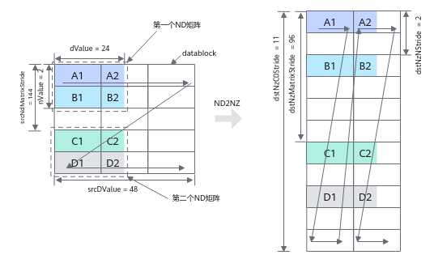

# 随路转换ND2NZ搬运-DataCopy-数据搬运-基础API-Ascend C算子开发接口-API-CANN社区版8.5.0开发文档-昇腾社区
**页面ID:** atlasascendc_api_07_00127
**来源:** https://www.hiascend.com/document/detail/zh/CANNCommunityEdition/850/API/ascendcopapi/atlasascendc_api_07_00127.html
---

# 随路转换ND2NZ搬运

#### 产品支持情况

| 产品 | 是否支持Global Memory -> Local Memory | 是否支持Local Memory -> Local Memory |
| --- | --- | --- |
| Atlas A3 训练系列产品/Atlas A3 推理系列产品 | √ | √ |
| Atlas A2 训练系列产品/Atlas A2 推理系列产品 | √ | √ |
| Atlas 200I/500 A2 推理产品 | x | x |
| Atlas 推理系列产品AI Core | √ | x |
| Atlas 推理系列产品Vector Core | x | x |
| Atlas 训练系列产品 | x | x |

#### 功能说明

支持在数据搬运时进行ND到NZ格式的转换。

#### 函数原型

- Global Memory -> Local Memory12template<typenameT>__aicore__inlinevoidDataCopy(constLocalTensor<T>&dst,constGlobalTensor<T>&src,constNd2NzParams&intriParams)
- Local Memory -> Local Memory12template<typenameT>__aicore__inlinevoidDataCopy(constLocalTensor<T>&dst,constLocalTensor<T>&src,constNd2NzParams&intriParams)

#### 参数说明

| 参数名 | 描述 |
| --- | --- |
| T | 源操作数或者目的操作数的数据类型。支持的数据类型请参考支持的通路和数据类型。 |

| 参数名称 | 输入/输出 | 含义 |
| --- | --- | --- |
| dst | 输出 | 目的操作数，类型为LocalTensor。 |
| src | 输入 | 源操作数，类型为LocalTensor或GlobalTensor。 |
| intriParams | 输入 | 搬运参数，类型为Nd2NzParams。具体定义请参考${INSTALL_DIR}/include/ascendc/basic_api/interface/kernel_struct_data_copy.h，${INSTALL_DIR}请替换为CANN软件安装后文件存储路径。 |

| 参数名称 | 含义 |
| --- | --- |
| ndNum | 传输ND矩阵的数目，取值范围：ndNum∈[0, 4095]。 |
| nValue | ND矩阵的行数，取值范围：nValue∈[0, 16384]。 |
| dValue | ND矩阵的列数，取值范围：dValue∈[0, 65535]。 |
| srcNdMatrixStride | 源操作数相邻ND矩阵起始地址间的偏移，取值范围：srcNdMatrixStride∈[0, 65535]，单位为元素。 |
| srcDValue | 源操作数同一ND矩阵的相邻行起始地址间的偏移，取值范围：srcDValue∈[1, 65535]，单位为元素。 |
| dstNzC0Stride | ND转换到NZ格式后，源操作数中的一行会转换为目的操作数的多行。dstNzC0Stride表示，目的NZ矩阵中，来自源操作数同一行的多行数据相邻行起始地址间的偏移，取值范围：dstNzC0Stride∈[1, 16384]，单位：C0_SIZE（32B）。 |
| dstNzNStride | 目的NZ矩阵中，Z型矩阵相邻行起始地址之间的偏移。取值范围：dstNzNStride∈[1, 16384]，单位：C0_SIZE（32B）。 |
| dstNzMatrixStride | 目的NZ矩阵中，相邻NZ矩阵起始地址间的偏移，取值范围：dstNzMatrixStride∈[1, 65535]，单位为元素。 |

ND2NZ转换示意图如下，样例中参数设置值和解释说明如下：

- ndNum = 2，表示传输ND矩阵的数目为2 (ND矩阵1为A1~A2 + B1~B2，ND矩阵2为C1~C2 + D1~D2)。
- nValue = 2，ND矩阵的行数，也就是矩阵的高度为2。
- dValue = 24，ND矩阵的列数，也就是矩阵的宽度为24个元素。当dValue不满足32B对齐时，在目的操作数中不足的部分会被补齐为0，例如图示中A2所在DataBlock的空白部分会被补齐为0。
- srcNdMatrixStride = 144，表达相邻ND矩阵起始地址间的偏移，即为A1~C1的距离，即为9个DataBlock，9 * 16 = 144个元素。
- srcDValue = 48，表示一行的所含元素个数，即为A1到B1的距离，即为3个DataBlock，3 * 16 = 48个元素
- dstNzC0Stride = 11。ND转换到NZ格式后，源操作数中的一行会转换为目的操作数的多行，例如src中A1和A2为1行，dst中A1和A2被分为2行。多行数据起始地址之间的偏移就是A1和A2在dst中的偏移，偏移为11个DataBlock。
- dstNzNStride = 2，表示src中一个ND矩阵的第x行和第x+1行转换为NZ格式后在dst中的偏移，即A1和B1在dst之间的偏移为2个DataBlock。
- dstNzMatrixStride = 96，表达dst中第x个ND矩阵的起点和第x+1个ND矩阵的起点的偏移，即A1和C1之间的距离，即为6个DataBlock，6 * 16 = 96个元素。

#### 返回值说明

无

#### 约束说明

针对Atlas 推理系列产品AI Core，使用Global Memory -> Local Memory通路的ND2NZ搬运接口时，需要预留8K的UB空间，作为接口的临时数据存放区。

#### 支持的通路和数据类型

下文的数据通路均通过逻辑位置TPosition来表达，并注明了对应的物理通路。TPosition与物理内存的映射关系见表1。

| 产品型号 | 数据通路 | 源操作数和目的操作数的数据类型 (两者保持一致) |
| --- | --- | --- |
| Atlas 推理系列产品AI Core | GM -> VECIN（GM -> UB） | int8_t、uint8_t、int16_t、uint16_t、int32_t、uint32_t、half、float |
| GM -> A1、B1（GM -> L1 Buffer） | int16_t、uint16_t、int32_t、uint32_t、half、float |
| Atlas A2 训练系列产品/Atlas A2 推理系列产品 | GM -> VECIN（GM -> UB）GM -> A1、B1（GM -> L1 Buffer） | int8_t、uint8_t、int16_t、uint16_t、int32_t、uint32_t、half、bfloat16_t、float |
| Atlas A3 训练系列产品/Atlas A3 推理系列产品 | GM -> VECIN（GM -> UB）GM -> A1、B1（GM -> L1 Buffer） | int8_t、uint8_t、int16_t、uint16_t、int32_t、uint32_t、half、bfloat16_t、float |

| 产品型号 | 数据通路 | 源操作数和目的操作数的数据类型 (两者保持一致) |
| --- | --- | --- |
| Atlas A2 训练系列产品/Atlas A2 推理系列产品 | VECIN、VECCALC、VECOUT -> TSCM（UB -> L1 Buffer） | int8_t、uint8_t、int16_t、uint16_t、int32_t、uint32_t、half、bfloat16_t、float |
| Atlas A3 训练系列产品/Atlas A3 推理系列产品 | VECIN、VECCALC、VECOUT -> TSCM（UB -> L1 Buffer） | int8_t、uint8_t、int16_t、uint16_t、int32_t、uint32_t、half、bfloat16_t、float |

#### 调用示例

| 12345678910111213141516171819202122232425262728293031323334353637383940414243444546474849505152535455 | #include"kernel_operator.h"classKernelDataCopyGm2UbNd2Nz{public:__aicore__inlineKernelDataCopyGm2UbNd2Nz(){}__aicore__inlinevoidInit(__gm__uint8_t*dstGm,__gm__uint8_t*srcGm){AscendC::Nd2NzParamsintriParamsIn{1,32,32,0,32,32,1,0};intriParams=intriParamsIn;srcGlobal.SetGlobalBuffer((__gm__half*)srcGm);dstGlobal.SetGlobalBuffer((__gm__half*)dstGm);pipe.InitBuffer(inQueueSrcVecIn,1,intriParams.nValue*intriParams.dValue*sizeof(half));pipe.InitBuffer(inQueueSrcVecOut,1,intriParams.nValue*intriParams.dValue*sizeof(half));}__aicore__inlinevoidProcess(){CopyIn();Compute();CopyOut();}private:__aicore__inlinevoidCopyIn(){AscendC::LocalTensor<half>srcLocal=inQueueSrcVecIn.AllocTensor<half>();AscendC::DataCopy(srcLocal,srcGlobal,intriParams);inQueueSrcVecIn.EnQue(srcLocal);}__aicore__inlinevoidCompute(){AscendC::LocalTensor<half>srcLocal=inQueueSrcVecIn.DeQue<half>();AscendC::LocalTensor<half>dstLocal=inQueueSrcVecOut.AllocTensor<half>();AscendC::DataCopy(dstLocal,srcLocal,intriParams.nValue*intriParams.dValue);inQueueSrcVecOut.EnQue(dstLocal);inQueueSrcVecIn.FreeTensor(srcLocal);}__aicore__inlinevoidCopyOut(){AscendC::LocalTensor<half>dstLocal=inQueueSrcVecOut.DeQue<half>();AscendC::DataCopy(dstGlobal,dstLocal,intriParams.nValue*intriParams.dValue);inQueueSrcVecOut.FreeTensor(dstLocal);}private:AscendC::TPipepipe;AscendC::TQue<AscendC::TPosition::VECIN,1>inQueueSrcVecIn;AscendC::TQue<AscendC::TPosition::VECOUT,1>inQueueSrcVecOut;AscendC::GlobalTensor<half>srcGlobal;AscendC::GlobalTensor<half>dstGlobal;AscendC::Nd2NzParamsintriParams;};extern"C"__global____aicore__voidkernel_data_copy_nd2nz_ub2out(__gm__uint8_t*src_gm,__gm__uint8_t*dst_gm){KernelDataCopyGm2UbNd2Nzop;op.Init(dst_gm,src_gm);op.Process();} |
| --- | --- |

结果示例：
