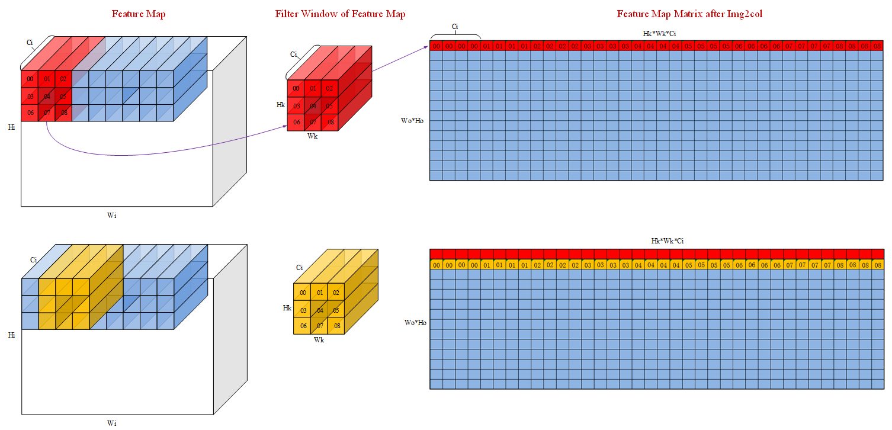
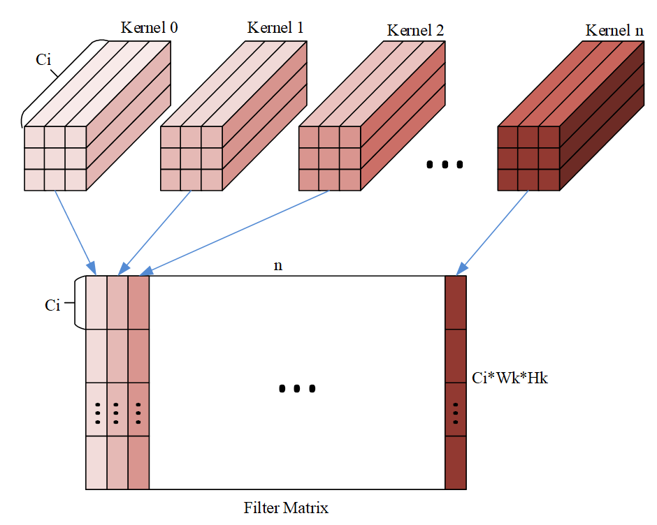
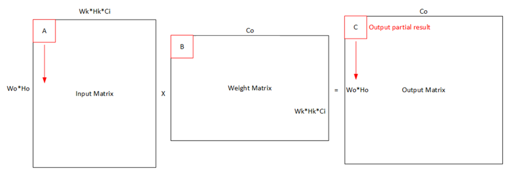
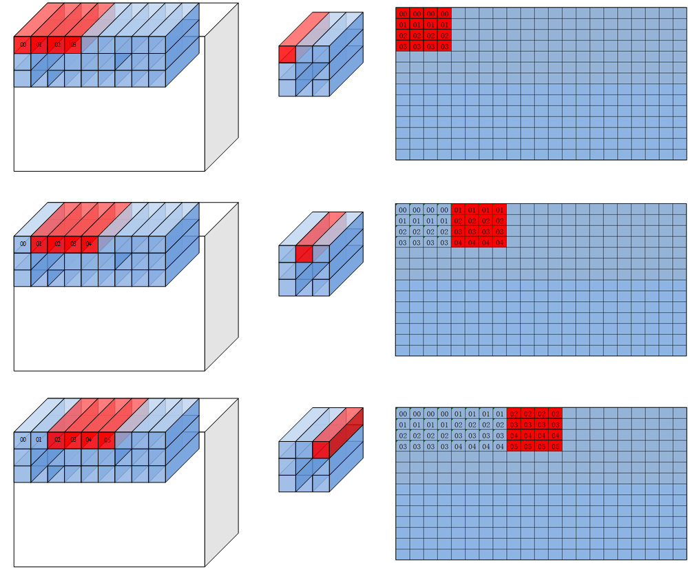
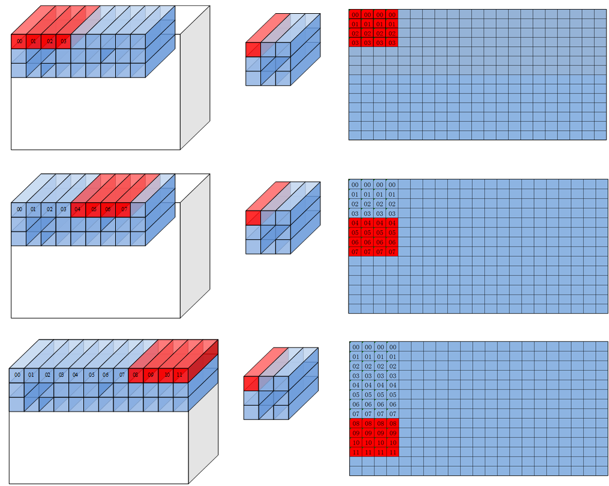

# Load3D-LoadData-数据搬运-矩阵计算（ISASI）-基础API-Ascend C算子开发接口-API-CANN社区版8.5.0开发文档-昇腾社区
**页面ID:** atlasascendc_api_07_00170
**来源:** https://www.hiascend.com/document/detail/zh/CANNCommunityEdition/850/API/ascendcopapi/atlasascendc_api_07_00170.html
---

# Load3D

#### 产品支持情况

| 产品 | 是否支持 |
| --- | --- |
| Atlas A3 训练系列产品/Atlas A3 推理系列产品 | √ |
| Atlas A2 训练系列产品/Atlas A2 推理系列产品 | √ |
| Atlas 200I/500 A2 推理产品 | √ |
| Atlas 推理系列产品AI Core | √ |
| Atlas 推理系列产品Vector Core | x |
| Atlas 训练系列产品 | √ |

#### 功能说明

Load3D用于完成image to column操作，将多维feature map转为二维矩阵。支持如下数据通路：A1->A2; B1->B2。

#### 函数原型

- Load3Dv1接口12template<typenameT,constIsResetLoad3dConfig&defaultConfig=IS_RESER_LOAD3D_DEFAULT_CONFIG,typenameU=PrimT<T>,typenameStd::enable_if<Std::is_same<PrimT<T>,U>::value,bool>::type=true>__aicore__inlinevoidLoadData(constLocalTensor<T>&dst,constLocalTensor<T>&src,constLoadData3DParamsV1<U>&loadDataParams)
- Load3Dv2接口12template<typenameT,constIsResetLoad3dConfig&defaultConfig=IS_RESER_LOAD3D_DEFAULT_CONFIG,typenameU=PrimT<T>,typenameStd::enable_if<Std::is_same<PrimT<T>,U>::value,bool>::type=true>__aicore__inlinevoidLoadData(constLocalTensor<T>&dst,constLocalTensor<T>&src,constLoadData3DParamsV2<U>&loadDataParams)

#### 参数说明

| 参数名称 | 含义 |
| --- | --- |
| T | 源操作数和目的操作数的数据类型。Load3Dv1接口：Atlas 训练系列产品，支持的数据类型为：uint8_t/int8_t/halfAtlas 推理系列产品AI Core，支持的数据类型为：uint8_t/int8_t/halfLoad3Dv2接口：Atlas 推理系列产品AI Core，支持的数据类型为：uint8_t/int8_t/half/int4b_tAtlas A2 训练系列产品/Atlas A2 推理系列产品，TPosition为A1/A2时，支持数据类型为：uint8_t/int8_t/half/bfloat16_t/uint32_t/int32_t/float/int4b_tTPosition为B1/B2时，支持数据类型为：half/bfloat16_t/uint32_t/int32_t/floatAtlas A3 训练系列产品/Atlas A3 推理系列产品，TPosition为A1/A2时，支持数据类型为：uint8_t/int8_t/half/bfloat16_t/uint32_t/int32_t/float/int4b_tTPosition为B1/B2时，支持数据类型为：half/bfloat16_t/uint32_t/int32_t/floatAtlas 200I/500 A2 推理产品，TPosition为A1/A2时，支持数据类型为：uint8_t/int8_t/half/bfloat16/uint32_t/int32_t/float/int4b_tTPosition为B1/B2时，支持数据类型为：half/bfloat16_t/uint32_t/int32_t/float |
| defaultConfig | 控制是否在Load3Dv1/Load3Dv2接口内部设置相关属性。 IsResetLoad3dConfig类型。IsResetLoad3dConfig结构定义如下：1234structIsResetLoad3dConfig{boolisSetFMatrix=true;boolisSetPadding=true;};isSetFMatrix配置为true，表示在接口内部设置FeatureMap的属性描述（包括l1H、l1W、padList，参数介绍参考表3、表4）；设置为false，表示该接口传入的FeatureMap的属性描述不生效，开发者需要通过SetFmatrix进行设置。isSetPadding配置为true，表示在接口内部设置Pad属性描述（即padValue参数，参数介绍参考表3、表4）；设置为false，表示该接口传入的Pad属性不生效，开发者需要通过SetLoadDataPaddingValue进行设置。可参考样例调用示例。该参数的默认值如下：1constexprIsResetLoad3dConfigIS_RESER_LOAD3D_DEFAULT_CONFIG={true,true}; | 1234 | structIsResetLoad3dConfig{boolisSetFMatrix=true;boolisSetPadding=true;}; | 1 | constexprIsResetLoad3dConfigIS_RESER_LOAD3D_DEFAULT_CONFIG={true,true}; |
| 1234 | structIsResetLoad3dConfig{boolisSetFMatrix=true;boolisSetPadding=true;}; |
| 1 | constexprIsResetLoad3dConfigIS_RESER_LOAD3D_DEFAULT_CONFIG={true,true}; |
| U | LoadData3DParamsV1/LoadData3DParamsV2中padValue的数据类型。当dst、src使用基础数据类型时， U和dst、src的数据类型T需保持一致，否则编译失败。当dst 、src使用TensorTrait类型时，U和dst、src的数据类型T的LiteType需保持一致，否则编译失败。最后一个模板参数仅用于上述数据类型检查，用户无需关注。 |

| 参数名称 | 输入/输出 | 含义 |
| --- | --- | --- |
| dst | 输出 | 目的操作数，类型为LocalTensor。数据连续排列顺序由目的操作数所在TPosition决定，具体约束如下：A2：ZZ格式；B2：ZN格式；A1/B1：无格式要求，一般情况下为NZ格式。 |
| src | 输入 | 源操作数，类型为LocalTensor或GlobalTensor。数据类型需要与dst保持一致。 |
| loadDataParams | 输入 | LoadData参数结构体，类型为：LoadData3DParamsV1，具体参考表3。LoadData3DParamsV2，具体参考表4。上述结构体参数定义请参考${INSTALL_DIR}/include/ascendc/basic_api/interface/kernel_struct_mm.h，${INSTALL_DIR}请替换为CANN软件安装后文件存储路径。 |

| 参数名称 | 含义 |
| --- | --- |
| padList | padding列表 [padding_left, padding_right, padding_top, padding_bottom]，每个元素取值范围：[0,255]。默认为{0, 0, 0, 0}。 |
| l1H | 源操作数 height，取值范围：l1H∈[1, 32767]。 |
| l1W | 源操作数 width，取值范围：l1W∈[1, 32767] 。 |
| c1Index | 该指令在源tensor C1维度的起点，取值范围：c1Index∈[0, 4095] 。默认为0。 |
| fetchFilterW | 该指令在卷积核上w维度的起始位置，取值范围：fetchFilterW∈[0, 254] 。默认为0。 |
| fetchFilterH | 该指令在filter上h维度的起始位置，取值范围：fetchFilterH∈[0, 254] 。默认为0。 |
| leftTopW | 该指令在源操作数上w维度的起点，取值范围：leftTopW∈[-255, 32767] 。默认为0。如果padding_left = a，leftTopW配置为-a。 |
| leftTopH | 该指令在源操作数上h维度的起点，取值范围：leftTopH∈[-255, 32767] 。默认为0。如果padding_top = a，leftTopH配置为-a。 |
| strideW | 卷积核在源操作数w维度滑动的步长，取值范围：strideW∈[1, 63] 。 |
| strideH | 卷积核在源操作数h维度滑动的步长，取值范围：strideH∈[1, 63] 。 |
| filterW | 卷积核width，取值范围：filterW∈[1, 255] 。 |
| filterH | 卷积核height，取值范围：filterH∈[1, 255] 。 |
| dilationFilterW | 卷积核width膨胀系数，取值范围：dilationFilterW∈[1, 255] 。 |
| dilationFilterH | 卷积核height膨胀系数，取值范围：dilationFilterH∈[1, 255] 。 |
| jumpStride | 迭代之间，目的操作数首地址步长，取值范围：jumpStride∈[1, 127] 。 |
| repeatMode | 迭代模式。模式0：每次迭代，增加卷积核窗口中的点，对应在目的矩阵上往w维度方向增长。模式1：每次迭代，增加滑动窗口左上坐标，对应在目的矩阵上往h维度方向增长。取值范围：repeatMode∈[0, 1] 。默认为0。 |
| repeatTime | 迭代次数，每一次源操作数和目的操作数的地址都会改变。取值范围：repeatTime∈[1，255] 。 |
| cSize | 配置是否开启cSize = 4(b16) / cSize = 8(b8)优化，取值范围：cSize∈[0, 1] 。默认为0。 |
| padValue | Pad填充值的数值，数据类型需要与src保持一致。默认为0。若不想使能padding，可将padList设为全0。 |

| 参数名称 | 含义 |
| --- | --- |
| padList | padding 列表 [padding_left, padding_right, padding_top, padding_bottom]，每个元素取值范围：[0,255]。默认为{0, 0, 0, 0}。 |
| l1H | 源操作数height，取值范围：l1H∈[1, 32767]。 |
| l1W | 源操作数weight，取值范围：l1W∈[1, 32767] 。 |
| channelSize | 源操作数的通道数，取值范围：channelSize∈[1, 63] 。针对以下型号，channelSize的取值要求为：对于half，channelSize可取值为4，8，16，N * 16 + 4，N * 16 + 8；对于int8_t/uint8_t，channelSize可取值为4，8，16，32，N * 32 + 4，N * 32 + 8，N * 32 + 16；对于int4b_t，ChannelSize可取值为8，16，32，N * 64，N * 64 + 8，N * 64 + 16，N * 64 + 32。N为正整数。Atlas 推理系列产品AI Core针对以下型号，channelSize的取值要求为：对于uint32_t/int32_t/float，channelSize可取值为4，N * 8，N * 8 + 4；对于half/bfloat16，channelSize可取值为4，8，N * 16，N * 16 + 4，N * 16 + 8；对于int8_t/uint8_t，channelSize可取值为4，8，16， 32 * N，N * 32 + 4，N * 32 + 8，N * 32 + 16；对于int4b_t，ChannelSize可取值为8，16，32，N * 64，N * 64 + 8，N * 64 + 16，N * 64 + 32。N为正整数。Atlas A2 训练系列产品/Atlas A2 推理系列产品Atlas A3 训练系列产品/Atlas A3 推理系列产品Atlas 200I/500 A2 推理产品 |
| kExtension | 该指令在目的操作数width维度的传输长度，如果不覆盖最右侧的分形，对于half类型，应为16的倍数，对于int8_t/uint8_t应为32的倍数；覆盖的情况则无倍数要求。取值范围: kExtension∈[1, 65535] 。 |
| mExtension | 该指令在目的操作数height维度的传输长度，如果不覆盖最下侧的分形，对于half/int8_t/uint8_t，应为16的倍数；覆盖的情况则无倍数要求。取值范围：mExtension∈[1, 65535] 。 |
| kStartPt | 该指令在目的操作数width维度的起点，对于half类型，应为16的倍数，对于int8_t/uint8_t应为32的倍数。取值范围[0, 65535] 。默认为0。 |
| mStartPt | 该指令在目的操作数height维度的起点，如果不覆盖最下侧的分形，对于half/int8_t/uint8_t，应为16的倍数；覆盖的情况则无倍数要求。取值范围[0, 65535] 。默认为0。 |
| strideW | 卷积核在源操作数width维度滑动的步长，取值范围：strideW∈[1, 63] 。 |
| strideH | 卷积核在源操作数height 维度滑动的步长，取值范围：strideH∈[1, 63] 。 |
| filterW | 卷积核width，取值范围：filterW∈[1, 255] 。 |
| filterH | 卷积核height，取值范围：filterH∈[1, 255] 。 |
| dilationFilterW | 卷积核width膨胀系数，取值范围：dilationFilterW∈[1, 255] 。 |
| dilationFilterH | 卷积核height膨胀系数，取值范围：dilationFilterH∈[1, 255] 。 |
| enTranspose | 是否启用转置功能，对整个目标矩阵进行转置，支持数据类型为 bool，仅在目的TPosition为A2，且源操作数为half类型时有效。默认为false。true：启用false：不启用 |
| enSmallK | 是否使能small k特性，每个分形矩阵大小为16*4，支持数据类型为 bool，默认为false。当前产品形态，该特性已不再支持。true：使能false：不使能 |
| padValue | Pad填充值的数值，数据类型需要与src保持一致。默认为0。若不想使能padding，可将padList设为全0。 |
| filterSizeW | 是否在filterW的基础上将卷积核width增加256 个元素。true，增加；false，不增加。 |
| filterSizeH | 是否在filterH的基础上将卷积核height增加256个元素。true，增加；false，不增加。 |
| fMatrixCtrl | 表示LoadData3DV2指令从左矩阵还是右矩阵获取FeatureMap的属性描述，与SetFmatrix配合使用，当前只支持设置为false，默认值为false。true：从右矩阵中获取FeatureMap的属性描述；false：从左矩阵中获取FeatureMap的属性描述。 |

#### 约束说明

- 操作数地址对齐要求请参见通用地址对齐约束。

- LoadData3DParamsV1 cSize特性的开启，需要保证A1/B1中的feature map为 4 channel对齐。

#### Load3d数据格式说明

要求输入的feature map和filter的格式是NC1HWC0，其中C0是最低维度而且C0是固定值为16（对于u8/s8类型为32），C1=C/C0。

为了简化场景，以下场景假设输入的feature map的channel 为4，即Ci=4。输入feature maps在A1中的形状为 (Hi,Wi,Ci)，经过load3dv1处理后在A2的数据形状为(Wo*Ho, Hk*Wk*Ci)。其中Wo 和Ho是卷积后输出的shape，Hk和Wk是filter的shape。

直观的来看，img2col的过程就是filter在feature map上扫过，将对应feature map的数据展开成输出数据的每一行的过程。filter首先在W方向上滑动Wo步，然后在H方向上走一步然后重复以上过程，最终输出Wo*Ho行数据。下图中红色和黄色的数据分别代表第一行和第二行。数字表示原始输入数据，filter和输出数据三者之间的关联关系。可以看到，load3dv1首先在输入数据的Ci维度搬运对应于00的4个数，然后搬运对应于01的四个数，最终这一行的大小为Hk*Wk*Ci即3*3*4=36个数。

对应的feature map格式如下图：

对应的filter的格式如下图：

其中n为filter的个数，可以看出维度排布为 (Hk,Wk,Ci,n)，但是需要注意的是下图的格式还需要根据Mmad中B矩阵的格式转换。

实际操作中，由于存储空间或者计算能力限制，我们通常会将整个卷积计算分块，一次只搬运并计算一小块数据。

对于A2的feature map来说有两种方案，水平分块和垂直分块。分别对应参数中repeatMode的0和1。

注：下图中的分型矩阵大小为4x4，实际应该为16x16 (对于u8/s8类型为16x32)

repeatMode =0时，每次repeat会改变在filter窗口中读取数据点的位置，然后跳到下一个C0的位置。

repeatMode =1的时候filter窗口中读取数据的位置保持不变，每个repeat在feature map中前进C0个元素。

#### 返回值说明

无

#### 调用示例

该调用示例支持的运行平台为Atlas 推理系列产品AI Core。

| 123456789101112131415161718192021222324252627282930313233343536373839404142434445464748495051525354555657585960616263646566676869707172737475767778798081828384858687888990919293949596979899100101102103104105106107108109110111112113114115116117118119120121122123124125126127128129130131132133134135136137138 | #include"kernel_operator.h"classKernelLoadData{public:__aicore__inlineKernelLoadData(){coutBlocks=(Cout+16-1)/16;ho=(H+padTop+padBottom-dilationH*(Kh-1)-1)/strideH+1;wo=(W+padLeft+padRight-dilationW*(Kw-1)-1)/strideW+1;howo=ho*wo;howoRound=((howo+16-1)/16)*16;featureMapA1Size=C1*H*W*C0;// shape: [C1, H, W, C0]weightA1Size=C1*Kh*Kw*Cout*C0;// shape: [C1, Kh, Kw, Cout, C0]featureMapA2Size=howoRound*(C1*Kh*Kw*C0);weightB2Size=(C1*Kh*Kw*C0)*coutBlocks*16;m=howo;k=C1*Kh*Kw*C0;n=Cout;dstSize=coutBlocks*howo*16;// shape: [coutBlocks, howo, 16]dstCO1Size=coutBlocks*howoRound*16;fmRepeat=featureMapA2Size/(16*C0);weRepeat=weightB2Size/(16*C0);}__aicore__inlinevoidInit(__gm__uint8_t*fmGm,__gm__uint8_t*weGm,__gm__uint8_t*dstGm){fmGlobal.SetGlobalBuffer((__gm__half*)fmGm);weGlobal.SetGlobalBuffer((__gm__half*)weGm);dstGlobal.SetGlobalBuffer((__gm__half*)dstGm);pipe.InitBuffer(inQueueFmA1,1,featureMapA1Size*sizeof(half));pipe.InitBuffer(inQueueFmA2,1,featureMapA2Size*sizeof(half));pipe.InitBuffer(inQueueWeB1,1,weightA1Size*sizeof(half));pipe.InitBuffer(inQueueWeB2,1,weightB2Size*sizeof(half));pipe.InitBuffer(outQueue,1,dstCO1Size*sizeof(float));pipe.InitBuffer(outQueueUB,1,dstSize*sizeof(half));}__aicore__inlinevoidProcess(){CopyIn();Split();Compute();CopyUB();CopyOut();}private:__aicore__inlinevoidCopyIn(){AscendC::LocalTensor<half>featureMapA1=inQueueFmA1.AllocTensor<half>();AscendC::LocalTensor<half>weightB1=inQueueWeB1.AllocTensor<half>();AscendC::DataCopy(featureMapA1,fmGlobal,{1,static_cast<uint16_t>(featureMapA1Size*sizeof(half)/32),0,0});AscendC::DataCopy(weightB1,weGlobal,{1,static_cast<uint16_t>(weightA1Size*sizeof(half)/32),0,0});inQueueFmA1.EnQue(featureMapA1);inQueueWeB1.EnQue(weightB1);}__aicore__inlinevoidSplit(){AscendC::LocalTensor<half>featureMapA1=inQueueFmA1.DeQue<half>();AscendC::LocalTensor<half>weightB1=inQueueWeB1.DeQue<half>();AscendC::LocalTensor<half>featureMapA2=inQueueFmA2.AllocTensor<half>();AscendC::LocalTensor<half>weightB2=inQueueWeB2.AllocTensor<half>();uint8_tpadList[4]={padLeft,padRight,padTop,padBottom};AscendC::LoadData(featureMapA2,featureMapA1,{padList,H,W,0,0,0,-1,-1,strideW,strideH,Kw,Kh,dilationW,dilationH,1,0,fmRepeat,0,(half)(0)});AscendC::LoadData(weightB2,weightB1,{0,weRepeat,1,0,0,false,0});inQueueFmA2.EnQue<half>(featureMapA2);inQueueWeB2.EnQue<half>(weightB2);inQueueFmA1.FreeTensor(featureMapA1);inQueueWeB1.FreeTensor(weightB1);}__aicore__inlinevoidCompute(){AscendC::LocalTensor<half>featureMapA2=inQueueFmA2.DeQue<half>();AscendC::LocalTensor<half>weightB2=inQueueWeB2.DeQue<half>();AscendC::LocalTensor<float>dstCO1=outQueueCO1.AllocTensor<float>();AscendC::Mmad(dstCO1,featureMapA2,weightB2,{m,n,k,0,false,true});outQueueCO1.EnQue<float>(dstCO1);inQueueFmA2.FreeTensor(featureMapA2);inQueueWeB2.FreeTensor(weightB2);}__aicore__inlinevoidCopyUB(){AscendC::LocalTensor<float>dstCO1=outQueueCO1.DeQue<float>();AscendC::LocalTensor<half>dstUB=outQueueUB.AllocTensor<half>();AscendC::DataCopyParamsdataCopyParams;dataCopyParams.blockCount=1;dataCopyParams.blockLen=m*n*sizeof(float)/1024;AscendC::DataCopyEnhancedParamsenhancedParams;enhancedParams.blockMode=AscendC::BlockMode::BLOCK_MODE_MATRIX;AscendC::DataCopy(dstUB,dstCO1,dataCopyParams,enhancedParams);outQueueUB.EnQue<half>(dstUB);outQueueCO1.FreeTensor(dstCO1);}__aicore__inlinevoidCopyOut(){AscendC::LocalTensor<half>dstUB=outQueueUB.DeQue<half>();AscendC::DataCopy(dstGlobal,dstUB,m*n);outQueueUB.FreeTensor(dstUB);}private:AscendC::TPipepipe;// feature map queueAscendC::TQue<AscendC::TPosition::A1,1>inQueueFmA1;AscendC::TQue<AscendC::TPosition::A2,1>inQueueFmA2;// weight queueAscendC::TQue<AscendC::TPosition::B1,1>inQueueWeB1;AscendC::TQue<AscendC::TPosition::B2,1>inQueueWeB2;// dst queueAscendC::TQue<AscendC::TPosition::CO1,1>outQueueCO1;AscendC::TQue<AscendC::TPosition::CO2,1>outQueueUB;AscendC::GlobalTensor<half>fmGlobal,weGlobal,dstGlobal;uint16_tC1=2;uint16_tH=4,W=4;uint8_tKh=2,Kw=2;uint16_tCout=16;uint16_tC0=16;uint8_tdilationH=2,dilationW=2;uint8_tpadTop=1,padBottom=1,padLeft=1,padRight=1;uint8_tstrideH=1,strideW=1;uint16_tcoutBlocks,ho,wo,howo,howoRound;uint32_tfeatureMapA1Size,weightA1Size,featureMapA2Size,weightB2Size,dstSize,dstCO1Size;uint16_tm,k,n;uint8_tfmRepeat,weRepeat;};extern"C"__global____aicore__voidload_data_simple_kernel(__gm__uint8_t*fmGm,__gm__uint8_t*weGm,__gm__uint8_t*dstGm){KernelLoadDataop;op.Init(fmGm,weGm,dstGm);op.Process();} |
| --- | --- |
