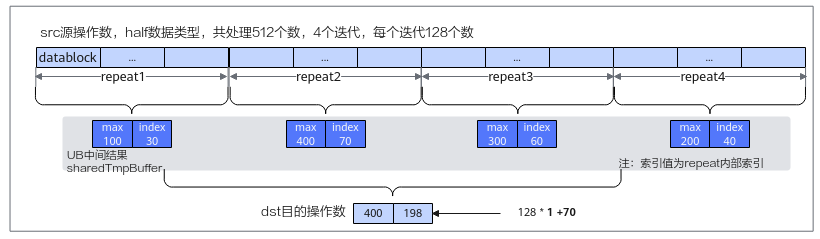
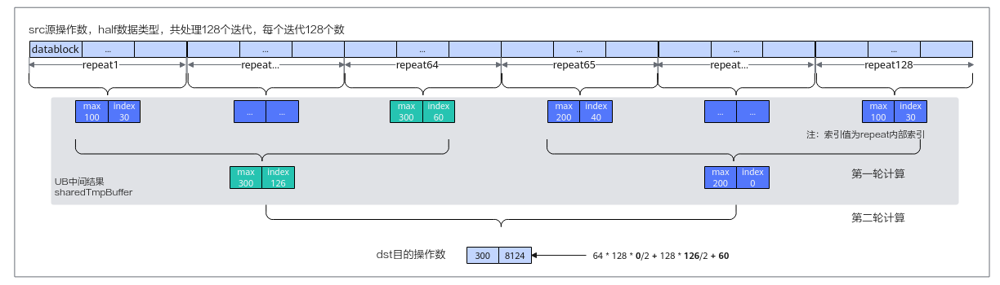

# ReduceMax-归约计算-矢量计算-基础API-Ascend C算子开发接口-API-CANN社区版8.5.0开发文档-昇腾社区
**页面ID:** atlasascendc_api_07_0076
**来源:** https://www.hiascend.com/document/detail/zh/CANNCommunityEdition/850/API/ascendcopapi/atlasascendc_api_07_0076.html
---

# ReduceMax

#### 产品支持情况

| 产品 | 是否支持 |
| --- | --- |
| Atlas A3 训练系列产品/Atlas A3 推理系列产品 | √ |
| Atlas A2 训练系列产品/Atlas A2 推理系列产品 | √ |
| Atlas 200I/500 A2 推理产品 | √ |
| Atlas 推理系列产品AI Core | √ |
| Atlas 推理系列产品Vector Core | x |
| Atlas 训练系列产品 | √ |

#### 功能说明

在所有的输入数据中找出最大值及最大值对应的索引位置。归约指令的总体介绍请参考如何使用归约计算API。

#### 函数原型

- tensor前n个数据计算12template<typenameT>__aicore__inlinevoidReduceMax(constLocalTensor<T>&dst,constLocalTensor<T>&src,constLocalTensor<T>&sharedTmpBuffer,constint32_tcount,boolcalIndex=0)
- tensor高维切分计算mask逐bit模式12template<typenameT>__aicore__inlinevoidReduceMax(constLocalTensor<T>&dst,constLocalTensor<T>&src,constLocalTensor<T>&sharedTmpBuffer,constuint64_tmask[],constint32_trepeatTime,constint32_tsrcRepStride,boolcalIndex=0)mask连续模式12template<typenameT>__aicore__inlinevoidReduceMax(constLocalTensor<T>&dst,constLocalTensor<T>&src,constLocalTensor<T>&sharedTmpBuffer,constint32_tmask,constint32_trepeatTime,constint32_tsrcRepStride,boolcalIndex=0)

#### 参数说明

| 参数名 | 描述 |
| --- | --- |
| T | 操作数数据类型。Atlas A3 训练系列产品/Atlas A3 推理系列产品，支持的数据类型为：half/floatAtlas A2 训练系列产品/Atlas A2 推理系列产品，支持的数据类型为：half/floatAtlas 200I/500 A2 推理产品，支持的数据类型为：half/floatAtlas 推理系列产品AI Core，支持的数据类型为：half/floatAtlas 训练系列产品，支持的数据类型为：half |

| 参数名称 | 输入/输出 | 含义 |
| --- | --- | --- |
| dst | 输出 | 目的操作数。类型为LocalTensor，支持的TPosition为VECIN/VECCALC/VECOUT。LocalTensor的起始地址需要保证4字节对齐（针对half数据类型），8字节对齐（针对float数据类型）。 |
| src | 输入 | 源操作数。类型为LocalTensor，支持的TPosition为VECIN/VECCALC/VECOUT。LocalTensor的起始地址需要32字节对齐。源操作数的数据类型需要与目的操作数保持一致。 |
| sharedTmpBuffer | 输入 | API执行期间，部分硬件型号需要一块空间用于存储中间结果，空间大小需要满足最小所需空间的要求，具体计算方法可参考下文ReduceMax计算示意图中的介绍。类型为LocalTensor，支持的TPosition为VECIN/VECCALC/VECOUT。LocalTensor的起始地址需要32字节对齐。数据类型需要与目的操作数保持一致。Atlas A3 训练系列产品/Atlas A3 推理系列产品，需要使用sharedTmpBuffer。Atlas A2 训练系列产品/Atlas A2 推理系列产品，需要使用sharedTmpBuffer。Atlas 200I/500 A2 推理产品，需要使用sharedTmpBuffer。Atlas 推理系列产品AI Core，需要使用sharedTmpBufferAtlas 训练系列产品，需要使用sharedTmpBuffer。 |
| count | 输入 | 参与计算的元素个数。参数取值范围和操作数的数据类型有关，数据类型不同，能够处理的元素个数最大值不同，最大处理的数据量不能超过UB大小限制。 |
| calIndex | 输入 | 指定是否获取最大值的索引，bool类型，默认值为false，取值：true：同时获取最大值和最大值索引。false：不获取索引，只获取最大值。 |
| mask/mask[] | 输入 | mask用于控制每次迭代内参与计算的元素。逐bit模式：可以按位控制哪些元素参与计算，bit位的值为1表示参与计算，0表示不参与。mask为数组形式，数组长度和数组元素的取值范围和操作数的数据类型有关。当操作数为16位时，数组长度为2，mask[0]、mask[1]∈[0, 264-1]并且不同时为0；当操作数为32位时，数组长度为1，mask[0]∈(0, 264-1]；当操作数为64位时，数组长度为1，mask[0]∈(0, 232-1]。例如，mask=[8, 0]，8=0b1000，表示仅第4个元素参与计算。连续模式：表示前面连续的多少个元素参与计算。取值范围和操作数的数据类型有关，数据类型不同，每次迭代内能够处理的元素个数最大值不同。当操作数为16位时，mask∈[1, 128]；当操作数为32位时，mask∈[1, 64]；当操作数为64位时，mask∈[1, 32]。 |
| repeatTime | 输入 | 迭代次数。与通用参数说明中不同的是，支持更大的取值范围，保证不超过int32_t最大值的范围即可。 |
| srcRepStride | 输入 | 源操作数相邻迭代间的地址步长，即源操作数每次迭代跳过的datablock数目。详细说明请参考repeatStride。 |

ReduceMax计算过程如ReduceMax计算示意图所示：先在每个repeat迭代中获取最大值及索引，作为中间结果存储在sharedTmpBuffer工作区中，然后在中间结果中再按照repeat迭代求最大值，以此类推，逐步求出最终的最大值和索引放在目的操作数中。需要注意的是，每次repeat迭代获取的最值索引是repeat内部索引，返回最终结果时，需要根据迭代位置和内部索引推导全量数据内的索引。

数据量较大时通过一轮归约无法得出最终结果，需要进行多轮计算，同理，每次repeat迭代获取的最值索引是repeat内部索引，返回最终结果时，需要根据迭代位置和内部索引推导全量数据内的索引。

sharedTmpBuffer空间需要开发者申请并传入，根据是否需要获取索引，sharedTmpBuffer空间计算方式不同：需要返回索引的情况下，需要把每轮计算所需的空间进行累加，同时每轮计算的空间都要考虑UB空间32字节对齐的要求；无需返回索引的情况下，只需要提供第一轮计算所需的空间并满足32字节对齐要求即可，后续的轮次可以直接使用这块空间，此时不需要推导索引的过程，所以之前轮次的中间数据可以直接覆盖。计算最小所需空间的算法如下：

- 无需返回最大值索引1234intfirstMaxRepeat=repeatTime;// 对于tensor高维切分计算接口，firstMaxRepeat就是repeatTime；对于tensor前n个数据计算接口，firstMaxRepeat为count/elementsPerRepeatintiter1OutputCount=firstMaxRepeat*2;// 第一轮操作产生的元素个数，无论开发者是否需要返回索引，底层指令都会返回索引，所以这里要为索引预留空间，产生的元素个数为repeat次数*2intiter1AlignEnd=RoundUp(iter1OutputCount,elementsPerBlock)*elementsPerBlock;// 第一轮产生的元素个数按照datablock(32字节)向上对齐intfinalWorkLocalNeedSize=iter1AlignEnd;// 第一轮计算完成后，后续可能还需要多轮迭代，但是可以复用同一块空间，所以第一轮计算所需的空间就是最终sharedTmpBuffer所需的空间大小
- 需要返回最大值索引123456789intfirstMaxRepeat=repeatTime;// 对于tensor高维切分计算接口，firstMaxRepeat就是repeatTime；对于tensor前n个数据计算接口，firstMaxRepeat为count/elementsPerRepeatintiter1OutputCount=firstMaxRepeat*2;// 第一轮操作产生的元素个数intiter2AlignStart=RoundUp(iter1OutputCount,elementsPerBlock)*elementsPerBlock;// 第二轮操作起始位置偏移，即第一轮产生的元素个数按照datablock(32字节)向上对齐的结果// 第一轮计算完成后，后续可能还需要多轮迭代，此时不可以复用同一块空间，因为第一轮的中间结果索引还需要再进行使用，所以需要继续准备第二轮和第三轮的空间intiter2OutputCount=RoundUp(iter1OutputCount,elementsPerRepeat)*2;// 第二轮操作产生的元素个数intiter3AlignStart=RoundUp(iter2OutputCount,elementsPerBlock)*elementsPerBlock;// 第三轮操作起始位置偏移，即第二轮产生的元素个数按照datablock(32字节)向上对齐的结果intiter3OutputCount=RoundUp(iter2OutputCount,elementsPerRepeat)*2;// 第三轮操作产生的元素个数intiter3AlignEnd=RoundUp(iter3OutputCount,elementsPerBlock)*elementsPerBlock;// 第三轮产生的元素个数按照datablock(32字节)向上对齐的结果intfinalWorkLocalNeedSize=iter2AlignStart+iter3AlignStart+iter3AlignEnd;// 最终sharedTmpBuffer所需的空间大小

以上计算出来的最终的空间大小单位是元素个数，若转成Bytes数表示为finalWorkLocalNeedSize * typeSize (Bytes)，具体计算示例请参考调用示例中sharedTmpBuffer空间计算示例。

开发者为了节省地址空间，可以选择sharedTmpBuffer空间复用源操作数的空间。此时因为sharedTmpBuffer需要的最小空间一定小于源操作数的空间，所以无需关注和计算最小空间。

#### 返回值说明

无

#### 约束说明

- 操作数地址对齐要求请参见通用地址对齐约束。
- 操作数地址重叠约束请参考通用地址重叠约束。需要使用sharedTmpBuffer的情况下，支持dst与sharedTmpBuffer地址重叠（通常情况下dst比sharedTmpBuffer所需的空间要小），此时sharedTmpBuffer必须满足最小所需空间要求，否则不支持地址重叠。

- dst结果存储顺序为最大值，最大值索引，若不需要索引，只会存储最大值。返回结果中索引index数据是按照dst的数据类型进行存储的，比如dst使用half类型时，index按照half类型进行存储，如果按照half格式进行读取，index的值是不对的，因此index的读取需要使用reinterpret_cast方法转换到整数类型。若输入数据类型是half，需要使用reinterpret_cast<uint16_t*>，若输入是float，需要使用reinterpret_cast<uint32_t*>，比如tensor高维切分计算接口完整示例中，输入数据是half类型，计算结果为[0.9985, 6.8e-06]，6.8e-06需要使用reinterpret_cast<uint16_t*>方法转换得到索引值114。转换示例如下：12floatmaxIndex=dst.GetValue(1);uint32_trealIndex=*reinterpret_cast<uint32_t*>(&maxIndex);
- 返回最大值索引时，如果存在多个最大值，返回第一个最大值的索引。
- 当输入类型是half的时候，只支持获取最大不超过65535（uint16_t能表示的最大值）的索引值。

#### 调用示例

- tensor高维切分计算样例-mask连续模式123// dstLocal,srcLocal和sharedTmpBuffer均为half类型,srcLocal的计算数据量为8320,并且连续排布，需要索引值，使用tensor高维切分计算接口，设定repeatTime为65，mask为全部元素参与计算int32_tmask=128;AscendC::ReduceMax<half>(dstLocal,srcLocal,sharedTmpBuffer,mask,65,8,true);
- tensor高维切分计算样例-mask逐bit模式123// dstLocal,srcLocal和sharedTmpBuffer均为half类型,srcLocal的计算数据量为8320,并且连续排布，需要索引值，使用tensor高维切分计算接口，设定repeatTime为65,mask为全部元素参与计算uint64_tmask[2]={0xFFFFFFFFFFFFFFFF,0xFFFFFFFFFFFFFFFF};AscendC::ReduceMax<half>(dstLocal,srcLocal,sharedTmpBuffer,mask,65,8,true);
- tensor前n个数据计算样例12// dstLocal,srcLocal和sharedTmpBuffer均为half类型,srcLocal的计算数据量为8320,并且连续排布，需要索引值，使用tensor前n个数据计算接口AscendC::ReduceMax<half>(dstLocal,srcLocal,sharedTmpBuffer,8320,true);

- sharedTmpBuffer空间计算示例123456789101112131415161718192021222324252627282930313233343536373839404142434445464748495051525354555657585960616263646566676869707172737475767778798081828384858687888990919293// ReduceMax接口sharedTmpBuffer计算示例一:// dstLocal,srcLocal和sharedTmpBuffer均为half类型,srcLocal的计算数据量为8320, 使用tensor高维切分计算接口, repeatTime为65, mask为128,需要索引值// tensor高维切分计算接口调用示例为:AscendC::ReduceMax<half>(dstLocal,srcLocal,sharedTmpBuffer,128,65,8,true);// 此时sharedTmpBuffer所需的最小空间计算过程为:intRoundUp(inta,intb){return(a+b-1)/b;}inttypeSize=2;intelementsPerBlock=32/typeSize=16;intelementsPerRepeat=256/typeSize=128;intfirstMaxRepeat=repeatTime;intiter1OutputCount=firstMaxRepeat*2=130;// 第一轮操作产生的元素个数intiter2AlignStart=RoundUp(iter1OutputCount,elementsPerBlock)*elementsPerBlock=144;// 对第一轮操作输出个数向上取整intiter2OutputCount=RoundUp(iter1OutputCount,elementsPerRepeat)*2=4;// 第二轮操作产生的元素个数intiter3AlignStart=RoundUp(iter2OutputCount,elementsPerBlock)*elementsPerBlock=16;// 对第二轮操作输出个数向上取整intiter3OutputCount=RoundUp(iter2OutputCount,elementsPerRepeat)*2=2;// 第三轮操作产生的元素个数intiter3AlignEnd=RoundUp(iter3OutputCount,elementsPerBlock)*elementsPerBlock=16;// 第三轮产生的元素个数做向上取整// 最终sharedTmpBuffer所需的最小空间为 iter2AlignStart + iter3AlignStart + iter3AlignEnd = 144 + 16 + 16 = 176 ,也就是352Bytes// ReduceMax接口sharedTmpBuffer计算示例二:// dstLocal,srcLocal和sharedTmpBuffer均为half类型,srcLocal的计算数据量为32640, 使用tensor高维切分计算接口,repeatTime为255, mask为128,需要索引值// tensor高维切分计算接口调用示例为:AscendC::ReduceMax<half>(dstLocal,srcLocal,sharedTmpBuffer,128,255,8,true);// 此时sharedTmpBuffer所需的最小空间计算过程为:inttypeSize=2;intelementsPerBlock=32/typeSize=16;intelementsPerRepeat=256/typeSize=128;intfirstMaxRepeat=repeatTime;intiter1OutputCount=firstMaxRepeat*2=510;// 第一轮操作产生的元素个数intiter2AlignStart=RoundUp(iter1OutputCount,elementsPerBlock)*elementsPerBlock=512;// 对第一轮操作输出个数向上取整intiter2OutputCount=RoundUp(iter1OutputCount,elementsPerRepeat)*2=8;// 第二轮操作产生的元素个数intiter3AlignStart=RoundUp(iter2OutputCount,elementsPerBlock)*elementsPerBlock=16;// 对第二轮操作输出个数向上取整intiter3OutputCount=RoundUp(iter2OutputCount,elementsPerRepeat)*2=2;// 第三轮操作产生的元素个数intiter3AlignEnd=RoundUp(iter3OutputCount,elementsPerBlock)*elementsPerBlock=16;// 第三轮产生的元素个数做向上取整// 需要的空间为 iter2AlignStart + iter3AlignStart + iter3AlignEnd = 512 + 16 + 16 = 544 ,也就是1088Bytes// ReduceMax接口sharedTmpBuffer计算示例三:// dstLocal,srcLocal和sharedTmpBuffer均为half类型,srcLocal的计算数据量为65408,使用tensor前n个数据计算接口,count=65408,需要索引值// tensor前n个数据计算接口调用示例为:AscendC::ReduceMax<half>(dstLocal,srcLocal,sharedTmpBuffer,65408,true);// 此时sharedTmpBuffer所需的最小空间计算过程为:inttypeSize=2;intelementsPerBlock=32/typeSize=16;intelementsPerRepeat=256/typeSize=128;intfirstMaxRepeat=count/elementsPerRepeat=511;intiter1OutputCount=firstMaxRepeat*2=1022;// 第一轮操作产生的元素个数intiter2AlignStart=RoundUp(iter1OutputCount,elementsPerBlock)*elementsPerBlock=1024;// 对iter1OutputCount输出个数向上取整intiter2OutputCount=RoundUp(iter1OutputCount,elementsPerRepeat)*2=16;// 第二轮操作产生的元素个数intiter3AlignStart=RoundUp(iter2OutputCount,elementsPerBlock)*elementsPerBlock=16;// 对iter2OutputCount输出个数向上取整intiter3OutputCount=RoundUp(iter2OutputCount,elementsPerRepeat)*2=2;// 第三轮操作产生的元素个数intiter3AlignEnd=RoundUp(iter3OutputCount,elementsPerBlock)*elementsPerBlock=16;// 第三轮产生的元素个数做向上取整// 需要的空间为 iter2AlignStart + iter3AlignStart + iter3AlignEnd = 1024 + 16 + 16 = 1056,也就是2112Bytes// ReduceMax接口sharedTmpBuffer计算示例四:// dstLocal,srcLocal和sharedTmpBuffer均为half类型,srcLocal的的计算数据量为512,使用tensor高维切分计算接口,repeatTime为4, mask为128,需要索引值// tensor高维切分计算接口调用示例为:AscendC::ReduceMax<half>(dstLocal,srcLocal,sharedTmpBuffer,128,4,8,true);// 此时sharedTmpBuffer所需的最小空间计算过程为:inttypeSize=2;intelementsPerBlock=32/typeSize=16;intelementsPerRepeat=256/typeSize=128;intfirstMaxRepeat=repeatTime;intiter1OutputCount=firstMaxRepeat*2=8;// 第一轮操作产生的元素个数intiter2AlignStart=RoundUp(iter1OutputCount,elementsPerBlock)*elementsPerBlock=16;// 对iter1OutputCount输出个数向上取整intiter2OutputCount=RoundUp(iter1OutputCount,elementsPerRepeat)*2=2;// 第二轮操作产生的元素个数// 本用例中，由于第二轮操作产生的元素个数为2，即第二轮结束就可以拿到最大值和其索引值，因此需要的空间为iter2AlignStart + RoundUp(iter2OutputCount, elementsPerBlock) * elementsPerBlock = 16 + 16 = 32，也就是64Bytes// ReduceMax接口sharedTmpBuffer计算示例五:// dstLocal,srcLocal和sharedTmpBuffer均为half类型,srcLocal的计算数据量count为65408,使用tensor前n个数据计算接口,count=65408，不需要索引值// tensor前n个数据计算接口调用示例为:AscendC::ReduceMax<half>(dstLocal,srcLocal,sharedTmpBuffer,65408,false);// 此时sharedTmpBuffer所需的最小空间计算过程为:inttypeSize=2;intelementsPerBlock=32/typeSize=16;intelementsPerRepeat=256/typeSize=128;intfirstMaxRepeat=count/elementsPerRepeat=511;intiter1OutputCount=firstMaxRepeat*2=1022;// 第一轮操作产生的元素个数intiter1AlignEnd=RoundUp(iter1OutputCount,elementsPerBlock)*elementsPerBlock=1024;// 第一轮产生的元素个数做向上取整// 由于calIndex为false,因此最终sharedTmpBuffer所需的最小空间大小就是对第一轮产生元素做向上取整后的结果，此处就是1024，也就是2048Bytes// ReduceMax接口sharedTmpBuffer计算示例六:// dstLocal,srcLocal和sharedTmpBuffer均为float类型,srcLocal的计算数据量为8320, 使用tensor高维切分计算接口, repeatTime为130, mask为64,需要索引值// tensor高维切分计算接口调用示例为:AscendC::ReduceMax<float>(dstLocal,srcLocal,sharedTmpBuffer,64,130,8,true);// 此时sharedTmpBuffer所需的最小空间计算过程为:inttypeSize=4;intelementsPerBlock=32/typeSize=8;intelementsPerRepeat=256/typeSize=64;intfirstMaxRepeat=repeatTime;intiter1OutputCount=firstMaxRepeat*2=260;// 第一轮操作产生的元素个数intiter2AlignStart=RoundUp(iter1OutputCount,elementsPerBlock)*elementsPerBlock=264;// 对第一轮操作输出个数向上取整intiter2OutputCount=RoundUp(iter1OutputCount,elementsPerRepeat)*2=10;// 第二轮操作产生的元素个数intiter3AlignStart=RoundUp(iter2OutputCount,elementsPerBlock)*elementsPerBlock=16;// 对第二轮操作输出个数向上取整intiter3OutputCount=RoundUp(iter2OutputCount,elementsPerRepeat)*2=2;// 第三轮操作产生的元素个数intiter3AlignEnd=RoundUp(iter3OutputCount,elementsPerBlock)*elementsPerBlock=8;// 第三轮产生的元素个数做向上取整// 最终sharedTmpBuffer所需的最小空间就是 iter2AlignStart + iter3AlignStart + iter3AlignEnd = 264 + 16 + 8 = 288,也就是1152Bytes
- tensor高维切分计算接口完整示例:123456789101112131415161718192021222324252627282930313233343536373839404142434445464748495051525354555657585960#include"kernel_operator.h"classKernelReduce{public:__aicore__inlineKernelReduce(){}__aicore__inlinevoidInit(__gm__uint8_t*src,__gm__uint8_t*dstGm){srcGlobal.SetGlobalBuffer((__gm__half*)src);dstGlobal.SetGlobalBuffer((__gm__half*)dstGm);repeat=srcDataSize/mask;pipe.InitBuffer(inQueueSrc,1,srcDataSize*sizeof(half));pipe.InitBuffer(workQueue,1,32*sizeof(half));// 此处按照公式计算所需的最小work空间为32，也就是64Bytespipe.InitBuffer(outQueueDst,1,dstDataSize*sizeof(half));}__aicore__inlinevoidProcess(){CopyIn();Compute();CopyOut();}private:__aicore__inlinevoidCopyIn(){AscendC::LocalTensor<half>srcLocal=inQueueSrc.AllocTensor<half>();AscendC::DataCopy(srcLocal,srcGlobal,srcDataSize);inQueueSrc.EnQue(srcLocal);}__aicore__inlinevoidCompute(){AscendC::LocalTensor<half>srcLocal=inQueueSrc.DeQue<half>();AscendC::LocalTensor<half>dstLocal=outQueueDst.AllocTensor<half>();AscendC::LocalTensor<half>sharedTmpBuffer=workQueue.AllocTensor<half>();AscendC::ReduceMax<half>(dstLocal,srcLocal,sharedTmpBuffer,mask,repeat,repStride,true);outQueueDst.EnQue<half>(dstLocal);inQueueSrc.FreeTensor(srcLocal);workQueue.FreeTensor(sharedTmpBuffer);}__aicore__inlinevoidCopyOut(){AscendC::LocalTensor<half>dstLocal=outQueueDst.DeQue<half>();AscendC::DataCopy(dstGlobal,dstLocal,srcDataSize);outQueueDst.FreeTensor(dstLocal);}private:AscendC::TPipepipe;AscendC::TQue<AscendC::TPosition::VECIN,1>inQueueSrc;AscendC::TQue<AscendC::TPosition::VECOUT,1>workQueue;AscendC::TQue<AscendC::TPosition::VECOUT,1>outQueueDst;AscendC::GlobalTensor<half>srcGlobal,dstGlobal;intsrcDataSize=512;intdstDataSize=512;intmask=128;intrepStride=8;intrepeat=0;};extern"C"__global____aicore__voidkernel_ReduceMax_lv0_half_512(__gm__uint8_t*src,__gm__uint8_t*dstGm){KernelReduceop;op.Init(src,dstGm);op.Process();}示例结果如下：示例结果 输入数据(src_gm):
[0.4795   0.951    0.866    0.008545 0.8037   0.551    0.754    0.73     0.6035   0.251    0.4841   0.05914  0.9414   0.379    0.664    0.6914   0.9307   0.3853   0.4048
 0.7754   0.1265   0.709    0.7695   0.8057   0.9673   0.2566   0.8696   0.243    0.871    0.123    0.76     0.1844   0.7324   0.5757   0.0172   0.7188   0.556    0.3699
 0.7334   0.655    0.919    0.4219   0.82     0.1046   0.5796   0.4773   0.1405   0.3777   0.4421   0.983    0.728    0.642    0.37     0.9473   0.52     0.7783   0.699
 0.716    0.1791   0.1272   0.2471   0.3298   0.3518   0.9756   0.2268   0.6167   0.742    0.4185   0.8193   0.919    0.03827  0.02957  0.2598   0.798    0.3752   0.2109
 0.1753   0.7227   0.829    0.6978   0.347    0.463    0.685    0.1992   0.847    0.941    0.835    0.03336  0.1359   0.04736  0.758    0.5347   0.616    0.869    0.582
 0.694    0.2035   0.3613   0.8413   0.68     0.0896   0.3833   0.0768   0.292    0.11053  0.5586   0.578    0.3286   0.09314  0.5845   0.7124   0.2058   0.6523   0.7840.99850.6626   0.8975   0.405    0.884    0.7744   0.0258   0.484    0.768    0.7197   0.577    0.03143  0.9185   0.3608   0.3352   0.9077   0.709    0.85     0.4607
 0.61     0.4277   0.1004   0.1995   0.1608   0.2852   0.8887   0.813    0.3396   0.272    0.703    0.1312   0.734    0.2612   0.6895   0.8647   0.9165   0.1455   0.9233
 0.3027   0.7163   0.927    0.1995   0.155    0.6953   0.66     0.04163  0.99     0.544    0.4243   0.804    0.4612   0.01912  0.5127   0.8755   0.6665   0.707    0.01018
 0.874    0.8545   0.9375   0.9844   0.578    0.934    0.683    0.4668   0.63     0.2032   0.3188   0.9478   0.9375   0.03357  0.9927   0.996    0.451    0.1105   0.762
 0.82     0.8047   0.911    0.926    0.1973   0.9175   0.4521   0.4487   0.1273   0.718    0.737    0.305    0.922    0.1396   0.618    0.753    0.5913   0.874    0.08905
 0.003582 0.05252  0.674    0.3923   0.527    0.4106   0.7812   0.113    0.965    0.6157   0.4368   0.6646   0.7944   0.7964   0.531    0.6665   0.517    0.04468  0.5737
 0.752    0.4      0.4463   0.05496  0.939    0.6353   0.2036   0.667    0.3994   0.2573   0.118    0.973    0.5923   0.558    0.7114   0.785    0.714    0.7485   0.854
 0.2585   0.274    0.9824   0.4158   0.283    0.2194   0.3074   0.2793   0.531    0.8965   0.01456  0.5264   0.992    0.856    0.5986   0.734    0.908    0.12317  0.8374
 0.6665   0.1904   0.97     0.2546   0.364    0.6914   0.462    0.05353  0.02975  0.6235   0.4941   0.4714   0.788    0.06537  0.8423   0.2527   0.7734   0.591    0.443
 0.3022   0.02116  0.01605  0.772    0.6924   0.01032  0.594    0.1865   0.7393   0.8887   0.916    0.9653   0.696    0.901    0.1255   0.5513   0.2742   0.5586   0.988
 0.0954   0.4365   0.677    0.894    0.8413   0.05655  0.932    0.4426   0.336    0.848    0.9434   0.1976   0.813    0.773    0.2605   0.1543   0.8555   0.3596   0.997
 0.10315  0.5796   0.5327   0.2283   0.7583   0.3674   0.513    0.9126   0.751    0.532    0.399    0.832    0.549    0.2358   0.6655   0.477    0.5864   0.3528   0.989
 0.1412   0.748    0.3652   0.05292  0.3552   0.5767   0.826    0.4792   0.8477   0.03488  0.8267   0.2345   0.931    0.0884   0.6816   0.4685   0.618    0.09973  0.4385
 0.782    0.6465   0.03882  0.4158   0.1422   0.822    0.8203   0.95     0.3274   0.724    0.929    0.8726   0.004307 0.815    0.67     0.4368   0.7793   0.593    0.4663
 0.2207   0.01773  0.39     0.008896 0.4238   0.716    0.1155   0.601    0.9214   0.3708   0.4285   0.951    0.00431  0.726    0.977    0.1254   0.6484   0.4648   0.891
 0.723    0.6333   0.9077   0.4849   0.3008   0.0495   0.4575   0.266    0.2014   0.1106   0.6914   0.2744   0.4956   0.532    0.1752   0.709    0.3464   0.6104   0.4067
 0.1317   0.8647   0.8      0.4832   0.013855 0.6733   0.4524   0.6865   0.7017   0.9385   0.2957   0.2444   0.4167   0.55     0.8926   0.8364   0.506    0.9966   0.7207
 0.51     0.8745   0.3188   0.847    0.86     0.64     0.08453  0.59     0.2062   0.1031   0.1459   0.3806   0.2096   0.469    0.1492   0.10065  0.536    0.572    0.353
 0.068    0.07855  0.6177   0.3408   0.1538   0.2732   0.997    0.1158   0.4028   0.9536   0.7197   0.585    0.0899   0.3994   0.1835   0.737    0.4639   0.3071   0.47
 0.993    0.3862   0.293    0.1813   0.8193   0.745    0.064    0.7407   0.329    0.198    0.596    0.3      0.6562   0.819    0.2803   0.04095  0.703    0.3425   0.9224
 0.776    0.8057   0.734    0.2534   0.1824   0.793    0.3542   0.2595   0.2607   0.838    0.39     0.631    0.3542   0.1968   0.643    0.015366 0.4106   0.604   ]
输出数据(dst_gm):
[0.9985,  6.8e-06], 6.8e-06使用reinterpret_cast方法转换后为索引值114
- tensor前n个数据计算接口完整调用示例:123456789101112131415161718192021222324252627282930313233343536373839404142434445464748495051525354555657585960616263646566#include"kernel_operator.h"classKernelReduce{public:__aicore__inlineKernelReduce(){}__aicore__inlinevoidInit(__gm__uint8_t*src,__gm__uint8_t*dstGm){srcGlobal.SetGlobalBuffer((__gm__half*)src);dstGlobal.SetGlobalBuffer((__gm__half*)dstGm);repeatTime=srcDataSize/mask;pipe.InitBuffer(inQueueSrc,1,srcDataSize*sizeof(half));pipe.InitBuffer(workQueue,1,32*sizeof(half));// 此处按照公式计算所需的最小work空间为32，也就是64Bytespipe.InitBuffer(outQueueDst,1,dstDataSize*sizeof(half));}__aicore__inlinevoidProcess(){CopyIn();Compute();CopyOut();}private:__aicore__inlinevoidCopyIn(){AscendC::LocalTensor<half>srcLocal=inQueueSrc.AllocTensor<half>();AscendC::DataCopy(srcLocal,srcGlobal,srcDataSize);inQueueSrc.EnQue(srcLocal);}__aicore__inlinevoidCompute(){AscendC::LocalTensor<half>srcLocal=inQueueSrc.DeQue<half>();AscendC::LocalTensor<half>dstLocal=outQueueDst.AllocTensor<half>();AscendC::LocalTensor<half>sharedTmpBuffer=workQueue.AllocTensor<half>();// level2AscendC::ReduceMax<half>(dstLocal,srcLocal,sharedTmpBuffer,srcDataSize,true);outQueueDst.EnQue<half>(dstLocal);inQueueSrc.FreeTensor(srcLocal);workQueue.FreeTensor(sharedTmpBuffer);}__aicore__inlinevoidCopyOut(){AscendC::LocalTensor<half>dstLocal=outQueueDst.DeQue<half>();AscendC::DataCopy(dstGlobal,dstLocal,dstDataSize);outQueueDst.FreeTensor(dstLocal);}private:AscendC::TPipepipe;AscendC::TQue<AscendC::TPosition::VECIN,1>inQueueSrc;AscendC::TQue<AscendC::TPosition::VECOUT,1>workQueue;AscendC::TQue<AscendC::TPosition::VECOUT,1>outQueueDst;AscendC::GlobalTensor<half>srcGlobal,dstGlobal;intsrcDataSize=288;intdstDataSize=16;intmask=128;intrepStride=8;intrepeatTime=0;};extern"C"__global____aicore__voidkernel_ReduceMax_lv2_half_288(__gm__uint8_t*src,__gm__uint8_t*dstGm){KernelReduceop;op.Init(src,dstGm);op.Process();}示例结果如下：示例结果 输入数据(src_gm):
[0.4778   0.5903   0.2433   0.698    0.1943   0.407    0.891    0.1766   0.5977   0.9473   0.6523   0.10913  0.0143   0.86     0.2366   0.625    0.3696   0.708    0.946
 0.538    0.3826   0.08215  0.516    0.9116   0.1548   0.507    0.8145   0.89     0.5435   0.563    0.1125   0.543    0.3142   0.8086   0.6885   0.874    0.855    0.4019
 0.1613   0.04462  0.945    0.6064   0.6904   0.00758  0.9463   0.528    0.9966   0.629    0.714    0.03134  0.4407   0.0322   0.5376   0.04443  0.03778  0.522    0.793
 0.3086   0.4      0.3984   0.5693   0.8203   0.673    0.796    0.2747   0.2246   0.468    0.1146   0.4468   0.419    0.3816   0.1636   0.1414   0.4028   0.9785   0.8984
 0.4355   0.874    0.864    0.7856   0.739    0.895    0.2487   0.5034   0.958    0.661    0.8755   0.302    0.802    0.563    0.9067   0.1562   0.1337   0.1844   0.3047
 0.543    0.3855   0.9536   0.8633   0.5435   0.002748 0.8916   0.9614   0.3665   0.1588   0.51     0.77     0.552    0.84     0.2798   0.7217   0.8633   0.3794   0.5376
 0.03     0.7783   0.9297   0.9556   0.609    0.1776   0.5957   0.2954   0.6675   0.7183   0.4182   0.8804   0.1837   0.3235   0.3486   0.43     0.8633   0.3972   0.1307
 0.7915   0.43     0.2544   0.827    0.04843  0.1637   0.3376   0.4087   0.4993   0.5923   0.3057   0.04306  0.4905   0.693    0.7393   0.777    0.01379  0.2742   0.669
 0.6826   0.04028  0.0423   0.281    0.12476  0.5366   0.2098   0.559    0.8833   0.82     0.0745   0.7485   0.04004  0.776    0.863    0.1909   0.7876   0.734    0.4727
 0.3655   0.944    0.006794 0.01872  0.687    0.5664   0.9697   0.2437   0.2014   0.0269   0.3975   0.08405  0.36     0.0751   0.02632  0.135    0.531    0.554    0.378
 0.9365   0.5254   0.8687   0.181    0.329    0.322    0.3076   0.508    0.638    0.3462   0.3882   0.7705   0.5933   0.994    0.1188   0.0782   0.94     0.00856  0.1396
 0.2191   0.00648  0.8994   0.6714   0.6724   0.57     0.3127   0.4905   0.2119   0.3938   0.5957   0.1493   0.9424   0.716    0.3699   0.829    0.647    0.8286   0.04514
 0.4028   0.5786   0.148    0.34250.9990.869    0.04288  0.817    0.7075   0.03098  0.621    0.612    0.0774   0.532    0.4395   0.0711   0.4805   0.5835   0.5947
 0.1768   0.52     0.3428   0.9146   0.7324   0.5054   0.7397   0.2737   0.6313   0.1704   0.5093   0.8105   0.1312   0.752    0.3647   0.781    0.4197   0.2329   0.787
 0.762    0.63     0.9263   0.2673   0.1846   0.765    0.921    0.2913   0.3135   0.337    0.2598   0.1782   0.8013   0.641    0.6865   0.736    0.618    0.8755   0.2756
 0.9854   0.8296   0.262   ]
输出数据(dst_gm):
[0.999,  1.38e-05], 1.38e-05使用reinterpret_cast方法转换后为索引值232
