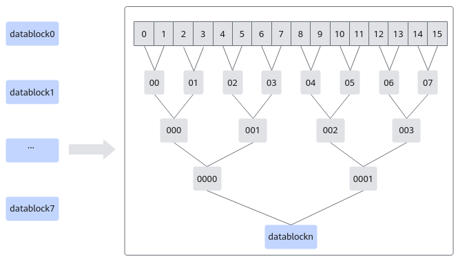
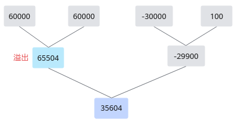

# BlockReduceSum-归约计算-矢量计算-基础API-Ascend C算子开发接口-API-CANN社区版8.5.0开发文档-昇腾社区
**页面ID:** atlasascendc_api_07_0084
**来源:** https://www.hiascend.com/document/detail/zh/CANNCommunityEdition/850/API/ascendcopapi/atlasascendc_api_07_0084.html
---

# BlockReduceSum

#### 产品支持情况

| 产品 | 是否支持 |
| --- | --- |
| Atlas A3 训练系列产品/Atlas A3 推理系列产品 | √ |
| Atlas A2 训练系列产品/Atlas A2 推理系列产品 | √ |
| Atlas 200I/500 A2 推理产品 | √ |
| Atlas 推理系列产品AI Core | √ |
| Atlas 推理系列产品Vector Core | x |
| Atlas 训练系列产品 | √ |

#### 功能说明

对每个datablock内所有元素求和。源操作数相加采用二叉树方式，两两相加。归约指令的总体介绍请参考如何使用归约计算API。

以128个half类型的数据求和为例，每个datablock可以计算16个half类型数据，分成8个datablock进行计算；每个datablock内，通过二叉树的方式，两两相加，BlockReduceSum求和示意图如下。

需要注意的是两两相加的计算过程中，计算结果大于65504时结果保存为65504。例如，源操作数为[60000,60000,-30000,100]，首先60000+60000溢出，结果为65504，然后计算-30000+100=-29900，最后计算65504-29900=35604，计算示意图如下图所示。

#### 函数原型

- mask逐比特模式12template<typenameT,boolisSetMask=true>__aicore__inlinevoidBlockReduceSum(constLocalTensor<T>&dst,constLocalTensor<T>&src,constint32_trepeatTime,constuint64_tmask[],constint32_tdstRepStride,constint32_tsrcBlkStride,constint32_tsrcRepStride)
- mask连续模式12template<typenameT,boolisSetMask=true>__aicore__inlinevoidBlockReduceSum(constLocalTensor<T>&dst,constLocalTensor<T>&src,constint32_trepeatTime,constint32_tmask,constint32_tdstRepStride,constint32_tsrcBlkStride,constint32_tsrcRepStride)

#### 参数说明

| 参数名 | 描述 |
| --- | --- |
| T | 操作数数据类型。Atlas A3 训练系列产品/Atlas A3 推理系列产品，支持的数据类型为：half/floatAtlas A2 训练系列产品/Atlas A2 推理系列产品，支持的数据类型为：half/floatAtlas 200I/500 A2 推理产品，支持的数据类型为：half/floatAtlas 推理系列产品AI Core，支持的数据类型为：half/floatAtlas 训练系列产品，支持的数据类型为：half |
| isSetMask | 是否在接口内部设置mask。true，表示在接口内部设置mask。false，表示在接口外部设置mask，开发者需要使用SetVectorMask接口设置mask值。这种模式下，本接口入参中的mask值必须设置为占位符MASK_PLACEHOLDER。 |

| 参数名称 | 输入/输出 | 含义 |
| --- | --- | --- |
| dst | 输出 | 目的操作数。类型为LocalTensor，支持的TPosition为VECIN/VECCALC/VECOUT。LocalTensor的起始地址需要保证16字节对齐（针对half数据类型），32字节对齐（针对float数据类型）。 |
| src | 输入 | 源操作数。类型为LocalTensor，支持的TPosition为VECIN/VECCALC/VECOUT。LocalTensor的起始地址需要32字节对齐。 |
| repeatTime | 输入 | 迭代次数。取值范围为[0, 255]。关于该参数的具体描述请参考高维切分API。 |
| mask/mask[] | 输入 | mask用于控制每次迭代内参与计算的元素。逐bit模式：可以按位控制哪些元素参与计算，bit位的值为1表示参与计算，0表示不参与。mask为数组形式，数组长度和数组元素的取值范围和操作数的数据类型有关。当操作数为16位时，数组长度为2，mask[0]、mask[1]∈[0, 264-1]并且不同时为0；当操作数为32位时，数组长度为1，mask[0]∈(0, 264-1]；当操作数为64位时，数组长度为1，mask[0]∈(0, 232-1]。例如，mask=[8, 0]，8=0b1000，表示仅第4个元素参与计算。连续模式：表示前面连续的多少个元素参与计算。取值范围和操作数的数据类型有关，数据类型不同，每次迭代内能够处理的元素个数最大值不同。当操作数为16位时，mask∈[1, 128]；当操作数为32位时，mask∈[1, 64]；当操作数为64位时，mask∈[1, 32]。 |
| dstRepStride | 输入 | 目的操作数相邻迭代间的地址步长。以一个repeatTime归约后的长度为单位。每个repeatTime(8个datablock)归约后，得到8个元素，所以输入类型为half类型时，RepStride单位为16Byte；输入类型为float类型时，RepStride单位为32Byte。注意，此参数值Atlas 训练系列产品不支持配置0。 |
| srcBlkStride | 输入 | 单次迭代内datablock的地址步长。详细说明请参考dataBlockStride。 |
| srcRepStride | 输入 | 源操作数相邻迭代间的地址步长，即源操作数每次迭代跳过的datablock数目。详细说明请参考repeatStride。 |

#### 返回值说明

无

#### 约束说明

- 操作数地址对齐要求请参见通用地址对齐约束。

- 为了节省地址空间，您可以定义一个Tensor，供源操作数与目的操作数同时使用（即地址重叠），需要注意计算后的目的操作数数据不能覆盖未参与计算的源操作数，需要谨慎使用。
- 对于Atlas 200I/500 A2 推理产品，若配置的mask/mask[]参数后，存在某个datablock里的任何一个元素都不参与计算，则该datablock内所有元素的和会填充为0返回。比如float场景下，当mask配置为32，即只计算前4个datablock，则后四个datablock内的和会返回0。

#### 调用示例

- 本样例中只展示Compute流程中的部分代码。如果您需要运行样例代码，请将该代码段拷贝并替换样例模板中Compute函数的部分代码即可。BlockReduceSum-tensor高维切分计算样例-mask连续模式123456int32_tmask=256/sizeof(half);intrepeat=1;// repeat = 1, 128 elements one repeat, 128 elements total// srcBlkStride = 1, no gap between blocks in one repeat// dstRepStride = 1, srcRepStride = 8, no gap between repeatsAscendC::BlockReduceSum<half>(dstLocal,srcLocal,repeat,mask,1,1,8);BlockReduceSum-tensor高维切分计算样例-mask逐bit模式123456uint64_tmask[2]={UINT64_MAX,UINT64_MAX};intrepeat=1;// repeat = 1, 128 elements one repeat, 128 elements total// srcBlkStride = 1, no gap between blocks in one repeat// dstRepStride = 1, srcRepStride = 8, no gap between repeatsAscendC::BlockReduceSum<half>(dstLocal,srcLocal,repeat,mask,1,1,8);结果示例如下：输入数据src_gm：
[-7.289, 4.48, -5.898, -6.199, 1.422, -6.168, -3.178, -1.198, 
 7.789, 6.754, -5.191, -0.6797, 2.883, 2.08, 8.664, -8.539,
 ...,
 -7.625, 2.529, 7.855, -2.012, -6.52, -6.652, -8.422, -9.914,
 -4.355, 1.849, 5.406, 1.483, -6.074, -1.897, 8.625, 1.969]  
输出数据dst_gm：
[-10.27, ..., -23.77, 0, ..., 0]

- 针对不同场景合理使用归约指令可以带来性能提升，相关介绍请参考选择低延迟指令，优化归约操作性能，具体样例请参考ReduceCustom。
