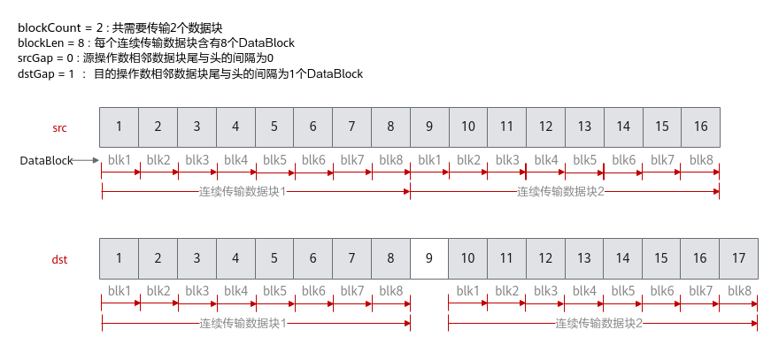

# 基础数据搬运-DataCopy-数据搬运-基础API-Ascend C算子开发接口-API-CANN社区版8.5.0开发文档-昇腾社区
**页面ID:** atlasascendc_api_07_0103
**来源:** https://www.hiascend.com/document/detail/zh/CANNCommunityEdition/850/API/ascendcopapi/atlasascendc_api_07_0103.html
---

# 基础数据搬运

#### 产品支持情况

| 产品 | 是否支持源操作数和目的操作数数据类型一致的原型 | 是否支持源操作数和目的操作数数据类型不一致的原型 |
| --- | --- | --- |
| Atlas A3 训练系列产品/Atlas A3 推理系列产品 | √ | √ |
| Atlas A2 训练系列产品/Atlas A2 推理系列产品 | √ | √ |
| Atlas 200I/500 A2 推理产品 | √ | x |
| Atlas 推理系列产品AI Core | √ | x |
| Atlas 推理系列产品Vector Core | √ | x |
| Atlas 训练系列产品 | √ | x |

#### 功能说明

提供基础的数据搬运能力，数据在传输过程中保持原始格式和内容不变，支持连续和非连续的数据搬运。

#### 函数原型

- Global Memory -> Local Memory1234567// 连续搬运template<typenameT>__aicore__inlinevoidDataCopy(constLocalTensor<T>&dst,constGlobalTensor<T>&src,constuint32_tcount)// 同时支持非连续搬运和连续搬运template<typenameT>__aicore__inlinevoidDataCopy(constLocalTensor<T>&dst,constGlobalTensor<T>&src,constDataCopyParams&repeatParams)
- Local Memory -> Local Memory1234567// 连续搬运template<typenameT>__aicore__inlinevoidDataCopy(constLocalTensor<T>&dst,constLocalTensor<T>&src,constuint32_tcount)// 同时支持非连续搬运和连续搬运template<typenameT>__aicore__inlinevoidDataCopy(constLocalTensor<T>&dst,constLocalTensor<T>&src,constDataCopyParams&repeatParams)
- Local Memory -> Global Memory1234567// 连续搬运template<typenameT>__aicore__inlinevoidDataCopy(constGlobalTensor<T>&dst,constLocalTensor<T>&src,constuint32_tcount)// 同时支持非连续搬运和连续搬运template<typenameT>__aicore__inlinevoidDataCopy(constGlobalTensor<T>&dst,constLocalTensor<T>&src,constDataCopyParams&repeatParams)
- Local Memory -> Local Memory，支持源操作数和目的操作数数据类型不一致123// 同时支持非连续搬运和连续搬运template<typenameT,typenameU>__aicore__inlinevoidDataCopy(constLocalTensor<T>&dst,constLocalTensor<U>&src,constDataCopyParams&repeatParams)

#### 参数说明

| 参数名 | 描述 |
| --- | --- |
| T、U | 操作数的数据类型。支持的数据类型请参考支持的通路和数据类型。 |

| 参数名 | 输入/输出 | 含义 |
| --- | --- | --- |
| dst | 输出 | 目的操作数，类型为LocalTensor或GlobalTensor。LocalTensor位于C2时，起始地址要求64B对齐；LocalTensor位于C2PIPE2GM时，起始地址要求128B对齐；其他情况均要求32字节对齐。GlobalTensor的起始地址要求按照对应数据类型所占字节数对齐。 |
| src | 输入 | 源操作数，类型为LocalTensor或GlobalTensor。LocalTensor的起始地址要求32字节对齐。GlobalTensor的起始地址要求按照对应数据类型所占字节数对齐。 |
| repeatParams | 输入 | 搬运参数，DataCopyParams类型。通过该参数可配置搬运的数据块大小、个数、间隔等信息，同时支持非连续和连续搬运。具体定义请参考${INSTALL_DIR}/include/ascendc/basic_api/interface/kernel_struct_data_copy.h，${INSTALL_DIR}请替换为CANN软件安装后文件存储路径。 |
| count | 输入 | 参与搬运的元素个数。说明：count * sizeof(T)需要32字节对齐，若不对齐，搬运量将对32字节做向下取整。 |

| 参数名称 | 含义 |
| --- | --- |
| blockCount | 待搬运的连续传输数据块个数。uint16_t类型，取值范围：blockCount∈[1, 4095]。 |
| blockLen | 待搬运的每个连续传输数据块长度，单位为DataBlock（32字节）。uint16_t类型，取值范围：blockLen∈[1, 65535]。特别地，当dst位于C2PIPE2GM时，单位为128B；当dst位于C2时，表示源操作数的连续传输数据块长度，单位为64B。 |
| srcGap | 源操作数相邻连续数据块的间隔（前面一个数据块的尾与后面数据块的头的间隔），单位为DataBlock（32字节）。uint16_t类型，srcGap不要超出该数据类型的取值范围。在L1 Buffer -> Fixpipe Buffer场景中，srcGap特指源操作数相邻连续数据块的间隔（前面一个数据块的头与后面数据块的头的间隔），单位为DataBlock（32字节）。uint16_t类型，srcGap不要超出该数据类型的取值范围。 |
| dstGap | 目的操作数相邻连续数据块间的间隔（前面一个数据块的尾与后面数据块的头的间隔），单位为DataBlock（32字节）。uint16_t类型，dstGap不要超出该数据类型的取值范围。特别地，当dstLocal位于C2PIPE2GM时，单位为128B；当dstLocal位于C2时，单位为64B。在L1 Buffer -> Fixpipe Buffer场景中，dstGap特指源操作数相邻连续数据块的间隔（前面一个数据块的头与后面数据块的头的间隔），单位为DataBlock（32字节）。uint16_t类型，dstGap不要超出该数据类型的取值范围。 |

下面的样例呈现了DataCopyParams结构体参数的使用方法，样例中完成了2个连续传输数据块的搬运，每个数据块含有8个DataBlock，源操作数相邻数据块之间无间隔，目的操作数相邻数据块尾与头之间间隔1个DataBlock。

#### 返回值说明

无

#### 约束说明

- 如果需要执行多个DataCopy指令，且DataCopy的目的地址存在重叠，需要通过调用PipeBarrier(ISASI)来插入同步指令，保证多个DataCopy指令的串行化，防止出现异常数据。如下图左侧示意图，执行两个DataCopy指令，搬运的目的GM地址存在重叠，两条搬运指令之间需要通过调用PipeBarrier<PIPE_MTE3>()添加MTE3搬出流水的同步；如下图右侧示意图所示，搬运的目的地址Unified Buffer存在重叠，两条搬运指令之间需要调用PipeBarrier<PIPE_MTE2>()添加MTE2搬入流水的同步。
- 针对如下产品型号：Atlas A2 训练系列产品/Atlas A2 推理系列产品Atlas A3 训练系列产品/Atlas A3 推理系列产品在跨卡通信算子开发场景，DataCopy类接口支持跨卡数据搬运，仅支持HCCS物理链路，不支持其他通路；开发者开发过程中，需要关注涉及卡间通信的物理通路，可通过npu-smi  info -t topo命令查询HCCS物理链路。

#### 支持的通路和数据类型

下文的数据通路均通过逻辑位置TPosition来表达，并注明了对应的物理通路。TPosition与物理内存的映射关系见表1。

| 产品型号 | 数据通路 | 源操作数和目的操作数的数据类型（两者保持一致） |
| --- | --- | --- |
| Atlas 训练系列产品 | GM -> VECIN（GM -> UB ）GM -> A1、B1（GM -> L1 Buffer ） | int8_t、uint8_t、int16_t、uint16_t、int32_t、uint32_t、int64_t、 uint64_t、 half、float、double |
| Atlas 推理系列产品AI Core | GM -> VECIN（GM -> UB ）GM -> A1、B1（GM -> L1 Buffer ） | int8_t、uint8_t、int16_t、uint16_t、int32_t、uint32_t、int64_t、 uint64_t、 half、float、double |
| Atlas 推理系列产品Vector Core | GM -> VECIN（GM -> UB ） | int8_t、uint8_t、int16_t、uint16_t、int32_t、uint32_t、int64_t、 uint64_t、 half、float、double |
| Atlas A2 训练系列产品/Atlas A2 推理系列产品 | GM -> VECIN（GM -> UB ）GM -> A1、B1、C1（GM -> L1 Buffer ） | int8_t、uint8_t、int16_t、uint16_t、int32_t、uint32_t、int64_t、 uint64_t、 half、bfloat16_t、float、double |
| Atlas A3 训练系列产品/Atlas A3 推理系列产品 | GM -> VECIN（GM -> UB ）GM -> A1、B1、C1（GM -> L1 Buffer ） | int8_t、uint8_t、int16_t、uint16_t、int32_t、uint32_t、int64_t、 uint64_t、 half、bfloat16_t、float、double |
| Atlas 200I/500 A2 推理产品 | GM -> VECIN（GM -> UB ） | int8_t、uint8_t、int16_t、uint16_t、int32_t、uint32_t、int64_t、 uint64_t、 half、bfloat16_t、float、double |

| 产品型号 | 数据通路 | 源操作数和目的操作数的数据类型（两者保持一致） |
| --- | --- | --- |
| Atlas 训练系列产品 | VECIN -> VECCALC或VECCALC -> VECOUT（UB -> UB） | int8_t、uint8_t、int16_t、uint16_t、int32_t、uint32_t、int64_t、 uint64_t、 half、float、double |
| Atlas 推理系列产品AI Core | VECIN -> VECCALC或VECCALC -> VECOUT（UB -> UB）VECIN、VECCALC、VECOUT -> A1、B1（UB -> L1 Buffer） | int8_t、uint8_t、int16_t、uint16_t、int32_t、uint32_t、int64_t、 uint64_t、 half、float、double |
| Atlas A2 训练系列产品/Atlas A2 推理系列产品 | VECIN -> VECCALC或VECCALC-> VECOUT（UB -> UB）VECIN、VECCALC、VECOUT -> TSCM（UB -> L1 Buffer）A1、B1、C1-> C2PIPE2GM（L1 Buffer -> Fixpipe Buffer） | int8_t、uint8_t、int16_t、uint16_t、int32_t、uint32_t、int64_t、 uint64_t、 half、bfloat16_t、float、double |
| C1 -> C2（L1 Buffer -> BiasTable Buffer） | int32_t、float |
| Atlas A3 训练系列产品/Atlas A3 推理系列产品 | VECIN -> VECCALC或VECCALC-> VECOUT（UB -> UB）VECIN、VECCALC、VECOUT -> TSCM（UB -> L1 Buffer）A1、B1、C1-> C2PIPE2GM（L1 Buffer -> Fixpipe Buffer） | int8_t、uint8_t、int16_t、uint16_t、int32_t、uint32_t、int64_t、 uint64_t、 half、bfloat16_t、float、double |
| C1 -> C2（L1 Buffer -> BiasTable Buffer） | int32_t、float |

| 产品型号 | 数据通路 | 源操作数和目的操作数的数据类型（两者保持一致） |
| --- | --- | --- |
| Atlas 训练系列产品 | VECOUT -> GM（UB -> GM） | int8_t、uint8_t、int16_t、uint16_t、int32_t、uint32_t、int64_t、 uint64_t、 half、float、double |
| Atlas 推理系列产品AI Core | VECOUT、CO2 -> GM（UB -> GM） | int8_t、uint8_t、int16_t、uint16_t、int32_t、uint32_t、int64_t、 uint64_t、 half、float、double |
| Atlas 推理系列产品Vector Core | VECOUT -> GM（UB -> GM） | int8_t、uint8_t、int16_t、uint16_t、int32_t、uint32_t、int64_t、 uint64_t、 half、float、double |
| Atlas A2 训练系列产品/Atlas A2 推理系列产品 | VECOUT -> GM（UB -> GM）A1、B1 -> GM（L1 Buffer -> GM） | int8_t、uint8_t、int16_t、uint16_t、int32_t、uint32_t、int64_t、 uint64_t、 half、bfloat16_t、float、double |
| Atlas A3 训练系列产品/Atlas A3 推理系列产品 | VECOUT -> GM（UB -> GM）A1、B1 -> GM（L1 Buffer -> GM） | int8_t、uint8_t、int16_t、uint16_t、int32_t、uint32_t、int64_t、 uint64_t、 half、bfloat16_t、float、double |
| Atlas 200I/500 A2 推理产品 | VECOUT -> GM（UB -> GM） | int8_t、uint8_t、int16_t、uint16_t、int32_t、uint32_t、int64_t、 uint64_t、 half、bfloat16_t、float、double |

| 产品型号 | 数据通路 | 源操作数的数据类型 | 目的操作数的数据类型 |
| --- | --- | --- | --- |
| Atlas A2 训练系列产品/Atlas A2 推理系列产品 | C1 -> C2（L1 Buffer -> BiasTable Buffer） | half | float |
| Atlas A3 训练系列产品/Atlas A3 推理系列产品 | C1 -> C2（L1 Buffer -> BiasTable Buffer） | half | float |

#### 调用示例

| 1234567891011121314151617 | AscendC::TPipepipe;AscendC::TQue<AscendC::TPosition::VECIN,1>inQueueSrc;AscendC::TQue<AscendC::TPosition::VECOUT,1>outQueueDst;AscendC::GlobalTensor<half>srcGlobal,dstGlobal;pipe.InitBuffer(inQueueSrc,1,512*sizeof(half));pipe.InitBuffer(outQueueDst,1,512*sizeof(half));AscendC::LocalTensor<half>srcLocal=inQueueSrc.AllocTensor<half>();AscendC::LocalTensor<half>dstLocal=outQueueDst.AllocTensor<half>();// 使用传入count参数的搬运接口，完成连续搬运AscendC::DataCopy(srcLocal,srcGlobal,512);AscendC::DataCopy(dstLocal,srcLocal,512);AscendC::DataCopy(dstGlobal,dstLocal,512);// 使用传入DataCopyParams参数的搬运接口，支持连续和非连续搬运// DataCopyParams intriParams;// AscendC::DataCopy(srcLocal, srcGlobal, intriParams);// AscendC::DataCopy(dstLocal , srcLocal, intriParams);// AscendC::DataCopy(dstGlobal, dstLocal, intriParams); |
| --- | --- |
