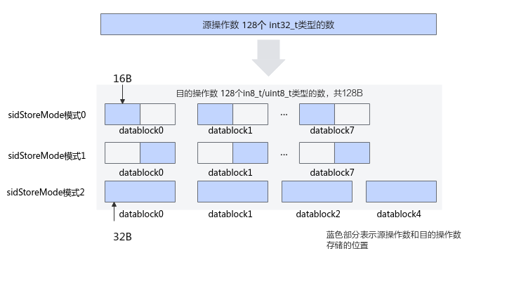

# 增强数据搬运-DataCopy-数据搬运-基础API-Ascend C算子开发接口-API-CANN社区版8.5.0开发文档-昇腾社区
**页面ID:** atlasascendc_api_07_0104
**来源:** https://www.hiascend.com/document/detail/zh/CANNCommunityEdition/850/API/ascendcopapi/atlasascendc_api_07_0104.html
---

# 增强数据搬运

#### 产品支持情况

| 产品 | 是否支持源操作数和目的操作数类型一致的原型 | 是否支持源操作数和目的操作数类型不一致的原型 |
| --- | --- | --- |
| Atlas A3 训练系列产品/Atlas A3 推理系列产品 | √ | x |
| Atlas A2 训练系列产品/Atlas A2 推理系列产品 | √ | x |
| Atlas 200I/500 A2 推理产品 | √ | x |
| Atlas 推理系列产品AI Core | √ | √ |
| Atlas 推理系列产品Vector Core | √ | x |
| Atlas 训练系列产品 | √ | x |

#### 功能说明

对数据搬运能力进行增强，相比于基础数据搬运接口，增加了CO1->CO2通路的随路计算。

#### 函数原型

- Global Memory -> Local Memory12template<typenameT>__aicore__inlinevoidDataCopy(constLocalTensor<T>&dst,constGlobalTensor<T>&src,constDataCopyParams&intriParams,constDataCopyEnhancedParams&enhancedParams)
- Local Memory -> Local Memory12template<typenameT>__aicore__inlinevoidDataCopy(constLocalTensor<T>&dst,constLocalTensor<T>&src,constDataCopyParams&intriParams,constDataCopyEnhancedParams&enhancedParams)
- Local Memory -> Global Memory12template<typenameT>__aicore__inlinevoidDataCopy(constGlobalTensor<T>&dst,constLocalTensor<T>&src,constDataCopyParams&intriParams,constDataCopyEnhancedParams&enhancedParams)
- Local Memory ->  Local  Memory，支持源操作数和目的操作数类型不一致12template<typenameT,typenameU>__aicore__inlinevoidDataCopy(constLocalTensor<T>&dst,constLocalTensor<U>&src,constDataCopyParams&intriParams,constDataCopyEnhancedParams&enhancedParams)

#### 参数说明

| 参数名 | 描述 |
| --- | --- |
| T、U | 操作数的数据类型。支持的数据类型请参考支持的通路和数据类型。 |

| 参数名称 | 输入/输出 | 含义 |
| --- | --- | --- |
| dst | 输出 | 目的操作数，类型为LocalTensor或GlobalTensor。 |
| src | 输入 | 源操作数，类型为LocalTensor或GlobalTensor。 |
| intriParams | 输入 | 搬运参数。DataCopyParams类型。 |
| enhancedParams | 输入 | 增强信息参数。DataCopyEnhancedParams类型。具体定义请参考${INSTALL_DIR}/include/ascendc/basic_api/interface/kernel_struct_data_copy.h，${INSTALL_DIR}请替换为CANN软件安装后文件存储路径。 |

| 参数名称 | 含义 |
| --- | --- |
| blockMode | 数据搬移基本分形，BlockMode枚举类型，支持以下配置：BLOCK_MODE_NORMAL：表示传输单位为32B。当前暂不支持。BLOCK_MODE_MATRIX：表示传输单位为一个16 * 16的cube分形。BLOCK_MODE_VECTOR：表示传输单位为一个1 * 16的cube分形。BLOCK_MODE_SMALL_CHANNEL：表示传输单位为一个16 * 4的cube分形。当前暂不支持。BLOCK_MODE_DEPTHWISE：表示传输单位为一个16 * 16的cube分形，提供随路channel-split功能。当前暂不支持。每种模式下对应的blockLen等参数单位见表4。 |
| deqScale | 随路精度转换辅助参数，即量化模式，支持的量化模式取值和对应的数据类型等信息请参考表5。其中DEQ、DEQ8、DEQ16模式，需要传入deqValue量化系数，设置deqValue的对应比特位；VDEQ、VDEQ8、VDEQ16模式，需要传入包含16个元素（deqValue）的量化参数向量，设置deqTensorAddr的对应比特位，同时保证DEQADDR中存储的反量化参数向量的每个元素（deqValue）都符合预期和使用限制。VDEQ模式下，反量化参数向量长度为32Byte（16个half元素）；其他模式下，反量化参数向量长度为128Byte（16个64bit的反量化元素）。 |
| deqValue | 量化系数。 deqValue的配置方式请参考deqValue配置方式。 |
| deqTensorAddr | UB中存储反量化参数向量的起始地址。deqScale为VDEQ/VDEQ8/VDEQ16模式时，需要传入反量化运算时的参数向量的地址。该地址要满足32B对齐。对于VDEQ模式，该地址指向32B大小的反量化参数向量，其中每个元素大小为16bit(half)。对于VDEQ8、VDEQ16模式，反量化参数向量中的每个元素大小都为64bit。搬运时会搬运blockCount个连续传输数据块，每个数据块的长度为blockLen。每个数据块对应一个128Byte的反量化向量。对于同一个数据块，反量化参数向量中的16个元素会被连续复用。不同的数据块，对应不同的反量化参数向量，地址会相应的偏移128B。例如：假设对应起始地址为A，第一个数据块的128B反量化参数向量起始地址为A，第二个数据块的128B反量化参数向量起始地址为A + 128B。同一个反量化参数向量的每一个元素的MCB标志位必须一致。 |
| sidStoreMode | 用于deqScale为DEQ8/VDEQ8时配置存储模式，控制反量化结果如何存储在dst地址中。配置效果参考sidStoreMode配置示意图。0：dst的数据存储在每个DataBlock的前半段，即每32B的高16B1：dst的数据存储在每个DataBlock的后半段，即每32B的低16B2：dst的数据存储在完整的DataBlock中，即整个32B |
| isRelu | 配置是否可以随路做线性整流操作。配置deqValue的情况下，如果该参数被置为true，那么会刷新deqValue的Relu标志位为1；如果被置为false，则不会做修改。配置deqTensorAddr的情况下，反量化参数向量元素中的Relu标志位不生效，以isRelu为准。仅配置isRelu，不配置量化参数，即deqValue配置为DEQ_NONE场景，支持src和dst的数据类型组合如下：{half，half}，{float，float}，{int32_t，int32_t}，{float，half}；同时配置isRelu和量化参数的场景，支持的数据类型组合参考表5。 |
| padMode | 预留参数，当前暂不支持。 |

| blockMode | src | dst | 数据类型 | blockLen单位 | srcStride单位 | dstStride单位 |
| --- | --- | --- | --- | --- | --- | --- |
| BLOCK_MODE_NORMAL | GM | A1 | int8_t、uint8_t、int16_t、uint16_t、int32_t、uint32_t、int64_t、 uint64_t、 half、bfloat16_t、float、double | 32B | 32B | 32B |
| GM | B1 | int8_t、uint8_t、int16_t、uint16_t、int32_t、uint32_t、int64_t、 uint64_t、 half、bfloat16_t、float、double | 32B | 32B | 32B |
| GM | VECIN | int8_t、uint8_t、int16_t、uint16_t、int32_t、uint32_t、int64_t、 uint64_t、 half、bfloat16_t、float、double | 32B | 32B | 32B |
| VECOUT | GM | int8_t、uint8_t、int16_t、uint16_t、int32_t、uint32_t、int64_t、 uint64_t、 half、bfloat16_t、float、double | 32B | 32B | 32B |
| VECIN | VECOUT | int8_t、uint8_t、int16_t、uint16_t、int32_t、uint32_t、int64_t、 uint64_t、 half、bfloat16_t、float、double | 32B | 32B | 32B |
| BLOCK_MODE_MATRIX | CO1 | CO2 | half、int16_t、uint16_t | 512B | 512B | 32B |
| CO1 | CO2 | float、int32_t、uint32_t | 1024B | 1024B | 32B |
| BLOCK_MODE_VECTOR | CO1 | CO2 | half、int16_t、uint16_t | 32B | 512B | 32B |
| CO1 | CO2 | float、int32_t、uint32_t | 64B | 1024B | 32B |

| 量化模式 | src.dtype | dst.dtype | 配合使用的参数 |
| --- | --- | --- | --- |
| DEQ | int32_t | half | deqValue中的变量M |
| DEQ | half | half |
| DEQ8 | int32_t | int8_t | deqValue变量M变量NMCB标志位OffsetSign标志位Relu标志位isRelu |
| DEQ8 | int32_t | uint8_t |
| DEQ16 | int32_t | half | deqValue变量M变量NMCB标志位Relu标志位isRelu |
| DEQ16 | int32_t | int16_t | deqValue变量NRelu标志位isRelu |
| VDEQ | int32_t | half | deqTensorAddr地址存储的反量化参数向量中的元素deqValue支持配置的参数分别对应DEQ/DEQ8/DEQ16的说明。deqTensorAddrDEQADDRRelu标志位isRelu |
| VDEQ8 | int32_t | int8_t |
| VDEQ8 | int32_t | uint8_t |
| VDEQ16 | int32_t | half |
| VDEQ16 | int32_t | int16_t |

| 模式 | 比特位数 | 变量名 | 作用介绍 |
| --- | --- | --- | --- |
| DEQ8、VDEQ8、DEQ16、VDEQ16 | 0~31 | M | 32位数视为float，作为反量化计算所需要乘的值。src为int32_t，dst为int16_t的场景下，变量M不生效。 |
| 32~35 | N | 4位比特位，表示范围为[1, 16](b'0000对应表示1， b'1111对应表示16)。当模式为DEQ8、VDEQ8时，MCB标志位置为1时，将输入的值进行右移N比特位。当模式为DEQ16、VDEQ16并且dst数据类型为int16_t时，直接进行N位的右移，不受MCB标志位控制。 |
| 36 | MCB标志位 | Mode Control Bit。如果置为0，输入的int32_t会被直接转换为float。如果置为1，输入的int32_t会先右移N比特位，转变成int16_t，然后转换为float。 |
| 37~45 | Offset | 9bit的整形数据，在进行反量化src * M的计算结果后与Offset进行相加。仅在DEQ8、VDEQ8模式中会用到。如果不使用offset，请置为0。 |
| 46 | Sign标志位 | 如果置为1，表明反量化结果是signed(int8)；如果为置为0，表明反量化结果是unsigned(uint8)。仅在DEQ8、VDEQ8模式中会用到。 |
| 47 | Relu标志位 | 如果置为1，对最终结果进行RELU计算；如果置为0，不进行额外计算。对于int32_t->int8_t，配置RELU时，offset必须配置成-128；对于int32_t->uint8_t，配置RELU时，offset必须配置成0。 |
| 48~63 | - | 预留 |
| DEQ、VDEQ | 0 ~ 15对应变量M， 这16位数被视为half，作为反量化计算需要乘的值。 |

#### 返回值说明

无

#### 约束说明

- 开发者需要保证DataCopyEnhancedParams中的isRelu参数配置和量化系数deqValue/量化参数向量deqTensorAddr的RELU标志位配置一致：都开启或都不开启。
- 如果CO1->CO2有随路精度转换，通路为UB的操作数的blockLen单位需要减半。

#### 支持的通路和数据类型

下文的数据通路均通过逻辑位置TPosition来表达，并注明了对应的物理通路。TPosition与物理内存的映射关系见表1。

| 支持型号 | 数据通路 | 源操作数和目的操作数的数据类型 (两者保持一致) |
| --- | --- | --- |
| Atlas 推理系列产品AI Core | CO1 -> CO2（L0C Buffer -> UB） | half、float、int32_t、uint32_t |

| 产品型号 | 数据通路 | 源操作数的数据类型 | 目的操作数的数据类型 |
| --- | --- | --- | --- |
| Atlas 推理系列产品AI Core | CO1 -> CO2（L0C Buffer -> UB） | float | half |
| int32_t | int8_t、uint8_t、int16_t、half |

| 支持型号 | 数据通路 |
| --- | --- |
| Atlas 训练系列产品 | GM -> VECINGM -> A1、B1VECIN -> VECCALC或VECCALC -> VECOUTVECOUT -> GM |
| Atlas 推理系列产品AI Core | GM -> VECINGM -> A1、B1VECIN -> VECCALC或VECCALC -> VECOUTVECIN、VECCALC、VECOUT -> A1、B1VECOUT、CO2 -> GM |
| Atlas 推理系列产品Vector Core | GM -> VECINVECOUT -> GM |
| Atlas A2 训练系列产品/Atlas A2 推理系列产品 | GM -> VECINGM -> A1、B1VECIN -> VECCALC或VECCALC -> VECOUTVECIN、VECCALC、VECOUT -> TSCMVECOUT -> GMA1、B1 -> GM |
| Atlas A3 训练系列产品/Atlas A3 推理系列产品 | GM -> VECINGM -> A1、B1VECIN -> VECCALC或VECCALC -> VECOUTVECIN、VECCALC、VECOUT -> TSCMVECOUT -> GMA1、B1 -> GM |
| Atlas 200I/500 A2 推理产品 | GM -> VECINVECOUT -> GM |

#### 调用示例

| 1234567891011 | AscendC::TPipepipe;AscendC::TQue<AscendC::TPosition::CO1,1>inQueueSrc;AscendC::TQue<AscendC::TPosition::CO2,1>outQueueDst;...AscendC::LocalTensor<half>srcLocal=inQueueSrc.AllocTensor<half>();AscendC::LocalTensor<half>dstLocal=outQueueDst.AllocTensor<half>();DataCopyParamsintriParams;DataCopyEnhancedParamsenhancedParams;enhancedParams.blockMode=BlockMode::BLOCK_MODE_MATRIX;AscendC::DataCopy(dstLocal,srcLocal,intriParams,enhancedParams);... |
| --- | --- |
