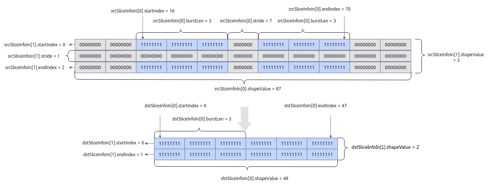

# 切片数据搬运-DataCopy-数据搬运-基础API-Ascend C算子开发接口-API-CANN社区版8.5.0开发文档-昇腾社区
**页面ID:** atlasascendc_api_07_0105
**来源:** https://www.hiascend.com/document/detail/zh/CANNCommunityEdition/850/API/ascendcopapi/atlasascendc_api_07_0105.html
---

# 切片数据搬运

#### 产品支持情况

| 产品 | 是否支持 |
| --- | --- |
| Atlas A3 训练系列产品/Atlas A3 推理系列产品 | √ |
| Atlas A2 训练系列产品/Atlas A2 推理系列产品 | √ |
| Atlas 200I/500 A2 推理产品 | x |
| Atlas 推理系列产品AI Core | √ |
| Atlas 推理系列产品Vector Core | x |
| Atlas 训练系列产品 | x |

#### 功能说明

支持数据的切片搬运，提取多维Tensor数据的子集进行搬运。

#### 函数原型

- Global Memory -> Local Memory12template<typenameT>__aicore__inlinevoidDataCopy(constLocalTensor<T>&dst,constGlobalTensor<T>&src,constSliceInfodstSliceInfo[],constSliceInfosrcSliceInfo[],constuint32_tdimValue=1)
- Local Memory -> Global Memory12template<typenameT>__aicore__inlinevoidDataCopy(constGlobalTensor<T>&dst,constLocalTensor<T>&src,constSliceInfodstSliceInfo[],constSliceInfosrcSliceInfo[],constuint32_tdimValue=1)

#### 参数说明

| 参数名 | 描述 |
| --- | --- |
| T | 源操作数和目的操作数的数据类型。支持的数据类型请参考支持的通路和数据类型。 |

| 参数名称 | 输入/输出 | 含义 |
| --- | --- | --- |
| dst | 输出 | 目的操作数，类型为LocalTensor或GlobalTensor。 |
| src | 输入 | 源操作数，类型为LocalTensor或GlobalTensor。 |
| srcSliceInfo/dstSliceInfo | 输入 | 目的操作数/源操作数切片信息，SliceInfo类型。具体定义请参考${INSTALL_DIR}/include/ascendc/basic_api/interface/kernel_struct_data_copy.h，${INSTALL_DIR}请替换为CANN软件安装后文件存储路径。 |
| dimValue | 输入 | 操作数维度信息，默认值为1。 |

| 参数名称 | 含义 |
| --- | --- |
| startIndex | 切片的起始元素位置。 |
| endIndex | 切片的终止元素位置。 |
| stride | 切片的间隔元素个数。 |
| burstLen | 横向切片，每一片数据的长度，仅在维度为1时生效，超出1维的情况下，必须配置为1，不支持配置成其他值。单位为datablock（32B）。比如，srcSliceInfo的List为 {{16, 70, 7, 3, 87},  {0, 2, 1, 1, 3}}，{16, 70, 7, 3, 87}表示第一维的切片信息，burstLen设置为3，表示一个切片数据段大小为3个datablock； {0, 2, 1, 1, 3}为第二维的切片信息，burstLen仅能设置为1。 |
| shapeValue | 当前维度的原始长度。单位为元素个数。 |

通过具体的示例对上述参数进行解析，示意图如下：

- dimValue为2，表示操作数有2维。
- srcSliceInfo为 {{16, 70, 7, 3, 87},  {0, 2, 1, 1, 3}}{16, 70, 7, 3, 87}是针对单独一行， 即从一维的角度来配置，每个元素代表一个数：startIndex= 16，表示有效数据段从第16个数开始；endIndex= 70，表示有效数据段到第70个数结束；stride= 7，单位为元素个数，表示相邻的2个切片数据段间隔的元素个数，为7个0的间距；burstLen= 3，单位为32B，表示在这一个有效数据段中，一个切片数据段大小为3个datablock；shapeValue= 87，表示单独一行的长度，单位为元素个数，即 8 * 10 + 7 = 87个元素。{0, 2, 1, 1, 3}是针对多行，即从二维的角度来配置，每个元素代表一行：startIndex= 0，表示有效数据段从第0行开始；endIndex= 2，表示有效数据段到第2行结束；stride= 1，表示相邻的2个切片数据段中间隔元素为1行；burstLen= 1，在dimValue > 1时必须填为1；shapeValue= 3，表明一共有3行。
- dstSliceInfo为{{0, 47, 0, 3, 48}, {0, 1, 0, 1, 2}}{0, 47, 0, 3, 48}是针对单独一行， 即从一维的角度来配置，每个元素代表一个数：startIndex= 0，表示有效数据段从第0个数开始；endIndex= 47，表示有效数据段到第47个数结束；stride= 0，单位为元素个数，表示相邻的2个切片数据段间隔的元素个数，为0表示两个切片数据段没有间距；burstLen= 3，单位为32B，表示在这一个有效数据段中，一个切片数据段大小为3个datablock；shapeValue= 48，表示单独一行的长度，单位为元素个数，即8 * 6 = 48个元素。{0, 1, 0, 1, 2} 是针对多行，即从二维的角度来配置，每个元素代表1行：startIndex= 0，表示有效数据段从第0行开始；endIndex= 1，表示有效数据段到第1行结束；stride= 0，表示相邻的2个切片数据段没有间隔；burstLen= 1，在dimValue > 1时必须填为1；shapeValue= 2，表示一共有2行。

#### 返回值说明

无

#### 约束说明

- 切片数据搬运中的横向burstLen大小设置，需要用户自己通过计算：横向切片元素个数* sizeof(T)/32byte。横向切片元素个数* sizeof(T)的大小必须是32byte的倍数。
- 切片数据搬运中的SliceInfo结构体数组大小和dimValue需要保持一致，并且不超过8。
- 切片数据搬运中的srcSliceInfo数组大小的和dstSliceInfo的大小需要保持一致，两者的结构体中的burstLen需要相等（srcSliceInfo[i].burstLen = dstSliceInfo[i].burstLen）。
- 切片数据搬运对参数有一定要求，建议使用者参考调用示例，并在CPU上仿真结果无误后，再到NPU侧执行。

#### 支持的通路和数据类型

下文的数据通路均通过逻辑位置TPosition来表达，并注明了对应的物理通路。TPosition与物理内存的映射关系见表1。

| 产品型号 | 数据通路 | 源操作数和目的操作数的数据类型（两者保持一致） |
| --- | --- | --- |
| Atlas 推理系列产品AI Core | GM -> VECIN（GM -> UB） | int8_t、uint8_t、int16_t、uint16_t、int32_t、uint32_t、half、float |
| Atlas A2 训练系列产品/Atlas A2 推理系列产品 | GM -> VECIN（GM -> UB） | int8_t、uint8_t、int16_t、uint16_t、int32_t、uint32_t、half、bfloat16_t、float |
| Atlas A3 训练系列产品/Atlas A3 推理系列产品 | GM -> VECIN（GM -> UB） | int8_t、uint8_t、int16_t、uint16_t、int32_t、uint32_t、half、bfloat16_t、float |

| 产品型号 | 数据通路 | 源操作数和目的操作数的数据类型（两者保持一致） |
| --- | --- | --- |
| Atlas 推理系列产品AI Core | VECOUT、CO2 -> GM（UB -> GM） | int8_t、uint8_t、int16_t、uint16_t、int32_t、uint32_t、half、float |
| Atlas A2 训练系列产品/Atlas A2 推理系列产品 | VECOUT -> GM（UB -> GM） | int8_t、uint8_t、int16_t、uint16_t、int32_t、uint32_t、half、bfloat16_t、float |
| Atlas A3 训练系列产品/Atlas A3 推理系列产品 | VECOUT -> GM（UB -> GM） | int8_t、uint8_t、int16_t、uint16_t、int32_t、uint32_t、half、bfloat16_t、float |

#### 调用示例

| 12345678910111213141516171819202122232425262728293031323334353637383940414243444546474849505152535455565758596061626364 | #include"kernel_operator.h"// 本样例中tensor数据类型为floattemplate<typenameT>classKernelDataCopySliceGM2UB{public:__aicore__inlineKernelDataCopySliceGM2UB(){}__aicore__inlinevoidInit(__gm__uint8_t*dstGm,__gm__uint8_t*srcGm){AscendC::SliceInfosrcSliceInfoIn[]={{16,70,7,3,87},{0,2,1,1,3}};// 如输入数据示例：startIndex为16，endIndex为70，burstLen为3，stride为7, shapeValue为87。AscendC::SliceInfodstSliceInfoIn[]={{0,47,0,3,48},{0,1,0,1,2}};// UB空间相对紧张，建议设置stride为0。uint32_tdimValueIn=2;uint32_tdstDataSize=96;uint32_tsrcDataSize=261;dimValue=dimValueIn;for(uint32_ti=0;i<dimValueIn;i++){srcSliceInfo[i].startIndex=srcSliceInfoIn[i].startIndex;srcSliceInfo[i].endIndex=srcSliceInfoIn[i].endIndex;srcSliceInfo[i].stride=srcSliceInfoIn[i].stride;srcSliceInfo[i].burstLen=srcSliceInfoIn[i].burstLen;srcSliceInfo[i].shapeValue=srcSliceInfoIn[i].shapeValue;dstSliceInfo[i].startIndex=dstSliceInfoIn[i].startIndex;dstSliceInfo[i].endIndex=dstSliceInfoIn[i].endIndex;dstSliceInfo[i].stride=dstSliceInfoIn[i].stride;dstSliceInfo[i].burstLen=dstSliceInfoIn[i].burstLen;dstSliceInfo[i].shapeValue=dstSliceInfoIn[i].shapeValue;}srcGlobal.SetGlobalBuffer((__gm__T*)srcGm);dstGlobal.SetGlobalBuffer((__gm__T*)dstGm);pipe.InitBuffer(inQueueSrcVecIn,1,dstDataSize*sizeof(T));}__aicore__inlinevoidProcess(){CopyIn();CopyOut();}private:__aicore__inlinevoidCopyIn(){AscendC::LocalTensor<T>srcLocal=inQueueSrcVecIn.AllocTensor<T>();AscendC::DataCopy(srcLocal,srcGlobal,dstSliceInfo,srcSliceInfo,dimValue);inQueueSrcVecIn.EnQue(srcLocal);}__aicore__inlinevoidCopyOut(){AscendC::LocalTensor<T>srcOutLocal=inQueueSrcVecIn.DeQue<T>();AscendC::DataCopy(dstGlobal,srcOutLocal,dstSliceInfo,dstSliceInfo,dimValue);inQueueSrcVecIn.FreeTensor(srcOutLocal);}private:AscendC::TPipepipe;AscendC::TQue<AscendC::TPosition::VECIN,1>inQueueSrcVecIn;AscendC::GlobalTensor<T>srcGlobal;AscendC::GlobalTensor<T>dstGlobal;AscendC::SliceInfodstSliceInfo[K_MAX_DIM];AscendC::SliceInfosrcSliceInfo[K_MAX_DIM];// K_MAX_DIM = 8uint32_tdimValue;};extern"C"__global____aicore__voidkernel_data_copy_slice_out2ub(__gm__uint8_t*src_gm,__gm__uint8_t*dst_gm){KernelDataCopySliceGM2UB<TYPE>op;op.Init(dst_gm,src_gm);op.Process();} |
| --- | --- |

结果示例请参考图1。
