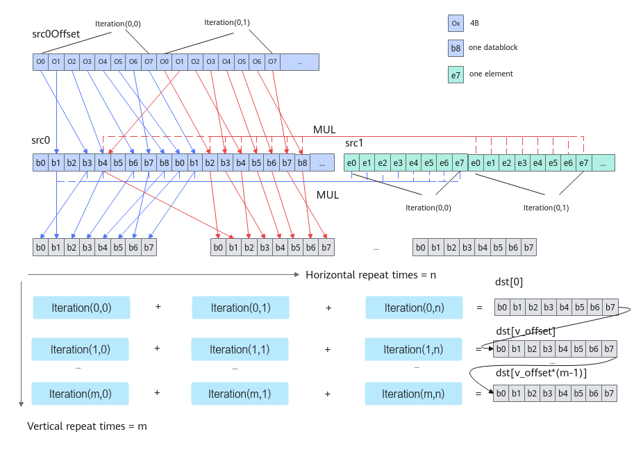

# BilinearInterpolation(ISASI)-基础算术-矢量计算-基础API-Ascend C算子开发接口-API-CANN社区版8.5.0开发文档-昇腾社区
**页面ID:** atlasascendc_api_07_0222
**来源:** https://www.hiascend.com/document/detail/zh/CANNCommunityEdition/850/API/ascendcopapi/atlasascendc_api_07_0222.html
---

# BilinearInterpolation(ISASI)

#### 产品支持情况

| 产品 | 是否支持 |
| --- | --- |
| Atlas A3 训练系列产品/Atlas A3 推理系列产品 | √ |
| Atlas A2 训练系列产品/Atlas A2 推理系列产品 | √ |
| Atlas 200I/500 A2 推理产品 | x |
| Atlas 推理系列产品AI Core | √ |
| Atlas 推理系列产品Vector Core | x |
| Atlas 训练系列产品 | x |

#### 功能说明

功能分为水平迭代和垂直迭代。每个水平迭代顺序地从src0Offset读取8个偏移值，表示src0的偏移，每个偏移值指向src0的一个DataBlock的起始地址，如果repeatMode=false，从src1中取一个值，与src0中8个DataBlock中每个值进行乘操作；如果repeatMode=true，从src1中取8个值，按顺序与src0中8个DataBlock中的值进行乘操作，最后当前迭代的dst结果与前一个dst结果按DataBlock进行累加，存入目的地址，在同一个水平迭代内dst地址不变。然后进行垂直迭代，垂直迭代的dst起始地址为上一轮垂直迭代的dst起始地址加上vROffset，本轮垂直迭代占用dst空间为dst起始地址之后的8个DataBlock，每轮垂直迭代进行hRepeat次水平迭代。

#### 函数原型

- mask逐bit模式：12template<typenameT>__aicore__inlinevoidBilinearInterpolation(constLocalTensor<T>&dst,constLocalTensor<T>&src0,constLocalTensor<uint32_t>&src0Offset,constLocalTensor<T>&src1,uint64_tmask[],uint8_thRepeat,boolrepeatMode,uint16_tdstBlkStride,uint16_tvROffset,uint8_tvRepeat,constLocalTensor<uint8_t>&sharedTmpBuffer)
- mask连续模式：12template<typenameT>__aicore__inlinevoidBilinearInterpolation(constLocalTensor<T>&dst,constLocalTensor<T>&src0,constLocalTensor<uint32_t>&src0Offset,constLocalTensor<T>&src1,uint64_tmask,uint8_thRepeat,boolrepeatMode,uint16_tdstBlkStride,uint16_tvROffset,uint8_tvRepeat,constLocalTensor<uint8_t>&sharedTmpBuffer)

#### 参数说明

| 参数名 | 描述 |
| --- | --- |
| T | 操作数数据类型。Atlas A2 训练系列产品/Atlas A2 推理系列产品，支持的数据类型为：half。Atlas A3 训练系列产品/Atlas A3 推理系列产品，支持的数据类型为：half。Atlas 推理系列产品AI Core，支持的数据类型为：half。 |

| 参数名 | 输入/输出 | 描述 |
| --- | --- | --- |
| dst | 输出 | 目的操作数。类型为LocalTensor，支持的TPosition为VECIN/VECCALC/VECOUT。LocalTensor的起始地址需要32字节对齐。 |
| src0、src1 | 输入 | 源操作数。类型为LocalTensor，支持的TPosition为VECIN/VECCALC/VECOUT。LocalTensor的起始地址需要32字节对齐。两个源操作数的数据类型需要与目的操作数保持一致。 |
| src0Offset | 输入 | 源操作数。类型为LocalTensor，支持的TPosition为VECIN/VECCALC/VECOUT。LocalTensor的起始地址需要32字节对齐。 |
| mask[]/mask | 输入 | mask用于控制每次迭代内参与计算的元素。逐bit模式：可以按位控制哪些元素参与计算，bit位的值为1表示参与计算，0表示不参与。mask为数组形式，数组长度和数组元素的取值范围和操作数的数据类型有关。当操作数为16位时，数组长度为2，mask[0]、mask[1]∈[0, 264-1]并且不同时为0；当操作数为32位时，数组长度为1，mask[0]∈(0, 264-1]；当操作数为64位时，数组长度为1，mask[0]∈(0, 232-1]。例如，mask=[8, 0]，8=0b1000，表示仅第4个元素参与计算。连续模式：表示前面连续的多少个元素参与计算。取值范围和操作数的数据类型有关，数据类型不同，每次迭代内能够处理的元素个数最大值不同。当操作数为16位时，mask∈[1, 128]；当操作数为32位时，mask∈[1, 64]；当操作数为64位时，mask∈[1, 32]。 |
| hRepeat | 输入 | 水平方向迭代次数，取值范围为[1, 255]。 |
| repeatMode | 输入 | 迭代模式：false：每次迭代src0读取的8个datablock中每个值均与src1的单个数值相乘。true：每次迭代src0的每个datablock分别与src1的1个数值相乘，共消耗8个block和8个elements。 |
| dstBlkStride | 输入 | 单次迭代内，目的操作数不同DataBlock间地址步长，以32B为单位。 |
| vROffset | 输入 | 垂直迭代间，目的操作数地址偏移量，以元素为单位，取值范围为[128, 65535)，vROffset * sizeof(T)需要保证32字节对齐 。 |
| vRepeat | 输入 | 垂直方向迭代次数，取值范围为[1, 255]。 |
| sharedTmpBuffer | 输入 | 临时空间。Atlas A2 训练系列产品/Atlas A2 推理系列产品，需要保证至少分配了src0.GetSize() * 32 + src1.GetSize() * 32字节的空间。Atlas A3 训练系列产品/Atlas A3 推理系列产品，需要保证至少分配了src0.GetSize() * 32 + src1.GetSize() * 32字节的空间。Atlas 推理系列产品AI Core，需要保证至少分配了src0OffsetLocal.GetSize() * sizeof(uint32_t)字节的空间。 |

#### 返回值说明

无

#### 约束说明

- 操作数地址对齐要求请参见通用地址对齐约束。

- src0、src1、src0Offset之间不允许地址重叠，且两个垂直repeat的目的地址之间不允许地址重叠。

#### 调用示例

- 接口样例-mask连续模式123456789101112AscendC::LocalTensor<half>dstLocal,src0Local,src1Local;AscendC::LocalTensor<uint32_t>src0OffsetLocal;AscendC::LocalTensor<uint8_t>tmpLocal;uint64_tmask=128;// mask连续模式uint8_thRepeat=2;// 水平迭代2次boolrepeatMode=false;// 迭代模式uint16_tdstBlkStride=1;// 单次迭代内数据连续写入uint16_tvROffset=128;// 相邻迭代间数据连续写入uint8_tvRepeat=2;// 垂直迭代2次AscendC::BilinearInterpolation(dstLocal,src0Local,src0OffsetLocal,src1Local,mask,hRepeat,repeatMode,dstBlkStride,vROffset,vRepeat,tmpLocal);
- 接口样例-mask逐bit模式123456789101112AscendC::LocalTensor<half>dstLocal,src0Local,src1Local;AscendC::LocalTensor<uint32_t>src0OffsetLocal;AscendC::LocalTensor<uint8_t>tmpLocal;uint64_tmask[2]={UINT64_MAX,UINT64_MAX};// mask逐bit模式uint8_thRepeat=2;// 水平迭代2次boolrepeatMode=false;// 迭代模式uint16_tdstBlkStride=1;// 单次迭代内数据连续写入uint16_tvROffset=128;// 相邻迭代间数据连续写入uint8_tvRepeat=2;// 垂直迭代2次AscendC::BilinearInterpolation(dstLocal,src0Local,src0OffsetLocal,src1Local,mask,hRepeat,repeatMode,dstBlkStride,vROffset,vRepeat,tmpLocal);
