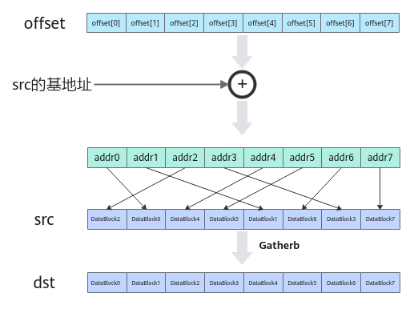

# Gatherb(ISASI)-离散与聚合-矢量计算-基础API-Ascend C算子开发接口-API-CANN社区版8.5.0开发文档-昇腾社区
**页面ID:** atlasascendc_api_07_0234
**来源:** https://www.hiascend.com/document/detail/zh/CANNCommunityEdition/850/API/ascendcopapi/atlasascendc_api_07_0234.html
---

# Gatherb(ISASI)

#### 产品支持情况

| 产品 | 是否支持 |
| --- | --- |
| Atlas A3 训练系列产品/Atlas A3 推理系列产品 | √ |
| Atlas A2 训练系列产品/Atlas A2 推理系列产品 | √ |
| Atlas 200I/500 A2 推理产品 | √ |
| Atlas 推理系列产品AI Core | x |
| Atlas 推理系列产品Vector Core | x |
| Atlas 训练系列产品 | x |

#### 功能说明

给定一个输入的张量和一个地址偏移张量，本接口根据偏移地址按照DataBlock的粒度将输入张量收集到结果张量中。

#### 函数原型

| 12 | template<typenameT>__aicore__inlinevoidGatherb(constLocalTensor<T>&dst,constLocalTensor<T>&src0,constLocalTensor<uint32_t>&offset,constuint8_trepeatTime,constGatherRepeatParams&repeatParams) |
| --- | --- |

#### 参数说明

| 参数名 | 描述 |
| --- | --- |
| T | 操作数数据类型。Atlas A3 训练系列产品/Atlas A3 推理系列产品，支持的数据类型为：uint16_t/uint32_tAtlas A2 训练系列产品/Atlas A2 推理系列产品，支持的数据类型为：uint16_t/uint32_tAtlas 200I/500 A2 推理产品，支持的数据类型为：int8_t/uint8_t/int16_t/uint16_t/half/float/int32_t/uint32_t/bfloat16_t/int64_t |

| 参数名称 | 输入/输出 | 含义 |
| --- | --- | --- |
| dst | 输出 | 目的操作数。类型为LocalTensor，支持的TPosition为VECIN/VECCALC/VECOUT。LocalTensor的起始地址需要32字节对齐。 |
| src0 | 输入 | 源操作数。类型为LocalTensor，支持的TPosition为VECIN/VECCALC/VECOUT。LocalTensor的起始地址需要32字节对齐。源操作数的数据类型需要与目的操作数保持一致。 |
| offset | 输入 | 每个datablock在源操作数中对应的地址偏移。类型为LocalTensor，支持的TPosition为VECIN/VECCALC/VECOUT。LocalTensor的起始地址需要32字节对齐。该偏移量是相对于src0的基地址而言的。每个元素值要大于等于0，单位为字节；且需要保证偏移后的地址满足32字节对齐。 |
| repeatTime | 输入 | 重复迭代次数，每次迭代完成8个datablock的数据收集，数据范围：repeatTime∈（0,255]。 |
| repeatParams | 输入 | 用于控制指令迭代的相关参数。类型为GatherRepeatParams，具体定义可参考${INSTALL_DIR}/include/ascendc/basic_api/interface/kernel_struct_gather.h。${INSTALL_DIR}请替换为CANN软件安装后文件存储路径。其中dstBlkStride、dstRepStride支持用户配置，参数说明参考表3。 |

| 参数名称 | 含义 |
| --- | --- |
| dstBlkStride | 单次迭代内，矢量目的操作数不同datablock间的地址步长。 |
| dstRepStride | 相邻迭代间，矢量目的操作数相同datablock间的地址步长。 |
| blockNumber | 预留参数。为后续的功能做保留，开发者暂时无需关注，使用默认值即可。 |
| src0BlkStride |
| src1BlkStride |
| src0RepStride |
| src1RepStride |
| repeatStrideMode |
| strideSizeMode |

#### 约束说明

无

#### 调用示例

| 1234567891011121314151617181920212223242526272829303132333435363738394041424344454647484950515253545556575859606162636465666768697071727374757677 | #include"kernel_operator.h"classVgatherbCase{public:__aicore__inlineVgatherbCase(){}__aicore__inlinevoidInit(__gm__uint8_t*x,__gm__uint8_t*y,__gm__uint8_t*offset){x_gm.SetGlobalBuffer(reinterpret_cast<__gm__uint16_t*>(x));y_gm.SetGlobalBuffer(reinterpret_cast<__gm__uint16_t*>(y));offset_gm.SetGlobalBuffer(reinterpret_cast<__gm__uint32_t*>(offset));uint32_tlen=128;bufferLen=len;tpipe.InitBuffer(vecIn,2,bufferLen*sizeof(uint16_t));tpipe.InitBuffer(vecOffset,2,8*sizeof(uint32_t));tpipe.InitBuffer(vecOut,2,bufferLen*sizeof(uint16_t));}__aicore__inlinevoidCopyIn(uint32_tindex){autox_buf=vecIn.AllocTensor<uint16_t>();autooffset_buf=vecOffset.AllocTensor<uint32_t>();AscendC::DataCopy(x_buf,x_gm[index*bufferLen],bufferLen);AscendC::DataCopy(offset_buf,offset_gm[0],8);vecIn.EnQue(x_buf);vecOffset.EnQue(offset_buf);}__aicore__inlinevoidCopyOut(uint32_tindex){autoy_buf=vecOut.DeQue<uint16_t>();AscendC::DataCopy(y_gm[index*bufferLen],y_buf,bufferLen);vecOut.FreeTensor(y_buf);}__aicore__inlinevoidCompute(){autox_buf=vecIn.DeQue<uint16_t>();autooffset_buf=vecOffset.DeQue<uint32_t>();autoy_buf=vecOut.AllocTensor<uint16_t>();AscendC::GatherRepeatParamsparams{1,8};uint8_trepeatTime=bufferLen*sizeof(uint16_t)/256;AscendC::Gatherb<uint16_t>(y_buf,x_buf,offset_buf,repeatTime,params);vecIn.FreeTensor(x_buf);vecOffset.FreeTensor(offset_buf);vecOut.EnQue(y_buf);}__aicore__inlinevoidProcess(){for(inti=0;i<1;i++){CopyIn(i);Compute();CopyOut(i);}}private:AscendC::GlobalTensor<uint16_t>x_gm;AscendC::GlobalTensor<uint16_t>y_gm;AscendC::GlobalTensor<uint32_t>offset_gm;AscendC::TPipetpipe;AscendC::TQue<AscendC::TPosition::VECIN,2>vecIn;AscendC::TQue<AscendC::TPosition::VECIN,2>vecOffset;AscendC::TQue<AscendC::TPosition::VECOUT,2>vecOut;uint32_tbufferLen=0;};extern"C"__global____aicore__voidvgatherb_core(__gm__uint8_t*x,__gm__uint8_t*y,__gm__uint8_t*offset){VgatherbCaseop;op.Init(x,y,offset);op.Process();} |
| --- | --- |
