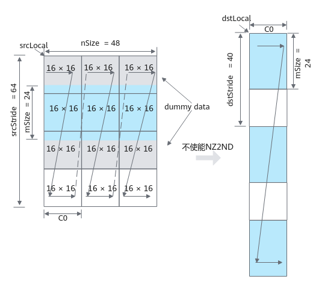
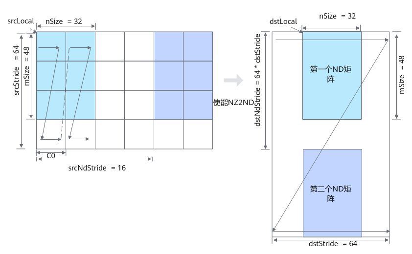

# Fixpipe-数据搬运-矩阵计算（ISASI）-基础API-Ascend C算子开发接口-API-CANN社区版8.5.0开发文档-昇腾社区
**页面ID:** atlasascendc_api_07_0251
**来源:** https://www.hiascend.com/document/detail/zh/CANNCommunityEdition/850/API/ascendcopapi/atlasascendc_api_07_0251.html
---

# Fixpipe

#### 产品支持情况

| 产品 | 是否支持 |
| --- | --- |
| Atlas A3 训练系列产品/Atlas A3 推理系列产品 | 仅支持包含FixpipeParamsV220参数的接口。 |
| Atlas A2 训练系列产品/Atlas A2 推理系列产品 | 仅支持包含FixpipeParamsV220参数的接口。 |
| Atlas 200I/500 A2 推理产品 | 仅支持包含FixpipeParamsM300参数的接口。 |
| Atlas 推理系列产品AI Core | x |
| Atlas 推理系列产品Vector Core | x |
| Atlas 训练系列产品 | x |

#### 功能说明

矩阵计算完成后，对结果进行处理，例如对计算结果进行量化操作，并把数据从CO1搬迁到Global Memory中。

#### 函数原型

- 传入FixpipeParamsV220通路CO1->GM，不使能tensor量化功能：12template<typenameT,typenameU,constFixpipeConfig&config=CFG_ROW_MAJOR>__aicore__inlinevoidFixpipe(constGlobalTensor<T>&dst,constLocalTensor<U>&src,constFixpipeParamsV220&intriParams)通路CO1->GM，使能tensor量化功能：12template<typenameT,typenameU,constFixpipeConfig&config=CFG_ROW_MAJOR,typenameS=uint64_t,typenameStd::enable_if<Std::is_same<PrimT<S>,uint64_t>::value,bool>::type=true>__aicore__inlinevoidFixpipe(constGlobalTensor<T>&dst,constLocalTensor<U>&src,constLocalTensor<S>&cbufWorkspace,constFixpipeParamsV220&intriParams)

- 传入FixpipeParamsM300通路CO1->UB，不使能tensor量化功能：12template<typenameT,typenameU,constFixpipeConfig&config=CFG_ROW_MAJOR>__aicore__inlinevoidFixpipe(constLocalTensor<T>&dst,constLocalTensor<U>&src,constFixpipeParamsM300&intriParams)通路CO1->UB，使能tensor量化功能：12template<typenameT,typenameU,constFixpipeConfig&config=CFG_ROW_MAJOR,typenameS=uint64_t,typenameStd::enable_if<Std::is_same<PrimT<S>,uint64_t>::value,bool>::type=true>__aicore__inlinevoidFixpipe(constLocalTensor<T>&dst,constLocalTensor<U>&src,constLocalTensor<S>&cbufWorkspace,constFixpipeParamsM300&intriParams);通路CO1->GM，不使能tensor量化功能：12template<typenameT,typenameU,constFixpipeConfig&config=CFG_ROW_MAJOR>__aicore__inlinevoidFixpipe(constGlobalTensor<T>&dst,constLocalTensor<U>&src,constFixpipeParamsM300&intriParams)通路CO1->GM，使能tensor量化功能：12template<typenameT,typenameU,constFixpipeConfig&config=CFG_ROW_MAJOR,typenameS=uint64_t,typenameStd::enable_if<Std::is_same<PrimT<S>,uint64_t>::value,bool>::type=true>__aicore__inlinevoidFixpipe(constGlobalTensor<T>&dst,constLocalTensor<U>&src,constLocalTensor<S>&cbufWorkspace,constFixpipeParamsM300&intriParams)

#### 参数说明

| 参数名 | 描述 |
| --- | --- |
| T | 目的操作数数据类型。 |
| U | 源操作数数据类型。 |
| config | Fixpipe相关配置参数，类型为FixpipeConfig。取值如下：CFG_ROW_MAJOR（默认取值）：使能NZ2ND，输出数据格式为ND格式。CFG_NZ: 不使能NZ2ND，输出数据格式为NZ格式。12345678910structFixpipeConfig{CO2Layoutformat;};enumclassCO2Layout:uint8_t{NZ=0,// 输出数据格式仍为NZ格式。ROW_MAJOR,// 使能NZ2ND，输出数据格式为ND格式。};constexprFixpipeConfigCFG_NZ={CO2Layout::NZ};constexprFixpipeConfigCFG_ROW_MAJOR={CO2Layout::ROW_MAJOR}; | 12345678910 | structFixpipeConfig{CO2Layoutformat;};enumclassCO2Layout:uint8_t{NZ=0,// 输出数据格式仍为NZ格式。ROW_MAJOR,// 使能NZ2ND，输出数据格式为ND格式。};constexprFixpipeConfigCFG_NZ={CO2Layout::NZ};constexprFixpipeConfigCFG_ROW_MAJOR={CO2Layout::ROW_MAJOR}; |
| 12345678910 | structFixpipeConfig{CO2Layoutformat;};enumclassCO2Layout:uint8_t{NZ=0,// 输出数据格式仍为NZ格式。ROW_MAJOR,// 使能NZ2ND，输出数据格式为ND格式。};constexprFixpipeConfigCFG_NZ={CO2Layout::NZ};constexprFixpipeConfigCFG_ROW_MAJOR={CO2Layout::ROW_MAJOR}; |
| S | cbufWorkspace的数据类型。当目的操作数、源操作数 、cbufWorkspace使用基础数据类型时，模板参数S必须为uint64_t类型，否则编译失败。当目的操作数、源操作数 、cbufWorkspace使用TensorTrait类型时，模板参数S的LiteType必须为uint64_t类型，否则编译失败。模板参数S后一个模板参数仅用于上述数据类型检查，用户无需关注。 |

| 参数名称 | 输入/输出 | 含义 |
| --- | --- | --- |
| dst | 输出 | 目的操作数，类型为LocalTensor或GlobalTensor。针对LocalTensor：Atlas 200I/500 A2 推理产品，支持的数据类型为：int8_t、uint8_t、half、bfloat16_t、float、half、int32_t。针对GlobalTensor：Atlas A3 训练系列产品/Atlas A3 推理系列产品，支持的数据类型为：int8_t、uint8_t、half、bfloat16_t、int32_t、float。Atlas A2 训练系列产品/Atlas A2 推理系列产品，支持的数据类型为：int8_t、uint8_t、half、bfloat16_t、int32_t、float。Atlas 200I/500 A2 推理产品，支持的数据类型为：int8_t、uint8_t、half、bfloat16_t、int32_t、float。数据格式为NZ或ND格式。经过Fixpipe处理，在量化操作之后，会将矩阵计算中多申请的数据删除。 |
| src | 输入 | 源操作数，支持的TPosition为CO1，为Mmad接口计算的结果，类型为LocalTensor数据结构的定义请参考LocalTensor。支持的数据类型为float/int32_t，支持的TPosition为CO1，数据格式为NZ格式。起始地址需要满足64B对齐。 |
| intriParams | 输入 | Fixpipe搬运参数，具体定义请参考${INSTALL_DIR}/include/ascendc/basic_api/interface/kernel_struct_fixpipe.h，${INSTALL_DIR}请替换为CANN软件安装后文件存储路径。参数说明请参考表3。 |
| cbufWorkspace | 输入 | 量化参数，类型为LocalTensor<uint64_t>，支持的TPosition为A1。仅当quantPre为VDEQF16/VQF322B8_PRE/VREQ8时支持，quantPre介绍请参考FixpipeParamsV220/FixpipeParamsM300/FixpipeParamsM310结构体中quantPre部分。 |

| 参数名称 | 数据类型 | 含义 |
| --- | --- | --- |
| nSize | 输入 | 源NZ矩阵在N方向上的大小。不使能NZ2ND功能若使能channelSplit功能，nSize必须为8的倍数，取值范围：nSize∈[1, 4095]。若不使能channelSplit功能，nSize必须为16的倍数，取值范围：nSize∈[1, 4095]。使能NZ2ND功能nSize取值范围 ∈[1, 4095]。 |
| mSize | 输入 | 源NZ矩阵在M方向上的大小。不使能NZ2ND功能取值范围：mSize∈[1, 65535]。使能NZ2ND功能取值范围：mSize∈[1, 8192]。 |
| srcStride | 输入 | 源NZ矩阵中相邻Z排布的起始地址偏移，取值范围：srcStride∈[0, 65535]， 单位：C0_Size(16*sizeof(T)，T为src的数据类型)。 |
| dstStride | 输入 | 不使能NZ2ND功能目的NZ矩阵中相邻Z排布的起始地址偏移，取值不为0， 单位：datablock(32Bytes)。使能NZ2ND功能目的ND矩阵每一行中的元素个数，取值不为0 ，单位：element。 |
| quantPre | 输入 | QuantMode_t是一个枚举类型，用于控制量化模式，默认值为QuantMode_t::NoQuant，即不使能量化功能。QuantMode_t取值如下：NoQuant，不使能量化功能F322F16，float量化成half，量化结果支持INF_NAN模式F322BF16，float量化成bfloat16_t，量化结果支持INF_NAN模式DEQF16，int32_t量化成half, scalar量化，量化结果不支持INF_NAN模式VDEQF16， int32_t量化成half，tensor量化，量化结果不支持INF_NAN模式QF322B8_PRE，float量化成uint8_t/int8_t，scalar量化VQF322B8_PRE，float量化成uint8_t/int8_t，tensor量化REQ8，int32_t量化成uint8_t/int8_t，scalar量化VREQ8，int32_t量化成uint8_t/int8_t，tensor量化 |
| deqScalar | 输入 | scalar量化参数，表示单个scale值，quantPre量化模式为scalar量化时需要设置该参数。支持的数据类型为uint64_t。 |
| ndNum | 输入 | 源NZ矩阵的数目，也就是传输ND矩阵的数目，取值范围：ndNum∈[1, 65535] |
| srcNdStride | 输入 | 不同NZ矩阵起始地址之间的间隔，取值范围：srcNdStride∈[1, 512]，单位：1024B。当ndNum配置为1时，srcNdStride配置为0即可，不生效。 |
| dstNdStride | 输入 | 目的相邻ND矩阵起始地址之间的偏移，取值范围：dstNdstride∈[1, 65535]，单位：element。当ndNum配置为1时，dstNdStride配置为0即可，不生效。 |
| reluEn | 输入 | 是否使能relu的开关，false：不使能relu功能；true：使能relu功能。 |
| unitFlag | 输入 | unitFlag是一种Mmad指令和Fixpipe指令细粒度的并行，使能该功能后，硬件每计算完一个分形，计算结果就会被搬出，该功能不适用于在L0C Buffer累加的场景。取值说明如下：0：保留值；2：使能unitFlag，硬件执行完指令之后，不会设置寄存器；3：使能unitFlag，硬件执行完指令之后，会将unitFlag关闭。使能该功能时，Fixpipe指令的unitFlag设置为3即可。 |
| isChannelSplit | 输入 | 是否使能通道拆分的功能。默认为false，不使能该功能。仅在src和dst都为float时才能使能通道拆分，且不能同时使能ChannelSplit和NZ2ND功能。 |

不使能NZ2ND的情况下，参数设置示例（通过Fixpipe接口搬运并去除dummy数据）和解释说明如下：

当M方向上的数据元素个数不是16的倍数时，搬入时会额外读取dummy数据，并在写入目标位置后丢弃这些dummy数据。矩阵块被定义为连续的16*16的数据块，个数为M/16向上取整，矩阵块的长度为M*16*sizeof(T)，T是数据类型。

- nSize = 48，表示源NZ矩阵中待搬运矩阵（图中蓝色区域）在N方向上的大小为48个元素。
- mSize = 24，表示源NZ矩阵中待搬运矩阵在M方向上的大小为24个元素。
- srcStride = 64，表示源NZ矩阵中待搬运矩阵相邻Z排布的起始地址偏移，即下图中第一个蓝色Z排布的起始地址与第二个蓝色Z排布的起始地址之间的间隔为64 * C0_Size。
- dstStride = 40，表示目的NZ矩阵中相邻Z排布的起始地址偏移，即下图中第一个蓝色Z排布的起始地址与第二个蓝色Z排布的起始地址之间的间隔为40 * 32B。

使能NZ2ND的情况下，参数设置示例和解释说明如下：

- ndNum = 2，表示源NZ矩阵的数目为2。图中蓝色区域为NZ矩阵1，紫色区域为NZ矩阵2。

- nSize = 32，表示源NZ矩阵（图中蓝色区域）在N方向上的大小为32个元素。
- mSize = 48，表示源NZ矩阵在M方向上的大小为48个元素。
- srcStride = 64，表示源NZ矩阵中相邻Z排布的起始地址偏移，即下图中第一个蓝色Z排布的起始地址与第二个蓝色Z排布的起始地址之间的间隔为64 * C0_Size。
- dstStride = 64，表示目的ND矩阵每一行中的元素个数为64。
- srcNdStride = 16,  表示不同NZ矩阵起始地址之间的间隔为16 *1024B。
- dstNdStride  = 4096，表示目的相邻ND矩阵起始地址之间的偏移为4096个元素。

#### 约束说明

- ndNum=0 表示不执行，此指令将不被执行并报warning。
- 对于量化输入为float32数据类型的说明如下：标准的IEEE 754 float32格式为：1bit符号位，8bits指数位，23bits尾数位；当前AI处理器支持的float32格式为：1bit符号位，8bits指数位，10bits尾数位。如果用户提供的是标准的IEEE 754 float32输入，API内部会处理成处理器支持的float32格式进行计算，此时如果golden数据生成过程中使用的是标准的IEEE 754 float32数据，则可能引入精度不匹配问题，需要修正golden数据的生成，将量化参数的23bits尾数位的低13bits数据位清零再参与量化计算。

#### 调用示例

- 示例一：通路CO1->GM，不使能tensor量化功能接口。输入A矩阵和B矩阵的数据类型为half，输出C矩阵为half，默认配置使能Nz2Nd的格式转换，使能F322F16量化将mmad计算出的结果由float量化成half。123456789101112131415161718192021222324252627282930313233343536373839404142434445464748495051525354555657585960616263646566676869707172737475767778798081828384858687888990919293949596979899100101102103104105106107108109110111112113114115116117118119120121122123124125126127128129130131132133134135136137138139140141142143144145146147148149150151152153154155156157158159160161162163164165#ifdef ASCENDC_CPU_DEBUG#include"tikicpulib.h"#endif#include"kernel_operator.h"template<typenameC_T,typenameA_T,typenameB_T,typenamedstCO1_T>classKernelMatmul{public:__aicore__inlineKernelMatmul(uint16_tmIn,uint8_tkIn,uint8_tnIn){m=mIn;k=kIn;n=nIn;aSize=m*k;bSize=k*n;cSize=m*n;mBlocks=m/AscendC::BLOCK_CUBE;nBlocks=n/AscendC::BLOCK_CUBE;kBlocks=k/(AscendC::ONE_BLK_SIZE/sizeof(A_T));}__aicore__inlinevoidInit(__gm__uint8_t*a,__gm__uint8_t*b,__gm__uint8_t*c){aGM.SetGlobalBuffer((__gm__A_T*)a);bGM.SetGlobalBuffer((__gm__B_T*)b);cGM.SetGlobalBuffer((__gm__C_T*)c);pipe.InitBuffer(inQueueA1,1,aSize*sizeof(A_T));pipe.InitBuffer(inQueueA2,1,aSize*sizeof(A_T));pipe.InitBuffer(inQueueB1,1,bSize*sizeof(B_T));pipe.InitBuffer(inQueueB2,2,bSize*sizeof(B_T));pipe.InitBuffer(outQueueCO1,1,cSize*sizeof(dstCO1_T));}__aicore__inlinevoidProcess(){CopyIn();SplitA();SplitB();Compute();CopyOut();}private:__aicore__inlinevoidCopyIn(){AscendC::LocalTensor<A_T>a1Local=inQueueA1.AllocTensor<A_T>();AscendC::LocalTensor<B_T>b1Local=inQueueB1.AllocTensor<B_T>();AscendC::Nd2NzParamsdataCopyA1Params;dataCopyA1Params.ndNum=1;dataCopyA1Params.nValue=m;dataCopyA1Params.dValue=k;dataCopyA1Params.srcNdMatrixStride=0;dataCopyA1Params.srcDValue=k;dataCopyA1Params.dstNzC0Stride=m;dataCopyA1Params.dstNzNStride=1;dataCopyA1Params.dstNzMatrixStride=0;AscendC::Nd2NzParamsdataCopyB1Params;dataCopyB1Params.ndNum=1;dataCopyB1Params.nValue=k;dataCopyB1Params.dValue=n;dataCopyB1Params.srcNdMatrixStride=0;dataCopyB1Params.srcDValue=n;dataCopyB1Params.dstNzC0Stride=k;dataCopyB1Params.dstNzNStride=1;dataCopyB1Params.dstNzMatrixStride=0;// AscendC::DataCopy GM->L1:ND->大N小zAscendC::DataCopy(a1Local,aGM,dataCopyA1Params);AscendC::DataCopy(b1Local,bGM,dataCopyB1Params);inQueueA1.EnQue(a1Local);inQueueB1.EnQue(b1Local);}__aicore__inlinevoidSplitA(){AscendC::LocalTensor<A_T>a1Local=inQueueA1.DeQue<A_T>();AscendC::LocalTensor<A_T>a2Local=inQueueA2.AllocTensor<A_T>();// AscendC::LoadData L1->L0AAscendC::LoadData2dParamsloadL0AParams;loadL0AParams.repeatTimes=mBlocks;loadL0AParams.srcStride=1;loadL0AParams.dstGap=kBlocks-1;loadL0AParams.ifTranspose=false;for(inti=0;i<kBlocks;i++){AscendC::LoadData(a2Local[i*16*(32/sizeof(A_T))],a1Local[i*m*(32/sizeof(A_T))],loadL0AParams);}inQueueA2.EnQue<A_T>(a2Local);inQueueA1.FreeTensor(a1Local);}__aicore__inlinevoidSplitB(){AscendC::LocalTensor<B_T>b1Local=inQueueB1.DeQue<B_T>();AscendC::LocalTensor<B_T>b2Local=inQueueB2.AllocTensor<B_T>();// Load2d transpose L1->L0BAscendC::LoadData2dTransposeParamsloadDataParams;loadDataParams.startIndex=0;loadDataParams.srcStride=1;loadDataParams.addrMode=0;loadDataParams.repeatTimes=k*n/B32_B16_SIZE;loadDataParams.dstGap=0;loadDataParams.dstFracGap=n/n_block-1;AscendC::LoadDataWithTranspose(b2Local,b1Local,loadDataParams);inQueueB1.FreeTensor(b1Local);inQueueB2.EnQue<B_T>(b2Local);}__aicore__inlinevoidCompute(){AscendC::LocalTensor<A_T>a2Local=inQueueA2.DeQue<A_T>();AscendC::LocalTensor<B_T>b2Local=inQueueB2.DeQue<B_T>();AscendC::LocalTensor<dstCO1_T>c1Local=outQueueCO1.AllocTensor<dstCO1_T>();AscendC::MmadParamsmmadParams;mmadParams.m=m;mmadParams.n=n;mmadParams.k=k;AscendC::Mmad(c1Local,a2Local,b2Local,mmadParams);// m*noutQueueCO1.EnQue<dstCO1_T>(c1Local);inQueueA2.FreeTensor(a2Local);inQueueB2.FreeTensor(b2Local);}__aicore__inlinevoidCopyOut(){AscendC::LocalTensor<dstCO1_T>c1Local=outQueueCO1.DeQue<dstCO1_T>();AscendC::FixpipeParamsV220fixpipeParams;fixpipeParams.nSize=n;fixpipeParams.mSize=m;fixpipeParams.srcStride=m;fixpipeParams.dstStride=n;fixpipeParams.ndNum=1;fixpipeParams.srcNdStride=2;fixpipeParams.dstNdStride=m*n;fixpipeParams.quantPre=QuantMode_t::F322F16;AscendC::Fixpipe(cGM,c1Local,fixpipeParams);outQueueCO1.FreeTensor(c1Local);}private:AscendC::TPipepipe;AscendC::TQue<AscendC::TPosition::A1,1>inQueueA1;AscendC::TQue<AscendC::TPosition::A2,1>inQueueA2;AscendC::TQue<AscendC::TPosition::B1,1>inQueueB1;AscendC::TQue<AscendC::TPosition::B2,1>inQueueB2;AscendC::TQue<AscendC::TPosition::CO1,1>outQueueCO1;AscendC::GlobalTensor<A_T>aGM;AscendC::GlobalTensor<B_T>bGM;AscendC::GlobalTensor<C_T>cGM;uint16_tm,k,n;uint16_tB32_B16_SIZE=16*16;uint8_tn_block=16;uint16_taSize,bSize,cSize,mBlocks,nBlocks,kBlocks;};#define KERNEL_MATMUL(c_type, a_type, b_type, co1_type, mIn, kIn, nIn)   \extern "C" __global__ __aicore__ void cube_matmul_loaddata_operator( \__gm__ uint8_t *a, __gm__ uint8_t *b, __gm__ uint8_t *c)         \{                                                                    \if (g_coreType == AscendC::AIV) {                                \return;                                                      \}                                                                \KernelMatmul<c_type, a_type, b_type, co1_type> op(mIn, kIn, nIn);\op.Init(a, b, c);                                                \op.Process();                                                    \}KERNEL_MATMUL(half,half,half,float,32,32,16);示例结果：输入数据A矩阵:
 [[6. 3. 9. 4. 5. 3. 9. 7. 3. 6. 2. 7. 3. 8. 8. 1. 8. 8. 5. 6. 6. 8. 2. 2.
  3. 6. 4. 8. 9. 6. 6. 1.]
 [2. 5. 7. 2. 4. 2. 5. 2. 4. 6. 4. 8. 5. 7. 1. 4. 3. 1. 8. 6. 4. 6. 9. 1.
  8. 2. 9. 5. 3. 7. 7. 8.]
 [5. 8. 2. 1. 4. 5. 7. 7. 4. 6. 8. 5. 6. 5. 4. 2. 5. 4. 7. 9. 5. 4. 7. 4.
  2. 2. 1. 7. 8. 4. 6. 6.]
 [8. 2. 4. 7. 6. 9. 7. 7. 4. 5. 6. 7. 6. 6. 5. 3. 7. 6. 7. 4. 5. 4. 1. 9.
  6. 7. 8. 9. 4. 9. 5. 5.]
 [4. 9. 4. 2. 7. 8. 3. 4. 1. 5. 3. 8. 8. 5. 5. 8. 3. 8. 5. 3. 9. 4. 5. 4.
  2. 4. 3. 8. 9. 8. 4. 3.]
 [1. 3. 8. 3. 1. 9. 9. 5. 5. 6. 3. 2. 3. 4. 3. 3. 5. 9. 6. 7. 1. 3. 4. 2.
  8. 5. 9. 1. 9. 5. 8. 9.]
 [3. 3. 1. 3. 5. 2. 7. 8. 8. 9. 6. 9. 3. 6. 5. 5. 2. 3. 2. 3. 5. 1. 6. 1.
  7. 8. 7. 2. 2. 7. 8. 1.]
 [4. 4. 6. 4. 6. 5. 1. 2. 7. 8. 3. 2. 9. 9. 7. 7. 7. 1. 2. 7. 2. 1. 5. 2.
  1. 3. 2. 1. 3. 3. 2. 9.]
 [4. 6. 3. 5. 8. 4. 1. 1. 2. 5. 8. 8. 8. 3. 9. 6. 5. 6. 7. 9. 2. 1. 9. 3.
  2. 5. 4. 1. 7. 5. 3. 9.]
 [7. 2. 3. 4. 9. 5. 6. 3. 4. 5. 4. 7. 4. 1. 9. 4. 2. 1. 7. 4. 9. 2. 4. 5.
  4. 5. 8. 7. 2. 2. 8. 3.]
 [5. 7. 6. 2. 9. 4. 7. 1. 8. 6. 2. 1. 6. 5. 5. 6. 3. 8. 1. 5. 2. 1. 8. 3.
  1. 9. 3. 3. 5. 2. 2. 5.]
 [4. 7. 5. 9. 9. 6. 7. 3. 1. 9. 2. 6. 5. 2. 6. 7. 1. 7. 6. 9. 3. 7. 6. 1.
  3. 9. 2. 4. 1. 9. 4. 8.]
 [2. 4. 3. 1. 1. 2. 2. 7. 2. 3. 7. 9. 8. 8. 3. 4. 1. 2. 9. 2. 9. 4. 4. 8.
  5. 7. 7. 3. 9. 9. 5. 3.]
 [3. 1. 1. 6. 1. 8. 3. 3. 6. 3. 4. 4. 3. 8. 2. 1. 1. 1. 6. 5. 8. 8. 5. 8.
  5. 1. 2. 2. 1. 3. 7. 4.]
 [4. 2. 8. 4. 4. 1. 9. 6. 9. 9. 5. 4. 3. 1. 3. 8. 1. 2. 8. 2. 5. 8. 9. 3.
  2. 5. 9. 7. 7. 4. 2. 1.]
 [2. 6. 7. 1. 3. 9. 9. 9. 6. 4. 5. 8. 1. 3. 7. 3. 8. 7. 3. 4. 8. 6. 9. 6.
  8. 9. 4. 4. 7. 6. 1. 4.]
 [2. 8. 2. 1. 2. 6. 2. 8. 5. 9. 9. 8. 6. 4. 4. 1. 4. 1. 4. 4. 4. 7. 5. 9.
  9. 8. 9. 1. 8. 4. 7. 3.]
 [3. 6. 2. 5. 1. 2. 9. 2. 6. 7. 4. 5. 9. 6. 5. 9. 7. 9. 5. 5. 6. 7. 4. 7.
  7. 6. 3. 6. 5. 2. 8. 3.]
 [1. 7. 3. 2. 4. 8. 1. 7. 3. 4. 1. 6. 1. 4. 4. 1. 6. 7. 9. 3. 9. 2. 2. 2.
  2. 8. 1. 1. 6. 3. 6. 1.]
 [4. 3. 9. 5. 2. 2. 1. 8. 5. 8. 9. 2. 4. 3. 2. 1. 8. 6. 6. 2. 9. 2. 9. 3.
  9. 5. 3. 7. 9. 7. 6. 2.]
 [9. 4. 8. 1. 3. 7. 9. 5. 2. 4. 9. 9. 6. 9. 6. 4. 6. 3. 3. 9. 6. 8. 1. 5.
  5. 1. 6. 5. 1. 9. 3. 9.]
 [2. 5. 2. 1. 8. 9. 9. 8. 1. 6. 1. 1. 9. 8. 3. 5. 6. 4. 2. 1. 3. 7. 8. 9.
  6. 6. 1. 9. 1. 7. 6. 8.]
 [4. 7. 6. 6. 2. 2. 1. 8. 7. 1. 1. 2. 1. 1. 9. 8. 9. 4. 9. 5. 7. 8. 9. 9.
  5. 1. 6. 8. 9. 6. 7. 5.]
 [1. 1. 6. 9. 9. 3. 7. 6. 5. 6. 5. 1. 5. 5. 3. 7. 6. 7. 4. 8. 8. 2. 2. 5.
  7. 8. 8. 2. 9. 1. 5. 1.]
 [5. 4. 6. 8. 8. 3. 7. 7. 5. 7. 8. 7. 4. 8. 2. 9. 4. 8. 1. 3. 8. 5. 3. 7.
  3. 7. 1. 9. 1. 5. 4. 7.]
 [6. 3. 1. 2. 8. 3. 2. 6. 8. 2. 8. 4. 1. 9. 4. 7. 5. 1. 7. 5. 5. 1. 1. 1.
  2. 8. 1. 7. 9. 8. 5. 4.]
 [2. 8. 5. 1. 3. 4. 9. 8. 6. 9. 6. 2. 4. 2. 2. 7. 8. 2. 1. 3. 7. 1. 4. 6.
  4. 6. 3. 3. 1. 6. 8. 3.]
 [5. 1. 5. 5. 9. 7. 9. 2. 1. 4. 7. 8. 1. 9. 8. 1. 2. 4. 3. 9. 9. 6. 7. 9.
  1. 5. 1. 9. 2. 5. 6. 9.]
 [1. 9. 9. 6. 5. 7. 9. 5. 4. 1. 2. 8. 3. 8. 1. 9. 6. 1. 7. 9. 3. 2. 2. 4.
  7. 9. 9. 4. 7. 1. 5. 8.]
 [3. 2. 2. 5. 9. 3. 6. 9. 2. 4. 4. 8. 4. 2. 6. 1. 2. 8. 8. 8. 9. 7. 7. 1.
  9. 6. 5. 8. 3. 3. 3. 4.]
 [9. 1. 6. 1. 3. 7. 8. 1. 2. 6. 5. 9. 4. 4. 7. 2. 3. 9. 8. 7. 8. 2. 6. 4.
  5. 6. 5. 4. 9. 6. 1. 9.]
 [4. 3. 2. 7. 8. 1. 7. 2. 9. 7. 7. 4. 2. 8. 2. 5. 6. 9. 5. 1. 3. 9. 8. 2.
  4. 8. 4. 7. 4. 1. 3. 7.]]
输入数据B矩阵: 
[[3. 5. 9. 6. 2. 9. 3. 6. 5. 9. 5. 5. 3. 8. 5. 2.]
 [5. 1. 5. 7. 5. 4. 2. 2. 4. 8. 1. 1. 3. 3. 7. 2.]
 [6. 7. 4. 6. 1. 4. 8. 3. 9. 2. 2. 3. 4. 6. 5. 3.]
 [4. 8. 2. 6. 4. 8. 6. 7. 3. 8. 6. 7. 3. 8. 1. 1.]
 [6. 7. 8. 6. 1. 9. 9. 3. 9. 9. 2. 1. 3. 3. 3. 3.]
 [7. 2. 4. 7. 5. 8. 9. 2. 1. 7. 9. 6. 8. 7. 1. 3.]
 [3. 3. 9. 2. 3. 9. 4. 1. 8. 2. 5. 1. 2. 6. 5. 5.]
 [6. 4. 8. 8. 7. 5. 9. 6. 7. 6. 8. 8. 2. 6. 1. 2.]
 [4. 2. 3. 8. 6. 1. 1. 1. 7. 9. 5. 2. 2. 5. 7. 6.]
 [4. 5. 9. 5. 6. 8. 1. 2. 1. 9. 2. 7. 8. 6. 6. 1.]
 [4. 8. 6. 6. 3. 1. 7. 8. 7. 3. 2. 9. 8. 6. 9. 8.]
 [3. 2. 5. 5. 7. 9. 7. 7. 4. 8. 3. 5. 2. 7. 1. 2.]
 [3. 8. 2. 8. 9. 5. 1. 5. 7. 4. 1. 3. 4. 1. 4. 6.]
 [9. 5. 2. 2. 4. 6. 3. 3. 7. 1. 9. 6. 8. 6. 4. 7.]
 [2. 3. 8. 1. 5. 9. 8. 4. 5. 4. 6. 5. 4. 5. 3. 2.]
 [3. 5. 4. 2. 1. 2. 9. 2. 3. 8. 9. 8. 8. 1. 2. 7.]
 [1. 4. 5. 1. 3. 8. 2. 5. 9. 9. 5. 5. 5. 6. 4. 2.]
 [7. 6. 7. 7. 6. 9. 1. 3. 8. 1. 9. 8. 8. 5. 1. 6.]
 [5. 3. 8. 9. 8. 2. 6. 6. 1. 3. 2. 1. 2. 9. 3. 9.]
 [1. 1. 4. 9. 8. 6. 6. 5. 6. 8. 4. 2. 2. 7. 2. 1.]
 [8. 1. 3. 5. 8. 7. 5. 7. 4. 6. 7. 4. 8. 2. 2. 3.]
 [5. 8. 6. 8. 1. 8. 6. 8. 3. 9. 1. 1. 3. 8. 3. 2.]
 [7. 7. 5. 1. 5. 4. 6. 1. 1. 6. 8. 8. 1. 7. 7. 2.]
 [1. 7. 7. 7. 7. 6. 1. 7. 3. 3. 8. 9. 3. 8. 9. 8.]
 [4. 9. 5. 6. 9. 6. 8. 9. 1. 1. 6. 5. 1. 4. 3. 5.]
 [4. 1. 8. 9. 6. 5. 5. 7. 8. 9. 8. 2. 7. 5. 5. 3.]
 [9. 8. 4. 9. 5. 4. 7. 5. 7. 6. 9. 8. 5. 7. 2. 9.]
 [6. 6. 5. 1. 4. 5. 9. 6. 7. 5. 5. 2. 3. 7. 6. 5.]
 [5. 2. 5. 7. 9. 2. 2. 3. 2. 3. 1. 4. 6. 5. 3. 1.]
 [5. 1. 9. 3. 2. 4. 1. 6. 7. 7. 4. 9. 8. 8. 6. 1.]
 [3. 7. 5. 6. 7. 8. 2. 2. 8. 7. 6. 1. 3. 5. 3. 2.]
 [7. 6. 7. 8. 6. 5. 2. 2. 8. 2. 2. 6. 6. 4. 9. 6.]]
输出数据C矩阵: 
[[ 807.  767. 1007.  925.  853. 1079.  837.  782.  977.  960.  838.  746.
   767. 1013.  642.  594.]
 [ 778.  775.  850.  874.  801.  853.  767.  682.  808.  852.  719.  709.
   651.  891.  663.  635.]
 [ 734.  705.  927.  901.  865.  906.  742.  687.  840.  892.  725.  718.
   692.  911.  702.  601.]
 [ 877.  895. 1099. 1070.  954. 1136.  926.  912. 1028. 1057.  983.  930.
   859. 1119.  760.  768.]
 [ 818.  722.  931.  904.  857.  969.  809.  724.  846.  948.  812.  786.
   811.  885.  644.  619.]
 [ 780.  750.  907.  964.  865.  905.  738.  638.  861.  808.  816.  759.
   735.  913.  627.  640.]
 [ 697.  671.  865.  810.  780.  863.  729.  656.  803.  892.  798.  734.
   664.  819.  593.  561.]
 [ 619.  633.  716.  734.  667.  767.  612.  515.  749.  794.  641.  652.
   650.  705.  596.  518.]
 [ 716.  738.  908.  907.  838.  902.  767.  684.  829.  907.  726.  787.
   728.  872.  671.  609.]
 [ 692.  710.  876.  838.  779.  926.  812.  692.  791.  894.  767.  660.
   629.  844.  588.  597.]
 [ 671.  639.  812.  787.  684.  815.  637.  511.  806.  819.  714.  627.
   652.  734.  628.  546.]
 [ 779.  764. 1011.  962.  806. 1042.  845.  728.  883. 1027.  794.  762.
   764.  949.  667.  576.]
 [ 750.  690.  856.  907.  875.  801.  716.  772.  771.  803.  760.  772.
   724.  865.  633.  656.]
 [ 598.  605.  649.  731.  678.  741.  591.  593.  577.  694.  662.  591.
   536.  750.  508.  508.]
 [ 754.  750.  902.  869.  746.  815.  807.  669.  780.  912.  750.  719.
   658.  905.  658.  633.]
 [ 844.  758. 1037.  971.  920. 1038.  903.  800.  920.  983.  937.  863.
   791. 1011.  726.  648.]
 [ 754.  782.  935. 1018.  936.  909.  770.  795.  799.  947.  796.  811.
   726.  937.  708.  644.]
 [ 744.  828.  940.  936.  914. 1014.  753.  760.  893.  946.  874.  777.
   768.  920.  699.  706.]
 [ 615.  467.  719.  754.  714.  750.  601.  560.  637.  739.  650.  544.
   598.  699.  434.  437.]
 [ 785.  791.  906.  889.  868.  866.  766.  768.  836.  871.  787.  814.
   738.  920.  693.  592.]
 [ 814.  822. 1006.  963.  831. 1062.  868.  826.  991.  950.  834.  853.
   809. 1021.  745.  700.]
 [ 782.  812.  957.  847.  800.  998.  773.  688.  882.  890.  854.  770.
   730.  889.  721.  642.]
 [ 792.  815.  966.  947.  895.  942.  858.  786.  859.  995.  884.  827.
   701. 1006.  711.  657.]
 [ 758.  791.  878.  960.  861.  938.  818.  735.  889.  906.  861.  763.
   751.  869.  588.  649.]
 [ 830.  853.  990.  936.  817. 1044.  862.  796.  990.  994.  902.  865.
   834.  953.  744.  698.]
 [ 679.  586.  833.  792.  716.  754.  713.  653.  816.  856.  708.  654.
   698.  802.  608.  566.]
 [ 636.  642.  844.  775.  723.  821.  652.  600.  809.  864.  743.  693.
   671.  763.  652.  546.]
 [ 804.  789.  987.  887.  824. 1084.  868.  766.  933.  924.  859.  786.
   762. 1002.  735.  639.]
 [ 813.  765.  906. 1016.  889.  947.  902.  735.  933.  949.  870.  738.
   737.  943.  664.  708.]
 [ 790.  769.  946.  935.  877.  996.  899.  798.  840.  903.  807.  718.
   651.  919.  579.  605.]
 [ 803.  725. 1003.  949.  900. 1002.  792.  749.  860.  863.  818.  812.
   790.  972.  686.  657.]
 [ 787.  813.  910.  873.  751.  927.  751.  688.  874.  914.  795.  733.
   721.  903.  697.  664.]]
- 示例二：通路CO1->GM，使能tensor量化功能接口。输入A矩阵和B矩阵的数据类型为int8，输出C矩阵为half，默认配置使能Nz2Nd的格式转换，使能tensor量化（VDEQF16）将mmad计算出的结果由int32 量化成half。123456789101112131415161718192021222324252627282930313233343536373839404142434445464748495051525354555657585960616263646566676869707172737475767778798081828384858687888990919293949596979899100101102103104105106107108109110111112113114115116117118119120121122123124125126127128129130131132133134135136137138139140141142143144145146147148149150151152153154155156157158159160161162163164165166167168169170171172173174175176177178179180181182183184185#ifdef ASCENDC_CPU_DEBUG#include"tikicpulib.h"#endif#include"kernel_operator.h"template<typenamec_T,typenamea_T,typenameb_T,typenamedstCO1_T>classKernelMatmul{public:__aicore__inlineKernelMatmul(uint16_tmIn,uint8_tkIn,uint8_tnIn){m=mIn;k=kIn;n=nIn;aSize=m*k;bSize=k*n;cSize=m*n;mBlocks=m/AscendC::BLOCK_CUBE;nBlocks=n/AscendC::BLOCK_CUBE;kBlocks=k/(AscendC::ONE_BLK_SIZE/sizeof(a_T));deqTensorLen=n;}__aicore__inlinevoidInit(__gm__uint8_t*a,__gm__uint8_t*b,__gm__uint8_t*c,__gm__uint8_t*deqTensor){aGM.SetGlobalBuffer((__gm__a_T*)a);bGM.SetGlobalBuffer((__gm__b_T*)b);cGM.SetGlobalBuffer((__gm__c_T*)c);deqTensorGM.SetGlobalBuffer((__gm__uint64_t*)deqTensor);pipe.InitBuffer(inQueueA1,1,aSize*sizeof(a_T));pipe.InitBuffer(inQueueA2,1,aSize*sizeof(a_T));pipe.InitBuffer(inQueueB1,1,bSize*sizeof(b_T));pipe.InitBuffer(inQueueB2,2,bSize*sizeof(b_T));pipe.InitBuffer(outQueueCO1,1,cSize*sizeof(dstCO1_T));pipe.InitBuffer(deqQueue,1,deqTensorLen*sizeof(uint64_t));}__aicore__inlinevoidProcess(){CopyIn();SplitA();SplitB();Compute();CopyOut();}private:__aicore__inlinevoidCopyIn(){AscendC::LocalTensor<a_T>a1Local=inQueueA1.AllocTensor<a_T>();AscendC::LocalTensor<b_T>b1Local=inQueueB1.AllocTensor<b_T>();AscendC::LocalTensor<uint64_t>deqLocal=deqQueue.AllocTensor<uint64_t>();AscendC::Nd2NzParamsdataCopyA1Params;dataCopyA1Params.ndNum=1;dataCopyA1Params.nValue=m;dataCopyA1Params.dValue=k;dataCopyA1Params.srcNdMatrixStride=0;dataCopyA1Params.srcDValue=k;dataCopyA1Params.dstNzC0Stride=m;dataCopyA1Params.dstNzNStride=1;dataCopyA1Params.dstNzMatrixStride=0;AscendC::Nd2NzParamsdataCopyB1Params;dataCopyB1Params.ndNum=1;dataCopyB1Params.nValue=k;dataCopyB1Params.dValue=n;dataCopyB1Params.srcNdMatrixStride=0;dataCopyB1Params.srcDValue=n;dataCopyB1Params.dstNzC0Stride=k;dataCopyB1Params.dstNzNStride=1;dataCopyB1Params.dstNzMatrixStride=0;// AscendC::DataCopy GM->L1:ND->大N小zAscendC::DataCopy(a1Local,aGM,dataCopyA1Params);AscendC::DataCopy(b1Local,bGM,dataCopyB1Params);AscendC::DataCopy(deqLocal,deqTensorGM,deqTensorLen);inQueueA1.EnQue(a1Local);inQueueB1.EnQue(b1Local);deqQueue.EnQue(deqLocal);}__aicore__inlinevoidSplitA(){AscendC::LocalTensor<a_T>a1Local=inQueueA1.DeQue<a_T>();AscendC::LocalTensor<a_T>a2Local=inQueueA2.AllocTensor<a_T>();AscendC::LoadData2dParamsloadL0AParams;loadL0AParams.repeatTimes=mBlocks;loadL0AParams.srcStride=1;loadL0AParams.dstGap=kBlocks-1;loadL0AParams.ifTranspose=false;for(inti=0;i<kBlocks;i++){AscendC::LoadData(a2Local[i*AscendC::BLOCK_CUBE*(AscendC::ONE_BLK_SIZE/sizeof(a_T))],a1Local[i*m*(AscendC::ONE_BLK_SIZE/sizeof(a_T))],loadL0AParams);}inQueueA2.EnQue<a_T>(a2Local);inQueueA1.FreeTensor(a1Local);}__aicore__inlinevoidSplitB(){AscendC::LocalTensor<b_T>b1Local=inQueueB1.DeQue<b_T>();AscendC::LocalTensor<b_T>b2Local=inQueueB2.AllocTensor<b_T>();// load2d transpose L1->L0BAscendC::LoadData2dTransposeParamsloadDataParams;loadDataParams.startIndex=0;loadDataParams.srcStride=1;loadDataParams.addrMode=0;loadDataParams.repeatTimes=k*n/B8_SIZE;n_block=AscendC::ONE_BLK_SIZE;loadDataParams.dstGap=n/n_block-1;loadDataParams.dstFracGap=0;AscendC::LoadDataWithTranspose(b2Local,b1Local,loadDataParams);inQueueB1.FreeTensor(b1Local);inQueueB2.EnQue<b_T>(b2Local);}__aicore__inlinevoidCompute(){AscendC::LocalTensor<a_T>a2Local=inQueueA2.DeQue<a_T>();AscendC::LocalTensor<b_T>b2Local=inQueueB2.DeQue<b_T>();AscendC::LocalTensor<dstCO1_T>c1Local=outQueueCO1.AllocTensor<dstCO1_T>();AscendC::MmadParamsmmadParams;mmadParams.m=m;mmadParams.n=n;mmadParams.k=k;AscendC::Mmad(c1Local,a2Local,b2Local,mmadParams);// m*noutQueueCO1.EnQue<dstCO1_T>(c1Local);inQueueA2.FreeTensor(a2Local);inQueueB2.FreeTensor(b2Local);}__aicore__inlinevoidCopyOut(){AscendC::LocalTensor<dstCO1_T>c1Local=outQueueCO1.DeQue<dstCO1_T>();AscendC::LocalTensor<uint64_t>deqTensorLocal=deqQueue.DeQue<uint64_t>();AscendC::FixpipeParamsV220fixpipeParams;fixpipeParams.nSize=n;fixpipeParams.mSize=m;fixpipeParams.srcStride=m;fixpipeParams.dstStride=n;fixpipeParams.ndNum=1;fixpipeParams.srcNdStride=4;fixpipeParams.dstNdStride=m*n;fixpipeParams.quantPre=QuantMode_t::VDEQF16;AscendC::Fixpipe(cGM,c1Local,deqTensorLocal,fixpipeParams);// CO1到GM可以进行NZ到ND的转换outQueueCO1.FreeTensor(c1Local);deqQueue.FreeTensor(deqTensorLocal);}private:AscendC::TPipepipe;AscendC::TQue<AscendC::TPosition::A1,1>inQueueA1;AscendC::TQue<AscendC::TPosition::A2,1>inQueueA2;AscendC::TQue<AscendC::TPosition::B1,1>inQueueB1;AscendC::TQue<AscendC::TPosition::C1,1>deqQueue;AscendC::TQue<AscendC::TPosition::B2,1>inQueueB2;AscendC::TQue<AscendC::TPosition::CO1,1>outQueueCO1;AscendC::GlobalTensor<a_T>aGM;AscendC::GlobalTensor<b_T>bGM;AscendC::GlobalTensor<c_T>cGM;AscendC::GlobalTensor<uint64_t>deqTensorGM;uint16_tm,k,n,n_mmad,startIndex,deqTensorLen;uint16_tB32_B16_SIZE=16*16;uint16_tB8_SIZE=32*32;uint8_tn_block=16;boolL0Atranspose;uint8_tL0BtransposeMode;uint16_taSize,bSize,cSize,b2Size,mBlocks,nBlocks,kBlocks;};#define KERNEL_MATMUL(c_type, a_type, b_type, dstCO1_type, mIn, kIn, nIn)             \extern "C" __global__ __aicore__ void cube_matmul_operator(                       \__gm__ uint8_t *a, __gm__ uint8_t *b, __gm__ uint8_t *c, __gm__ uint8_t *deq) \{                                                                                 \if (g_coreType == AscendC::AIV) {                                             \return;                                                                   \}                                                                             \KernelMatmul<c_type, a_type, b_type, dstCO1_type> op(mIn, kIn, nIn);          \op.Init(a, b, c, deq);                                                        \op.Process();                                                                 \}KERNEL_MATMUL(half,int8_t,int8_t,int32_t,32,32,32);示例结果：输入数据A矩阵:  
[[6 3 9 4 5 3 9 7 3 6 2 7 3 8 8 1 8 8 5 6 6 8 2 2 3 6 4 8 9 6 6 1]
 [2 5 7 2 4 2 5 2 4 6 4 8 5 7 1 4 3 1 8 6 4 6 9 1 8 2 9 5 3 7 7 8]
 [5 8 2 1 4 5 7 7 4 6 8 5 6 5 4 2 5 4 7 9 5 4 7 4 2 2 1 7 8 4 6 6]
 [8 2 4 7 6 9 7 7 4 5 6 7 6 6 5 3 7 6 7 4 5 4 1 9 6 7 8 9 4 9 5 5]
 [4 9 4 2 7 8 3 4 1 5 3 8 8 5 5 8 3 8 5 3 9 4 5 4 2 4 3 8 9 8 4 3]
 [1 3 8 3 1 9 9 5 5 6 3 2 3 4 3 3 5 9 6 7 1 3 4 2 8 5 9 1 9 5 8 9]
 [3 3 1 3 5 2 7 8 8 9 6 9 3 6 5 5 2 3 2 3 5 1 6 1 7 8 7 2 2 7 8 1]
 [4 4 6 4 6 5 1 2 7 8 3 2 9 9 7 7 7 1 2 7 2 1 5 2 1 3 2 1 3 3 2 9]
 [4 6 3 5 8 4 1 1 2 5 8 8 8 3 9 6 5 6 7 9 2 1 9 3 2 5 4 1 7 5 3 9]
 [7 2 3 4 9 5 6 3 4 5 4 7 4 1 9 4 2 1 7 4 9 2 4 5 4 5 8 7 2 2 8 3]
 [5 7 6 2 9 4 7 1 8 6 2 1 6 5 5 6 3 8 1 5 2 1 8 3 1 9 3 3 5 2 2 5]
 [4 7 5 9 9 6 7 3 1 9 2 6 5 2 6 7 1 7 6 9 3 7 6 1 3 9 2 4 1 9 4 8]
 [2 4 3 1 1 2 2 7 2 3 7 9 8 8 3 4 1 2 9 2 9 4 4 8 5 7 7 3 9 9 5 3]
 [3 1 1 6 1 8 3 3 6 3 4 4 3 8 2 1 1 1 6 5 8 8 5 8 5 1 2 2 1 3 7 4]
 [4 2 8 4 4 1 9 6 9 9 5 4 3 1 3 8 1 2 8 2 5 8 9 3 2 5 9 7 7 4 2 1]
 [2 6 7 1 3 9 9 9 6 4 5 8 1 3 7 3 8 7 3 4 8 6 9 6 8 9 4 4 7 6 1 4]
 [2 8 2 1 2 6 2 8 5 9 9 8 6 4 4 1 4 1 4 4 4 7 5 9 9 8 9 1 8 4 7 3]
 [3 6 2 5 1 2 9 2 6 7 4 5 9 6 5 9 7 9 5 5 6 7 4 7 7 6 3 6 5 2 8 3]
 [1 7 3 2 4 8 1 7 3 4 1 6 1 4 4 1 6 7 9 3 9 2 2 2 2 8 1 1 6 3 6 1]
 [4 3 9 5 2 2 1 8 5 8 9 2 4 3 2 1 8 6 6 2 9 2 9 3 9 5 3 7 9 7 6 2]
 [9 4 8 1 3 7 9 5 2 4 9 9 6 9 6 4 6 3 3 9 6 8 1 5 5 1 6 5 1 9 3 9]
 [2 5 2 1 8 9 9 8 1 6 1 1 9 8 3 5 6 4 2 1 3 7 8 9 6 6 1 9 1 7 6 8]
 [4 7 6 6 2 2 1 8 7 1 1 2 1 1 9 8 9 4 9 5 7 8 9 9 5 1 6 8 9 6 7 5]
 [1 1 6 9 9 3 7 6 5 6 5 1 5 5 3 7 6 7 4 8 8 2 2 5 7 8 8 2 9 1 5 1]
 [5 4 6 8 8 3 7 7 5 7 8 7 4 8 2 9 4 8 1 3 8 5 3 7 3 7 1 9 1 5 4 7]
 [6 3 1 2 8 3 2 6 8 2 8 4 1 9 4 7 5 1 7 5 5 1 1 1 2 8 1 7 9 8 5 4]
 [2 8 5 1 3 4 9 8 6 9 6 2 4 2 2 7 8 2 1 3 7 1 4 6 4 6 3 3 1 6 8 3]
 [5 1 5 5 9 7 9 2 1 4 7 8 1 9 8 1 2 4 3 9 9 6 7 9 1 5 1 9 2 5 6 9]
 [1 9 9 6 5 7 9 5 4 1 2 8 3 8 1 9 6 1 7 9 3 2 2 4 7 9 9 4 7 1 5 8]
 [3 2 2 5 9 3 6 9 2 4 4 8 4 2 6 1 2 8 8 8 9 7 7 1 9 6 5 8 3 3 3 4]
 [9 1 6 1 3 7 8 1 2 6 5 9 4 4 7 2 3 9 8 7 8 2 6 4 5 6 5 4 9 6 1 9]
 [4 3 2 7 8 1 7 2 9 7 7 4 2 8 2 5 6 9 5 1 3 9 8 2 4 8 4 7 4 1 3 7]]
输入数据B矩阵:  
[[3 5 9 6 2 9 3 6 5 9 5 5 3 8 5 2 5 1 5 7 5 4 2 2 4 8 1 1 3 3 7 2]
 [6 7 4 6 1 4 8 3 9 2 2 3 4 6 5 3 4 8 2 6 4 8 6 7 3 8 6 7 3 8 1 1]
 [6 7 8 6 1 9 9 3 9 9 2 1 3 3 3 3 7 2 4 7 5 8 9 2 1 7 9 6 8 7 1 3]
 [3 3 9 2 3 9 4 1 8 2 5 1 2 6 5 5 6 4 8 8 7 5 9 6 7 6 8 8 2 6 1 2]
 [4 2 3 8 6 1 1 1 7 9 5 2 2 5 7 6 4 5 9 5 6 8 1 2 1 9 2 7 8 6 6 1]
 [4 8 6 6 3 1 7 8 7 3 2 9 8 6 9 8 3 2 5 5 7 9 7 7 4 8 3 5 2 7 1 2]
 [3 8 2 8 9 5 1 5 7 4 1 3 4 1 4 6 9 5 2 2 4 6 3 3 7 1 9 6 8 6 4 7]
 [2 3 8 1 5 9 8 4 5 4 6 5 4 5 3 2 3 5 4 2 1 2 9 2 3 8 9 8 8 1 2 7]
 [1 4 5 1 3 8 2 5 9 9 5 5 5 6 4 2 7 6 7 7 6 9 1 3 8 1 9 8 8 5 1 6]
 [5 3 8 9 8 2 6 6 1 3 2 1 2 9 3 9 1 1 4 9 8 6 6 5 6 8 4 2 2 7 2 1]
 [8 1 3 5 8 7 5 7 4 6 7 4 8 2 2 3 5 8 6 8 1 8 6 8 3 9 1 1 3 8 3 2]
 [7 7 5 1 5 4 6 1 1 6 8 8 1 7 7 2 1 7 7 7 7 6 1 7 3 3 8 9 3 8 9 8]
 [4 9 5 6 9 6 8 9 1 1 6 5 1 4 3 5 4 1 8 9 6 5 5 7 8 9 8 2 7 5 5 3]
 [9 8 4 9 5 4 7 5 7 6 9 8 5 7 2 9 6 6 5 1 4 5 9 6 7 5 5 2 3 7 6 5]
 [5 2 5 7 9 2 2 3 2 3 1 4 6 5 3 1 5 1 9 3 2 4 1 6 7 7 4 9 8 8 6 1]
 [3 7 5 6 7 8 2 2 8 7 6 1 3 5 3 2 7 6 7 8 6 5 2 2 8 2 2 6 6 4 9 6]
 [4 8 4 7 6 4 1 5 1 7 2 4 1 1 5 5 3 5 2 2 7 5 4 7 5 8 2 4 6 2 8 9]
 [9 2 7 4 1 7 4 4 7 1 9 7 4 5 3 8 7 8 8 4 1 9 9 8 4 9 3 1 1 8 6 3]
 [4 9 2 7 3 9 5 2 6 8 8 7 1 5 6 1 9 4 1 6 1 6 2 1 3 5 2 6 6 8 1 9]
 [8 3 9 4 9 7 7 4 2 8 4 1 7 9 3 9 1 3 8 7 6 1 4 9 1 6 8 7 6 3 2 2]
 [2 3 4 5 4 9 9 3 4 4 7 3 8 7 9 7 7 5 8 5 8 4 1 8 1 9 5 8 8 3 9 5]
 [7 7 5 6 6 1 4 7 9 7 6 2 3 5 7 1 3 5 9 2 2 4 6 9 4 5 9 7 2 3 8 3]
 [2 9 2 4 1 4 7 2 5 4 8 8 2 3 3 3 1 3 5 9 5 8 3 8 6 8 4 1 1 6 1 7]
 [7 1 8 5 2 6 6 6 7 1 7 4 2 1 5 9 6 4 2 8 4 3 2 5 9 1 3 9 1 9 3 9]
 [9 4 4 9 4 9 4 5 4 1 3 2 6 5 6 1 8 2 4 1 7 5 9 3 5 7 9 3 9 4 1 4]
 [1 6 2 1 7 1 5 2 8 8 6 4 4 2 5 2 5 8 1 2 9 3 1 1 8 6 9 4 2 2 1 8]
 [9 1 8 3 8 7 1 6 2 3 8 1 4 8 6 7 4 8 5 9 3 7 4 1 3 8 4 3 3 3 2 4]
 [9 4 5 6 2 2 3 7 2 2 3 3 2 8 5 4 5 5 5 5 1 5 8 4 4 1 1 3 8 5 3 8]
 [6 3 6 7 9 9 4 5 9 2 6 6 4 9 9 2 8 9 4 7 4 7 4 4 6 8 9 6 2 7 3 6]
 [9 1 5 8 8 8 5 9 6 8 4 9 4 2 3 6 2 2 4 8 2 6 6 4 6 7 6 9 5 8 5 9]
 [5 5 5 9 2 4 6 3 1 5 2 2 8 6 3 2 6 2 7 8 7 9 6 2 6 6 1 5 1 3 4 7]
 [6 6 9 1 2 3 4 1 1 5 3 2 3 4 5 5 3 8 6 6 9 1 5 9 2 2 9 4 4 6 2 2]]
输入数据量化Tensor:  
[1065353216 1073741824 1065353216 1073741824 1065353216 1065353216
 1065353216 1073741824 1073741824 1073741824 1065353216 1065353216
 1065353216 1065353216 1065353216 1073741824 1073741824 1065353216
 1073741824 1065353216 1073741824 1073741824 1065353216 1065353216
 1073741824 1065353216 1073741824 1073741824 1065353216 1073741824
 1065353216 1073741824]
输出数据C矩阵: 
[[ 943. 1676.  932. 1962.  893.  941.  817. 1528. 1778. 1740.  823.  715.
   659.  915.  818. 1500. 1710.  794. 1824.  890. 1558. 1938.  846.  827.
  1596. 1066. 1916. 1842.  822. 1860.  724. 1702.]
 [ 889. 1638.  814. 1730.  757.  863.  772. 1326. 1454. 1592.  780.  620.
   582.  821.  720. 1326. 1430.  715. 1632.  930. 1534. 1790.  751.  762.
  1380.  921. 1736. 1546.  721. 1712.  564. 1524.]
 [ 855. 1614.  847. 1774.  805.  873.  817. 1442. 1548. 1544.  776.  690.
   638.  849.  744. 1416. 1486.  755. 1668.  927. 1472. 1798.  750.  853.
  1456.  984. 1682. 1630.  731. 1800.  596. 1530.]
 [1033. 1746. 1044. 2034.  940. 1044.  873. 1764. 1860. 1816.  931.  802.
   717.  951.  910. 1742. 1832.  857. 1934. 1053. 1770. 2082.  904.  883.
  1818. 1126. 1934. 1972.  867. 2074.  729. 1890.]
 [ 902. 1650.  872. 1874.  821.  897.  850. 1482. 1736. 1530.  846.  746.
   632.  897.  830. 1496. 1582.  793. 1814.  976. 1564. 1954.  770.  851.
  1546. 1058. 1686. 1766.  749. 1930.  715. 1588.]
 [ 886. 1578.  900. 1740.  799.  913.  756. 1410. 1630. 1492.  737.  643.
   666.  819.  749. 1458. 1612.  762. 1596.  893. 1574. 1878.  832.  759.
  1494.  979. 1866. 1572.  703. 1750.  503. 1498.]
 [ 753. 1364.  754. 1576.  802.  818.  702. 1262. 1416. 1494.  746.  617.
   612.  775.  655. 1254. 1380.  690. 1578.  845. 1496. 1734.  663.  659.
  1500.  908. 1638. 1544.  693. 1566.  569. 1492.]
 [ 677. 1428.  767. 1478.  708.  704.  662. 1154. 1298. 1428.  627.  533.
   502.  709.  580. 1288. 1192.  585. 1526.  810. 1478. 1478.  617.  716.
  1342.  833. 1472. 1348.  647. 1508.  521. 1106.]
 [ 851. 1560.  858. 1662.  837.  854.  766. 1264. 1496. 1588.  813.  677.
   589.  821.  730. 1388. 1402.  758. 1792.  994. 1588. 1796.  673.  863.
  1472. 1029. 1650. 1616.  687. 1884.  613. 1378.]
 [ 751. 1388.  793. 1644.  755.  802.  683. 1236. 1374. 1494.  723.  569.
   600.  811.  750. 1276. 1482.  652. 1674.  888. 1500. 1702.  591.  673.
  1378.  906. 1442. 1632.  739. 1614.  605. 1420.]
 [ 683. 1436.  740. 1504.  696.  720.  652. 1160. 1588. 1438.  681.  568.
   526.  711.  630. 1306. 1376.  683. 1508.  816. 1456. 1684.  607.  682.
  1422.  866. 1542. 1366.  643. 1590.  511. 1224.]
 [ 873. 1678.  919. 1798.  854.  850.  814. 1350. 1750. 1726.  784.  651.
   619.  864.  775. 1522. 1492.  748. 1870.  977. 1714. 1850.  789.  857.
  1558. 1029. 1886. 1812.  750. 1896.  632. 1446.]
 [ 854. 1464.  787. 1644.  810.  922.  822. 1400. 1542. 1450.  872.  707.
   599.  785.  745. 1294. 1520.  757. 1536.  902. 1398. 1682.  690.  730.
  1500.  946. 1704. 1658.  676. 1736.  611. 1680.]
 [ 657. 1252.  676. 1350.  557.  690.  661. 1132. 1282. 1196.  651.  539.
   538.  654.  614. 1168. 1210.  530. 1388.  705. 1246. 1370.  597.  674.
  1216.  711. 1338. 1362.  524. 1372.  470. 1212.]
 [ 761. 1524.  814. 1636.  805.  906.  706. 1358. 1718. 1606.  797.  590.
   549.  813.  730. 1230. 1568.  737. 1604.  945. 1396. 1830.  676.  670.
  1516.  895. 1726. 1626.  744. 1676.  560. 1574.]
 [ 912. 1756.  910. 1832.  874.  961.  873. 1544. 1906. 1696.  859.  785.
   715.  847.  875. 1508. 1694.  861. 1762.  916. 1704. 2014.  818.  901.
  1670. 1089. 2064. 1926.  836. 1946.  666. 1806.]
 [ 903. 1526.  879. 1748.  865.  887.  848. 1536. 1604. 1480.  834.  677.
   672.  853.  800. 1386. 1490.  792. 1634.  954. 1610. 1864.  768.  811.
  1610. 1047. 1858. 1710.  677. 1794.  566. 1592.]
 [ 908. 1756.  893. 1928.  866.  944.  805. 1522. 1728. 1538.  847.  664.
   653.  868.  779. 1504. 1772.  805. 1832.  954. 1686. 1930.  801.  870.
  1814.  986. 1836. 1724.  773. 1860.  711. 1700.]
 [ 610. 1272.  634. 1334.  578.  681.  674.  988. 1342. 1236.  636.  585.
   520.  666.  652. 1082. 1238.  615. 1248.  652. 1246. 1472.  570.  612.
  1110.  836. 1324. 1412.  551. 1374.  483. 1278.]
 [ 853. 1486.  856. 1790.  754.  997.  838. 1456. 1616. 1528.  807.  674.
   638.  819.  749. 1328. 1606.  731. 1614.  937. 1520. 1904.  841.  777.
  1492. 1082. 1710. 1552.  756. 1740.  560. 1640.]
 [1024. 1736.  989. 1946.  916.  966.  862. 1676. 1646. 1832.  833.  722.
   712.  886.  804. 1638. 1594.  783. 1904.  970. 1644. 1860.  852.  933.
  1534. 1041. 1912. 1826.  846. 1946.  753. 1588.]
 [ 853. 1726.  833. 1888.  777.  757.  798. 1534. 1634. 1460.  752.  692.
   594.  749.  748. 1548. 1490.  705. 1644.  850. 1588. 1772.  818.  816.
  1664.  945. 1706. 1618.  753. 1764.  625. 1636.]
 [ 903. 1646.  959. 1848.  781. 1035.  813. 1446. 1828. 1662.  849.  684.
   647.  892.  839. 1332. 1736.  803. 1822. 1004. 1540. 1914.  792.  840.
  1662. 1018. 1802. 1992.  818. 1854.  663. 1820.]
 [ 827. 1442.  887. 1760.  882.  972.  749. 1342. 1744. 1552.  826.  570.
   655.  850.  779. 1530. 1724.  791. 1758.  908. 1654. 1836.  766.  737.
  1568. 1034. 1812. 1700.  781. 1676.  603. 1512.]
 [ 915. 1642.  953. 1814.  825.  944.  842. 1466. 1836. 1736.  883.  674.
   656.  868.  787. 1622. 1698.  852. 1922.  973. 1722. 1918.  853.  875.
  1672.  999. 1836. 1810.  809. 1922.  733. 1656.]
 [ 742. 1342.  725. 1580.  765.  819.  656. 1236. 1544. 1652.  739.  639.
   592.  770.  681. 1164. 1454.  732. 1506.  794. 1358. 1612.  621.  641.
  1382.  857. 1456. 1548.  704. 1552.  585. 1500.]
 [ 699. 1408.  751. 1612.  729.  795.  720. 1298. 1438. 1414.  632.  540.
   590.  674.  633. 1310. 1380.  656. 1392.  826. 1484. 1658.  670.  675.
  1440.  871. 1522. 1530.  697. 1508.  541. 1466.]
 [ 932. 1604.  911. 1844.  817.  824.  835. 1416. 1644. 1710.  826.  701.
   693.  857.  806. 1668. 1560.  768. 1910.  937. 1660. 1810.  759.  924.
  1522.  963. 1734. 1828.  760. 1958.  697. 1582.]
 [ 909. 1844.  923. 1772.  851.  962.  825. 1330. 1844. 1736.  823.  639.
   662.  889.  841. 1492. 1742.  884. 1674.  940. 1800. 1892.  809.  782.
  1574.  966. 2034. 1866.  814. 1826.  592. 1686.]
 [ 861. 1508.  839. 1670.  806.  884.  777. 1308. 1542. 1538.  838.  650.
   627.  865.  799. 1362. 1530.  753. 1824.  848. 1496. 1744.  755.  811.
  1362. 1018. 1798. 1700.  809. 1690.  628. 1524.]
 [ 916. 1632.  918. 1792.  847.  948.  807. 1450. 1622. 1644.  848.  752.
   655.  883.  830. 1530. 1636.  784. 1750.  959. 1636. 1852.  725.  860.
  1498. 1032. 1818. 1660.  752. 1950.  662. 1574.]
 [ 822. 1602.  807. 1662.  757.  812.  678. 1306. 1734. 1624.  840.  633.
   568.  804.  737. 1366. 1586.  830. 1734.  860. 1544. 1862.  747.  801.
  1578.  921. 1696. 1490.  689. 1740.  622. 1506.]]
