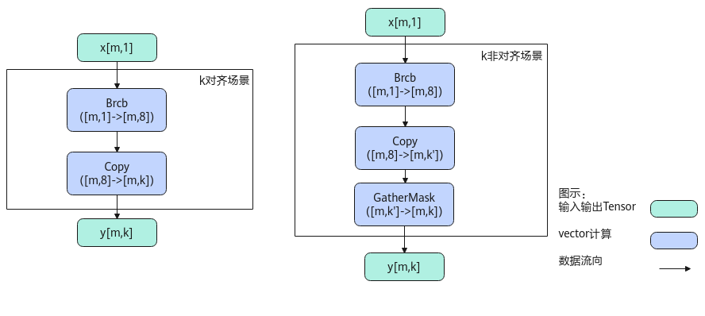

# Broadcast-张量变换-高阶API-Ascend C算子开发接口-API-CANN社区版8.5.0开发文档-昇腾社区
**页面ID:** atlasascendc_api_07_0853
**来源:** https://www.hiascend.com/document/detail/zh/CANNCommunityEdition/850/API/ascendcopapi/atlasascendc_api_07_0853.html
---

# Broadcast

#### 产品支持情况

| 产品 | 是否支持 |
| --- | --- |
| Atlas A3 训练系列产品/Atlas A3 推理系列产品 | √ |
| Atlas A2 训练系列产品/Atlas A2 推理系列产品 | √ |
| Atlas 200I/500 A2 推理产品 | x |
| Atlas 推理系列产品AI Core | √ |
| Atlas 推理系列产品Vector Core | x |
| Atlas 训练系列产品 | x |

#### 功能说明

将输入按照输出shape进行广播。

比如A的shape为(2,1)，广播的目标shape为(2,16)，则会将原来的一列扩展为相同的16列。

| 123456 | 输入数据：[[1][2]]输出数据：[[1111111111111111][2222222222222222]] |
| --- | --- |

#### 实现原理

以float类型，ND格式，[m, 1]广播到[m, k]为例，描述Broadcast高阶API内部算法框图，如下图所示。

计算过程分为如下几步，均在Vector上进行：

1. brcb步骤：将每个元素广播为一个datablock；
1. Copy步骤：将每个datablock均复制为多个datablock，k对齐场景下即为结果y；
1. 对于k非对齐的场景，再使用GatherMask截取[m, k]个元素， 其中k'表示k向上对齐32B的大小。

#### 函数原型

- 通过sharedTmpBuffer入参传入临时空间12template<typenameT,int32_tdim,int32_taxis,boolisReuseSource=false>__aicore__inlinevoidBroadcast(constLocalTensor<T>&dstLocal,constLocalTensor<T>&srcLocal,constuint32_tdstShape[dim],constuint32_tsrcShape[dim],LocalTensor<uint8_t>&sharedTmpBuffer)

- 接口框架申请临时空间12template<typenameT,int32_tdim,int32_taxis,boolisReuseSource=false>__aicore__inlinevoidBroadcast(constLocalTensor<T>&dstLocal,constLocalTensor<T>&srcLocal,constuint32_tdstShape[dim],constuint32_tsrcShape[dim])

该接口需要额外的临时空间来存储计算过程中的中间变量。临时空间支持开发者通过sharedTmpBuffer入参传入和接口框架申请两种方式。

- 通过sharedTmpBuffer入参传入，使用该tensor作为临时空间进行处理，接口框架不再申请。该方式开发者可以自行管理sharedTmpBuffer内存空间，并在接口调用完成后，复用该部分内存，内存不会反复申请释放，灵活性较高，内存利用率也较高。
- 接口框架申请临时空间，开发者无需申请，但是需要预留临时空间的大小。

通过sharedTmpBuffer传入的情况，开发者需要为tensor申请空间；接口框架申请的方式，开发者需要预留临时空间。临时空间大小BufferSize的获取方式如下：通过GetBroadCastMaxMinTmpSize中提供的接口获取需要预留空间范围的大小。

#### 参数说明

| 参数名称 | 功能 |
| --- | --- |
| T | 操作数的数据类型。Atlas A3 训练系列产品/Atlas A3 推理系列产品，支持的数据类型为：int8_t、uint8_t、half、float。Atlas A2 训练系列产品/Atlas A2 推理系列产品，支持的数据类型为：int8_t、uint8_t、half、float。Atlas 推理系列产品AI Core，支持的数据类型为：int8_t、uint8_t、half、float。 |
| dim | 输入/输出tensor的维度，目前仅支持1维和2维。 |
| axis | 要广播的维度，目前仅支持0和1。 |
| isReuseSource | 是否允许修改源操作数。该参数预留，传入默认值false即可。 |

| 参数名称 | 输入/输出 | 描述 |
| --- | --- | --- |
| dstLocal | 输出 | 目的操作数。类型为LocalTensor，支持的TPosition为VECIN/VECCALC/VECOUT。 |
| srcLocal | 输入 | 源操作数。源操作数的数据类型需要与目的操作数保持一致。类型为LocalTensor，支持的TPosition为VECIN/VECCALC/VECOUT。 |
| dstShape | 输入 | 输出tensor的shape：uint32_t类型的数组，长度为1或者2， 输入/输出的shape维度数目必须一致。 |
| srcShape | 输入 | 输入tensor的shape：uint32_t类型的数组，长度为1或者2， 输入/输出的shape维度数目必须一致。 |
| sharedTmpBuffer | 输入 | 临时缓存。类型为LocalTensor，支持的TPosition为VECIN/VECCALC/VECOUT。用于Broadcast内部复杂计算时存储中间变量，由开发者提供。临时空间大小BufferSize的获取方式请参考GetBroadCastMaxMinTmpSize。 |

#### 返回值说明

无

#### 约束说明

- 操作数地址对齐要求请参见通用地址对齐约束。
- 不支持源操作数与目的操作数地址重叠。
- 当前仅支持ND格式的输入，不支持其他格式。
- dim目前仅支持1或者2， axis目前仅支持0或者1。
- 对于Atlas 推理系列产品AI Core，在dim=2，axis=1时，srcShape[0]必须为32B对齐。
- 在dim=2，axis=0时，要求srcShape[1]必须32B对齐。

#### 调用示例

更多算子样例请参考broadcast算子样例。

| 12345678910111213141516171819202122232425262728293031323334353637383940414243444546474849505152535455565758596061626364656667686970717273 | #include"kernel_operator.h"template<typenameT,int32_tdim,int32_taxis>classKernelBroadcast{public:__aicore__inlineKernelBroadcast(){}__aicore__inlinevoidInit(GM_ADDRsrcGm,GM_ADDRdstGm,constuint32_tdstShape[dim],constuint32_tsrcShape[dim]){for(uint32_ti=0;i<dim;i++){srcSize*=srcShape[i];dstSize*=dstShape[i];}srcGlobal.SetGlobalBuffer(reinterpret_cast<__gm__T*>(srcGm),srcSize);dstGlobal.SetGlobalBuffer(reinterpret_cast<__gm__T*>(dstGm),dstSize);pipe.InitBuffer(inQueueX,1,srcSize*sizeof(T));pipe.InitBuffer(outQueue,1,dstSize*sizeof(T));dstShape_=dstShape;srcShape_=srcShape;}__aicore__inlinevoidProcess(){CopyIn();Compute();CopyOut();}private:__aicore__inlinevoidCopyIn(){AscendC::LocalTensor<T>srcLocal=inQueueX.AllocTensor<T>();AscendC::DataCopy(srcLocal,srcGlobal,srcSize);inQueueX.EnQue(srcLocal);}__aicore__inlinevoidCompute(){AscendC::LocalTensor<T>dstLocal=outQueue.AllocTensor<T>();AscendC::LocalTensor<T>srcLocal=inQueueX.DeQue<T>();AscendC::Broadcast<T,dim,axis>(dstLocal,srcLocal,dstShape_,srcShape_);outQueue.EnQue<T>(dstLocal);inQueueX.FreeTensor(srcLocal);}__aicore__inlinevoidCopyOut(){AscendC::LocalTensor<T>dstLocal=outQueue.DeQue<T>();AscendC::DataCopy(dstGlobal,dstLocal,dstSize);outQueue.FreeTensor(dstLocal);}private:AscendC::GlobalTensor<T>srcGlobal;AscendC::GlobalTensor<T>dstGlobal;AscendC::TPipepipe;AscendC::TQue<AscendC::TPosition::VECIN,1>inQueueX;AscendC::TQue<AscendC::TPosition::VECOUT,1>outQueue;constuint32_t*dstShape_{nullptr};constuint32_t*srcShape_{nullptr};int32_tsrcSize{1};int32_tdstSize{1};};template<typenameT,int32_tdim,int32_taxis>__aicore__voidkernel_broadcast_operator(GM_ADDRsrcGm,GM_ADDRdstGm,constuint32_tdstShape[dim],constuint32_tsrcShape[dim]){KernelBroadcast<T,dim,axis>op;op.Init(srcGm,dstGm,dstShape,srcShape);op.Process();} |
| --- | --- |

| 123456789101112131415161718192021222324252627282930313233343536 | 输入数据（srcLocal）:[[1][2][3][4][5][6][7][8][9][10][11][12][13][14][15][16]]dim：2axis：1输出数据（dstLocal）:[[1111111111111111][2222222222222222][3333333333333333][4444444444444444][5555555555555555][6666666666666666][7777777777777777][8888888888888888][9999999999999999][10101010101010101010101010101010][11111111111111111111111111111111][12121212121212121212121212121212][13131313131313131313131313131313][14141414141414141414141414141414][15151515151515151515151515151515][16161616161616161616161616161616]] |
| --- | --- |
