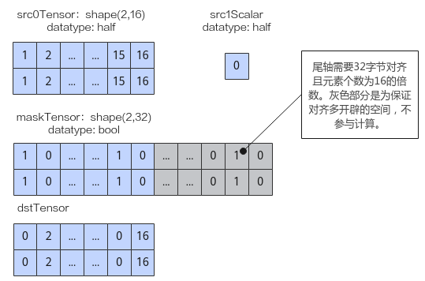
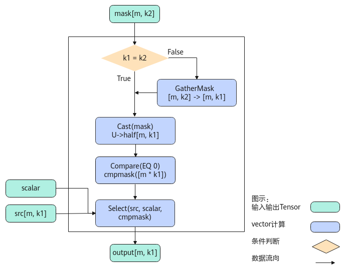

# Select-数据过滤-高阶API-Ascend C算子开发接口-API-CANN社区版8.5.0开发文档-昇腾社区
**页面ID:** atlasascendc_api_07_0861
**来源:** https://www.hiascend.com/document/detail/zh/CANNCommunityEdition/850/API/ascendcopapi/atlasascendc_api_07_0861.html
---

# Select

#### 产品支持情况

| 产品 | 是否支持 |
| --- | --- |
| Atlas A3 训练系列产品/Atlas A3 推理系列产品 | √ |
| Atlas A2 训练系列产品/Atlas A2 推理系列产品 | √ |
| Atlas 200I/500 A2 推理产品 | x |
| Atlas 推理系列产品AI Core | √ |
| Atlas 推理系列产品Vector Core | x |
| Atlas 训练系列产品 | x |

#### 功能说明

给定两个源操作数src0和src1，根据maskTensor相应位置的值（非bit位）选取元素，得到目的操作数dst。选择的规则为：当Mask的值为0时，从src0中选取，否则从src1选取。

该接口支持多维Shape，需满足maskTensor和源操作数Tensor的前轴（非尾轴）元素个数相同，且maskTensor尾轴元素个数大于等于源操作数尾轴元素个数，maskTensor多余部分丢弃不参与计算。

- maskTensor尾轴需32字节对齐且元素个数为16的倍数。
- 源操作数Tensor尾轴需32字节对齐。

如下图样例，源操作数src0为Tensor，shape为(2,16)，数据类型为half，尾轴长度满足32字节对齐；源操作数src1为scalar，数据类型为half；maskTensor的数据类型为bool，为满足对齐要求shape为(2,32)，仅有图中蓝色部分的mask掩码生效，灰色部分不参与计算。输出目的操作数dstTensor如下图所示。

#### 实现原理

以float类型，ND格式，shape为[m, k1]的source输入Tensor，shape为[m, k2]的mask Tensor为例，描述Select高阶API内部算法框图，如下图所示。

计算过程分为如下几步，均在Vector上进行：

1. GatherMask步骤：如果k1, k2不相等，则根据src的shape[m, k1]，对输入mask[m, k2]通过GatherMask进行reduce计算，使得mask的k轴多余部分被舍去，shape转换为[m, k1]；
1. Cast步骤：将上一步的mask结果cast成half类型；
1. Compare步骤：使用Compare接口将上一步的mask结果与0进行比较，得到cmpmask结果；
1. Select步骤：根据cmpmask的结果，选择srcTensor相应位置的值或者scalar值，输出Output。

#### 函数原型

- src0为srcTensor（tensor类型），src1为srcScalar（scalar类型）12template<typenameT,typenameU,boolisReuseMask=true>__aicore__inlinevoidSelect(constLocalTensor<T>&dst,constLocalTensor<T>&src0,Tsrc1,constLocalTensor<U>&mask,constLocalTensor<uint8_t>&sharedTmpBuffer,constSelectWithBytesMaskShapeInfo&info)

- src0为srcScalar（scalar类型），src1为srcTensor（tensor类型）12template<typenameT,typenameU,boolisReuseMask=true>__aicore__inlinevoidSelect(constLocalTensor<T>&dst,Tsrc0,constLocalTensor<T>&src1,constLocalTensor<U>&mask,constLocalTensor<uint8_t>&sharedTmpBuffer,constSelectWithBytesMaskShapeInfo&info)

该接口需要额外的临时空间来存储计算过程中的中间变量。临时空间需要开发者申请并通过sharedTmpBuffer入参传入。临时空间大小BufferSize的获取方式如下：通过GetSelectMaxMinTmpSize中提供的接口获取需要预留空间范围的大小。

#### 参数说明

| 参数名 | 描述 |
| --- | --- |
| T | 操作数的数据类型。Atlas A3 训练系列产品/Atlas A3 推理系列产品，支持的数据类型为：half、float。Atlas A2 训练系列产品/Atlas A2 推理系列产品，支持的数据类型为：half、float。Atlas 推理系列产品AI Core，支持的数据类型为：half、float。 |
| U | 掩码Tensor mask的数据类型。Atlas A3 训练系列产品/Atlas A3 推理系列产品，支持的数据类型为：bool、int8_t、uint8_t、int16_t、uint16_t、int32_t、uint32_t。Atlas A2 训练系列产品/Atlas A2 推理系列产品，支持的数据类型为：bool、int8_t、uint8_t、int16_t、uint16_t、int32_t、uint32_t。Atlas 推理系列产品AI Core，支持的数据类型为：bool、int8_t、uint8_t、int16_t、uint16_t、int32_t、uint32_t。 |
| isReuseMask | 是否允许修改maskTensor。默认为true。取值为true时，仅在maskTensor尾轴元素个数和srcTensor尾轴元素个数不同的情况下，maskTensor可能会被修改；其余场景，maskTensor不会修改。取值为false时，任意场景下，maskTensor均不会修改，但可能会需要更多的临时空间。 |

| 参数名称 | 输入/输出 | 含义 |
| --- | --- | --- |
| dst | 输出 | 目的操作数。类型为LocalTensor，支持的TPosition为VECIN/VECCALC/VECOUT。 |
| src0(srcTensor)src1(srcTensor) | 输入 | 源操作数。源操作数Tensor尾轴需32字节对齐。类型为LocalTensor，支持的TPosition为VECIN/VECCALC/VECOUT。 |
| src1(srcScalar)src0(srcScalar) | 输入 | 源操作数。类型为scalar。 |
| mask | 输入 | 掩码Tensor。用于描述如何选择srcTensor和srcScalar之间的值。maskTensor尾轴需32字节对齐且元素个数为16的倍数。src0为srcTensor（tensor类型），src1为srcScalar（scalar类型）若mask的值为0，选择srcTensor相应的值放入dstLocal，否则选择srcScalar的值放入dstLocal。src0为srcScalar（scalar类型），src1为srcTensor（tensor类型）若mask的值为0，选择srcScalar的值放入dstLocal，否则选择srcTensor相应的值放入dstLocal。 |
| sharedTmpBuffer | 输入 | 该API用于计算的临时空间，所需空间大小根据GetSelectMaxMinTmpSize获取。 |
| info | 输入 | 描述SrcTensor和maskTensor的shape信息。SelectWithBytesMaskShapeInfo类型，定义如下：123456structSelectWithBytesMaskShapeInfo{__aicore__SelectShapeInfo(){};uint32_tfirstAxis=0;uint32_tsrcLastAxis=0;uint32_tmaskLastAxis=0;};firstAxis：srcLocal/maskTensor的前轴元素个数。srcLastAxis：srcLocal的尾轴元素个数。maskLastAxis：maskTensor的尾轴元素个数。注意：需要满足srcTensor和maskTensor的前轴元素个数相同，均为firstAxis。需要满足firstAxis * srcLastAxis = srcTensor.GetSize() ；firstAxis * maskLastAxis = maskTensor.GetSize()。maskTensor尾轴的元素个数大于等于srcTensor尾轴的元素个数，计算时会丢弃maskTensor多余部分，不参与计算。 | 123456 | structSelectWithBytesMaskShapeInfo{__aicore__SelectShapeInfo(){};uint32_tfirstAxis=0;uint32_tsrcLastAxis=0;uint32_tmaskLastAxis=0;}; |
| 123456 | structSelectWithBytesMaskShapeInfo{__aicore__SelectShapeInfo(){};uint32_tfirstAxis=0;uint32_tsrcLastAxis=0;uint32_tmaskLastAxis=0;}; |

#### 返回值说明

无

#### 约束说明

- 源操作数与目的操作数可以复用。
- 操作数地址对齐要求请参见通用地址对齐约束。
- maskTensor尾轴元素个数和源操作数尾轴元素个数不同的情况下， maskTensor的数据有可能被接口改写。

#### 调用示例

| 123456789 | AscendC::SelectWithBytesMaskShapeInfoinfo;srcLocal1=inQueueX1.DeQue<srcType>();maskLocal=maskQueue.DeQue<maskType>();AscendC::LocalTensor<uint8_t>tmpBuffer=sharedTmpBuffer.Get<uint8_t>();dstLocal=outQueue.AllocTensor<srcType>();AscendC::Select(dstLocal,srcLocal1,scalar,maskLocal,tmpBuffer,info);outQueue.EnQue<srcType>(dstLocal);maskQueue.FreeTensor(maskLocal);inQueueX1.FreeTensor(srcLocal1); |
| --- | --- |

| 12345678910111213141516171819202122 | 输入数据srcLocal1:[-84.6-24.3830.97-30.2522.28-92.5690.44-58.72-86.565.746.754-86.3-96.7-37.38-81.946.9-99.494.2-41.78-60.3-14.4378.68.93-65.279.94-46.884.51620.03-25.5624.730.322321.98-87.4-93.946.22-69.990.8-24.17-96.2-91.90.449.76668.25-57.78-75.44-8.86-91.5621.676.82.1-78.-23.7592.-66.4475.94.92.62-90.915.94538.1650.8496.94-59.3844.22]输入数据scalar:[35.6]输入数据maskLocal:[FalseTrueFalseFalseTrueTrueFalseTrueTrueFalseFalseTrueFalseTrueFalseTrueTrueFalseFalseFalseTrueTrueTrueTrueTrueFalseTrueFalseTrueTrueTrueTrueFalseFalseTrueFalseTrueFalseTrueFalseTrueFalseTrueFalseTrueTrueTrueFalseTrueFalseTrueFalseTrueFalseTrueTrueTrueFalseFalseFalseTrueFalseTrueTrue]输出数据dstLocal:[-84.635.630.97-30.2535.635.690.4435.635.65.746.75435.6-96.735.6-81.935.635.694.2-41.78-60.335.635.635.635.635.6-46.8835.620.0335.635.635.635.6-87.4-93.935.6-69.935.6-24.1735.6-91.35.69.76635.6-57.7835.635.635.621.635.682.135.6-23.7535.6-66.4435.635.635.6-90.915.94538.1635.696.9435.635.6] |
| --- | --- |
