# Transpose-张量变换-高阶API-Ascend C算子开发接口-API-CANN社区版8.5.0开发文档-昇腾社区
**页面ID:** atlasascendc_api_07_0865
**来源:** https://www.hiascend.com/document/detail/zh/CANNCommunityEdition/850/API/ascendcopapi/atlasascendc_api_07_0865.html
---

# Transpose

#### 产品支持情况

| 产品 | 是否支持 |
| --- | --- |
| Atlas A3 训练系列产品/Atlas A3 推理系列产品 | √ |
| Atlas A2 训练系列产品/Atlas A2 推理系列产品 | √ |
| Atlas 200I/500 A2 推理产品 | x |
| Atlas 推理系列产品AI Core | √ |
| Atlas 推理系列产品Vector Core | x |
| Atlas 训练系列产品 | x |

#### 功能说明

对输入数据进行数据排布及Reshape操作，具体功能如下：

【场景1：NZ2ND，1、2轴互换】

输入Tensor { shape:[B, N, H/N/16, S/16, 16, 16], origin_shape:[B, N, S, H/N], format:"NZ", origin_format:"ND"}

输出Tensor { shape:[B, S, N, H/N], origin_shape:[B, S, N, H/N], format:"ND", origin_format:"ND"}

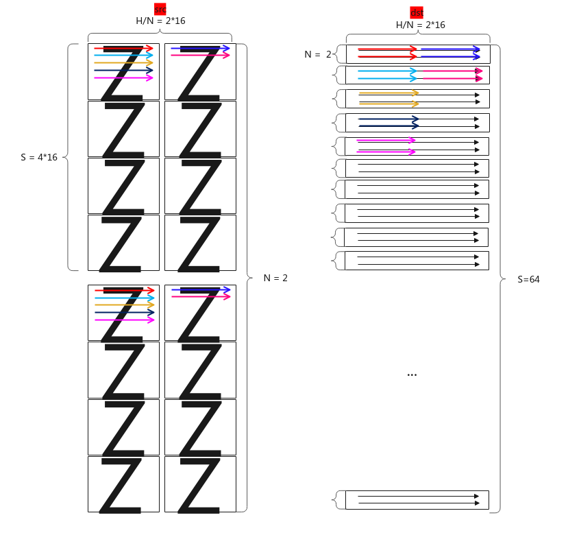

【场景2：NZ2NZ，1、2轴互换】

输入Tensor { shape:[B, N, H/N/16, S/16, 16, 16], origin_shape:[B, N, S, H/N], format:"NZ", origin_format:"ND"}

输出Tensor { shape:[B, S, H/N/16, N/16, 16, 16], origin_shape:[B, S, N, H/N], format:"NZ", origin_format:"ND"}

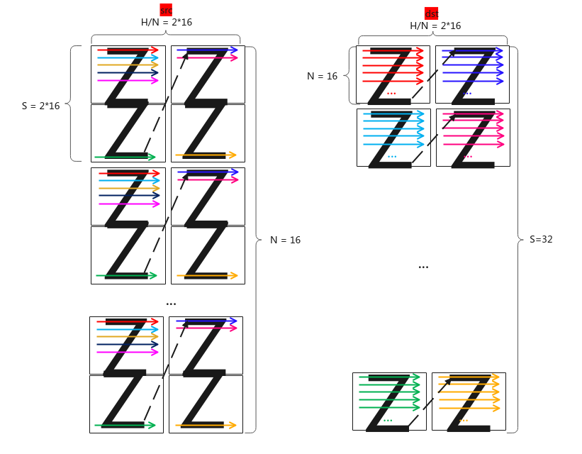

【场景3：NZ2NZ，尾轴切分】

输入Tensor { shape:[B, H / 16, S / 16, 16, 16], origin_shape:[B, S, H], format:"NZ", origin_format:"ND"}

输出Tensor { shape:[B, N, H/N/16, S / 16, 16, 16], origin_shape:[B, N, S, H/N], format:"NZ", origin_format:"ND"}

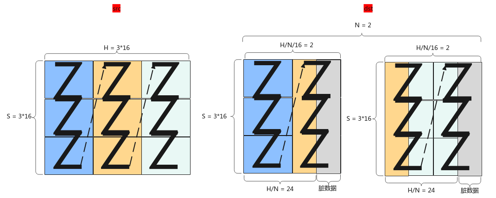

【场景4：NZ2ND，尾轴切分】

输入Tensor { shape:[B, H / 16, S / 16, 16, 16], origin_shape:[B, S, H], format:"NZ", origin_format:"ND"}

输出Tensor { shape:[B, N, S, H/N], origin_shape:[B, N, S, H/N], format:"ND", origin_format:"ND"}

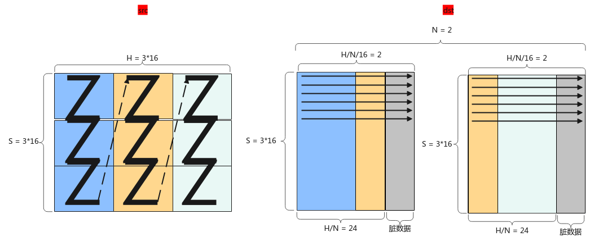

【场景5：NZ2ND，尾轴合并】

输入Tensor { shape:[B, N, H/N/16, S/16, 16, 16], origin_shape:[B, N, S, H/N], format:"NZ", origin_format:"ND"}

输出Tensor { shape:[B, S, H], origin_shape:[B, S, H], format:"ND", origin_format:"ND"}

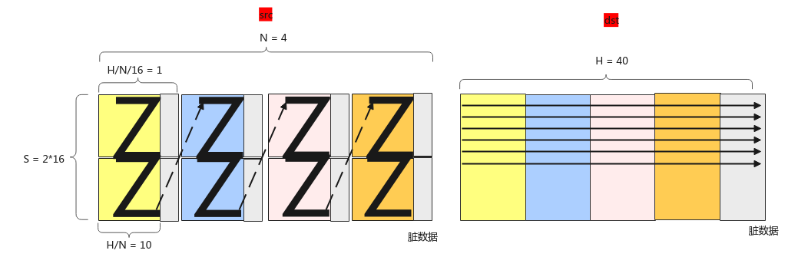

【场景6：NZ2NZ，尾轴合并】

输入Tensor { shape:[B, N, H/N/16, S/16, 16, 16], origin_shape:[B, N, S, H/N], format:"NZ", origin_format:"ND"}

输出Tensor { shape:[B, H/16, S/16, 16, 16], origin_shape:[B, S, H], format:"NZ", origin_format:"ND"}

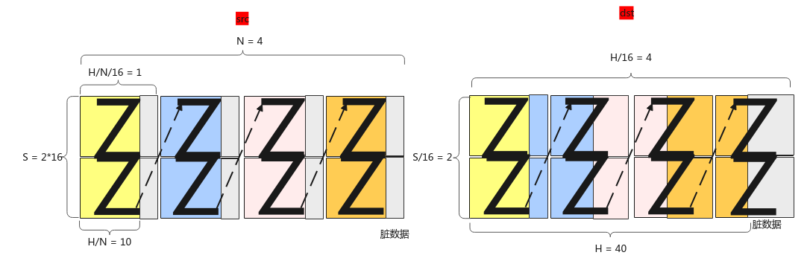

【场景7：二维转置】

支持在UB上对二维Tensor进行转置，其中srcShape中的H、W均是16的整倍。

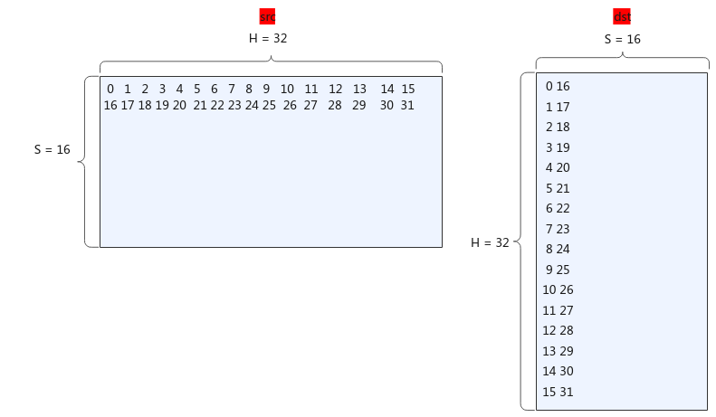

#### 实现原理

对应Transpose的7种功能场景，每种功能场景的算法框图如图所示。

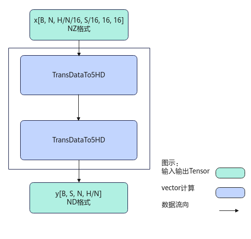

计算过程分为如下几步：

先后沿H/N方向，N方向，B方向循环处理：

1. 第1次TransDataTo5HD步骤：沿S方向转置S/16个连续的16*16的方形到temp中，在temp中每个方形与方形之间连续存储；
1. 第2次TransDataTo5HD步骤：将temp中S/16个16*16的方形转置到dst中，在dst中是ND格式，来自同一个方形的连续2行数据在目的操作数上的地址偏移(H/N)*N个元素，沿H方向的每2个方形的同一行数据在目的操作数上的地址偏移16个元素。

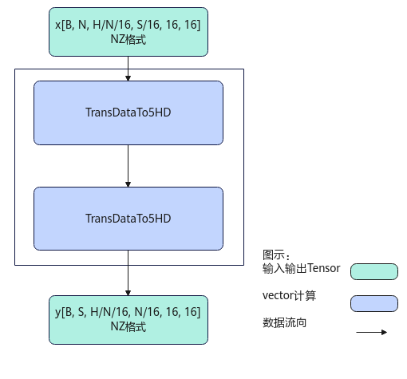

计算过程分为如下几步：

先后沿H/N方向，N方向，B方向循环处理：

1. 第1次TransDataTo5HD步骤：沿S方向分别取S/16个连续的16*16的方形到temp中，在temp中每个方形与方形之间连续存储；
1. 第2次TransDataTo5HD步骤：将temp中S/16个16*16的方形转置到dst中，在dst中是NZ格式，来自同一个方形的连续2行数据在目的操作数上的地址偏移(H/N)*N个元素，沿H方向的每2个方形的同一行数据在目的操作数上的地址偏移N*16个元素。

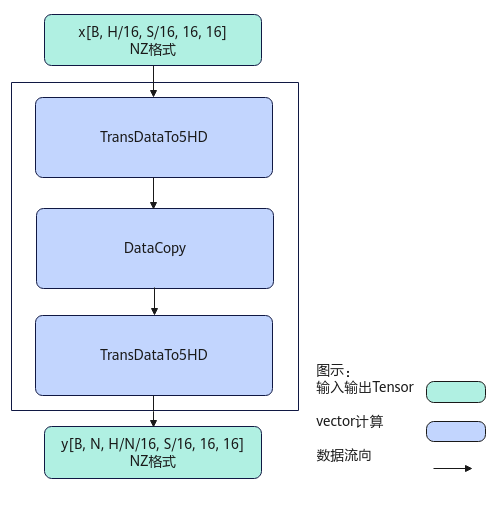

计算过程分为如下几步：

先后沿H方向，B方向循环处理：

1. 第1次TransDataTo5HD步骤：每次转置S/16个连续的16*16的方形到temp1中；
1. DataCopy步骤：当H/N<=16时，每次搬运H/N*S个元素到temp2中；当H/N>16时，前H/N/16次搬运16*S个元素到temp2中，最后一次搬运H/N%16*S个元素到temp2中；
1. 第2次TransDataTo5HD步骤：将temp2中的16*S的方形转置到dst中，在dst中是NZ格式，来自同一个方形的连续2行数据在目的操作数上的地址偏移16个元素，沿H方向的每2个方形的同一行数据在目的操作数上的地址偏移S*16个元素。

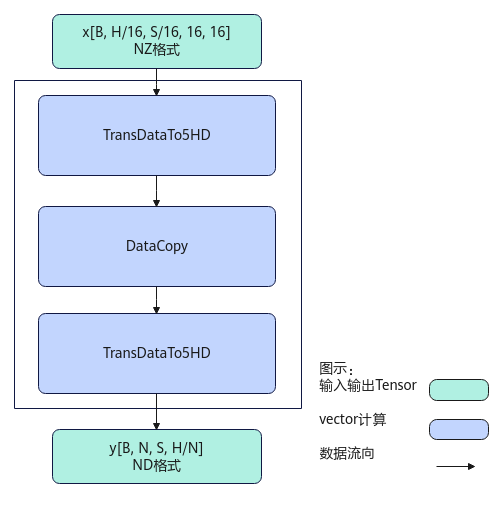

计算过程分为如下几步：

先后沿H方向，B方向循环处理：

1. 第1次TransDataTo5HD步骤：每次转置S/16个连续的16*16的方形到temp1中；
1. DataCopy步骤：当H/N<=16时，每次搬运H/N*S个元素到temp2中；当H/N>16时，前H/N/16次搬运16*S个元素到temp2中，最后一次搬运H/N%16*S个元素到tmp2中；
1. 第2次TransDataTo5HD步骤：将temp2中的数据转置到dst中，在dst中是ND格式，来自同一个方形的连续2行数据在目的操作数上的地址偏移(H/N+16-1)/16*16个元素，沿H方向的每2个方形的同一行数据在目的操作数上的地址偏移(H/N+16-1)/16*16*S个元素。

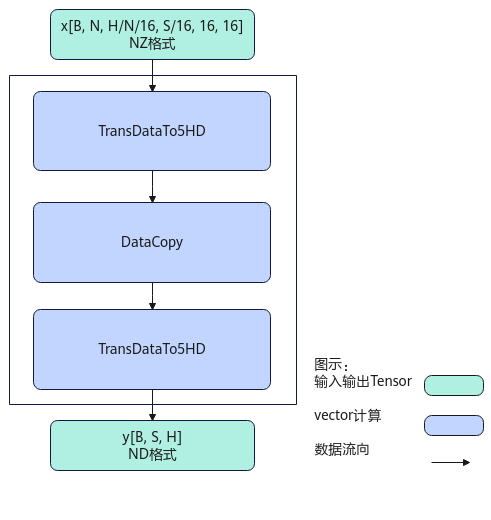

计算过程分为如下几步：

先后沿H方向，B方向循环处理：

1. 第1次TransDataTo5HD步骤：每次转置一个S*16的方形到temp1中；
1. DataCopy步骤：当H/N<=16时，每次搬运H/N*S个元素到temp2中；当H/N>16时，前H/N/16次搬运16*S个元素到temp2中，最后一次搬运H/N%16*S个元素到tmp2中；
1. 第2次TransDataTo5HD步骤：将temp2中的16*S的方形转置到dst中，在dst中是ND格式，来自同一个方形的连续2行数据在目的操作数上的地址偏移(H+16-1)/16*16个元素，沿H方向的每2个方形的同一行数据在目的操作数上的地址偏移H/N*S个元素。

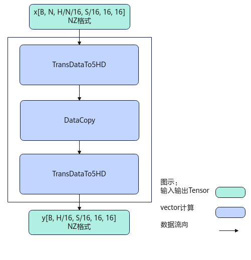

计算过程分为如下几步：

先后沿H方向，B方向循环处理：

1. 第1次TransDataTo5HD步骤：每次转置一个S*16的方形到temp1中；
1. DataCopy步骤：当H/N<=16时，每次搬运H/N*S个元素到temp2中；当H/N>16时，前H/N/16次搬运16*S个元素到temp2中，最后一次搬运H/N%16*S个元素到tmp2中；
1. 第2次TransDataTo5HD步骤：将temp2中的16*S的方形转置到dst中，在dst中是NZ格式，来自同一个方形的连续2行数据在目的操作数上的地址偏移16个元素，沿H方向的每2个方形的同一行数据在目的操作数上的地址偏移S*16个元素。

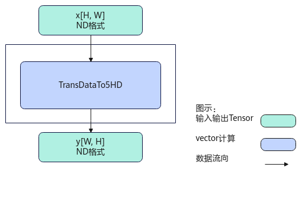

计算过程如下：

1. 调用TransDataTo5HD，通过设置不同的源操作数地址序列和目的操作数地址序列，将[H, W]转置为[W, H]，src和dst均是ND格式。

#### 函数原型

由于该接口的内部实现中涉及复杂的计算，需要额外的临时空间来存储计算过程中的中间变量。临时空间大小BufferSize的获取方法：通过Transpose Tiling中提供的GetTransposeMaxMinTmpSize接口获取所需最大和最小临时空间大小，最小空间可以保证功能正确，最大空间用于提升性能。

临时空间支持接口框架申请和开发者通过sharedTmpBuffer入参传入两种方式，因此Transpose接口的函数原型有两种：

- 通过sharedTmpBuffer入参传入临时空间12template<typenameT>__aicore__inlinevoidTranspose(constLocalTensor<T>&dst,constLocalTensor<T>&src,constLocalTensor<uint8_t>&sharedTmpBuffer,TransposeTypetransposeType,ConfusionTransposeTiling&tiling)该方式下开发者需自行申请并管理临时内存空间，并在接口调用完成后，复用该部分内存，内存不会反复申请释放，灵活性较高，内存利用率也较高。

- 接口框架申请临时空间12template<typenameT>__aicore__inlinevoidTranspose(constLocalTensor<T>&dst,constLocalTensor<T>&src,TransposeTypetransposeType,ConfusionTransposeTiling&tiling)该方式下开发者无需申请，但是需要预留临时空间的大小。

#### 参数说明

| 参数名 | 描述 |
| --- | --- |
| T | 操作数的数据类型。Atlas A3 训练系列产品/Atlas A3 推理系列产品，支持的数据类型为：int16_t、uint16_t、half、int32_t、uint32_t、float。Atlas A2 训练系列产品/Atlas A2 推理系列产品，支持的数据类型为：int16_t、uint16_t、half、int32_t、uint32_t、float。Atlas 推理系列产品AI Core，支持的数据类型为：int16_t、uint16_t、half、int32_t、uint32_t、float。 |

| 参数名 | 输入/输出 | 描述 |
| --- | --- | --- |
| dst | 输出 | 目的操作数，LocalTensor数据结构的定义请参考LocalTensor。类型为LocalTensor，支持的TPosition为VECIN/VECCALC/VECOUT。 |
| src | 输入 | 源操作数，LocalTensor数据结构的定义请参考LocalTensor。类型为LocalTensor，支持的TPosition为VECIN/VECCALC/VECOUT。 |
| sharedTmpBuffer | 输入 | 共享缓冲区，用于存放API内部计算产生的临时数据。该方式开发者可以自行管理sharedTmpBuffer内存空间，并在接口调用完成后，复用该部分内存，内存不会反复申请释放，灵活性较高，内存利用率也较高。共享缓冲区大小的获取方式请参考Transpose Tiling。类型为LocalTensor，支持的TPosition为VECIN/VECCALC/VECOUT。 |
| transposeType | 输入 | 数据排布及reshape的类型，类型为TransposeType枚举类。12345678910111213141516171819enumclassTransposeType:uint8_t{TRANSPOSE_TYPE_NONE,// default valueTRANSPOSE_NZ2ND_0213,// 场景1：NZ2ND，1、2轴互换TRANSPOSE_NZ2NZ_0213,// 场景2：NZ2NZ，1、2轴互换TRANSPOSE_NZ2NZ_012_WITH_N,// 场景3：NZ2NZ，尾轴切分TRANSPOSE_NZ2ND_012_WITH_N,// 场景4：NZ2ND，尾轴切分TRANSPOSE_NZ2ND_012_WITHOUT_N,// 场景5：NZ2ND，尾轴合并TRANSPOSE_NZ2NZ_012_WITHOUT_N,// 场景6：NZ2NZ，尾轴合并TRANSPOSE_ND2ND_ONLY,// 场景7：二维转置TRANSPOSE_ND_UB_GM,// 当前不支持TRANSPOSE_GRAD_ND_UB_GM,// 当前不支持TRANSPOSE_ND2ND_B16,// 当前不支持TRANSPOSE_NCHW2NHWC,// 当前不支持TRANSPOSE_NHWC2NCHW// 当前不支持}; | 12345678910111213141516171819 | enumclassTransposeType:uint8_t{TRANSPOSE_TYPE_NONE,// default valueTRANSPOSE_NZ2ND_0213,// 场景1：NZ2ND，1、2轴互换TRANSPOSE_NZ2NZ_0213,// 场景2：NZ2NZ，1、2轴互换TRANSPOSE_NZ2NZ_012_WITH_N,// 场景3：NZ2NZ，尾轴切分TRANSPOSE_NZ2ND_012_WITH_N,// 场景4：NZ2ND，尾轴切分TRANSPOSE_NZ2ND_012_WITHOUT_N,// 场景5：NZ2ND，尾轴合并TRANSPOSE_NZ2NZ_012_WITHOUT_N,// 场景6：NZ2NZ，尾轴合并TRANSPOSE_ND2ND_ONLY,// 场景7：二维转置TRANSPOSE_ND_UB_GM,// 当前不支持TRANSPOSE_GRAD_ND_UB_GM,// 当前不支持TRANSPOSE_ND2ND_B16,// 当前不支持TRANSPOSE_NCHW2NHWC,// 当前不支持TRANSPOSE_NHWC2NCHW// 当前不支持}; |
| 12345678910111213141516171819 | enumclassTransposeType:uint8_t{TRANSPOSE_TYPE_NONE,// default valueTRANSPOSE_NZ2ND_0213,// 场景1：NZ2ND，1、2轴互换TRANSPOSE_NZ2NZ_0213,// 场景2：NZ2NZ，1、2轴互换TRANSPOSE_NZ2NZ_012_WITH_N,// 场景3：NZ2NZ，尾轴切分TRANSPOSE_NZ2ND_012_WITH_N,// 场景4：NZ2ND，尾轴切分TRANSPOSE_NZ2ND_012_WITHOUT_N,// 场景5：NZ2ND，尾轴合并TRANSPOSE_NZ2NZ_012_WITHOUT_N,// 场景6：NZ2NZ，尾轴合并TRANSPOSE_ND2ND_ONLY,// 场景7：二维转置TRANSPOSE_ND_UB_GM,// 当前不支持TRANSPOSE_GRAD_ND_UB_GM,// 当前不支持TRANSPOSE_ND2ND_B16,// 当前不支持TRANSPOSE_NCHW2NHWC,// 当前不支持TRANSPOSE_NHWC2NCHW// 当前不支持}; |
| tiling | 输入 | 计算所需tiling信息，Tiling信息的获取请参考Transpose Tiling。 |

#### 返回值说明

无

#### 约束说明

- 操作数地址对齐要求请参见通用地址对齐约束。

#### 调用示例

本示例为场景1（NZ2ND，1、2轴互换）示例：

输入Tensor { shape:[B, N, H/N/16, S/16, 16, 16], origin_shape：[B, N, S, H/N], format:"NZ", origin_format:"ND"}

输出Tensor { shape:[B, S, N, H/N], origin_shape:[B, S, N, H/N], format:"ND", origin_format:"ND"}

B=1，N=2, S=64, H/N=32，输入数据类型均为half。

| 123456 | AscendC::TPipe*pipe=pipeIn;AscendC::TQue<AscendC::TPosition::VECIN,1>inQueueSrcVecIn;AscendC::TQue<AscendC::TPosition::VECOUT,1>inQueueSrcVecOut;pipe->InitBuffer(inQueueSrcVecIn,1,b*n*s*hnDiv*sizeof(T));pipe->InitBuffer(inQueueSrcVecOut,1,b*n*s*hnDiv*sizeof(T));AscendC::Transpose(dst,src,AscendC::TransposeType::TRANSPOSE_NZ2ND_0213,this->tiling); |
| --- | --- |
