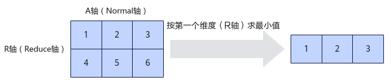
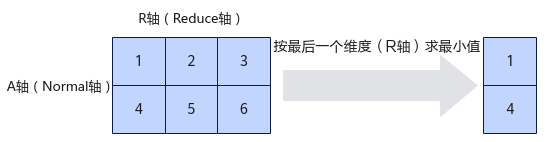

# ReduceMin-ReduceMin接口-归约操作-高阶API-Ascend C算子开发接口-API-CANN社区版8.5.0开发文档-昇腾社区
**页面ID:** atlasascendc_api_07_10056
**来源:** https://www.hiascend.com/document/detail/zh/CANNCommunityEdition/850/API/ascendcopapi/atlasascendc_api_07_10056.html
---

# ReduceMin

#### 产品支持情况

| 产品 | 是否支持 |
| --- | --- |
| Atlas A3 训练系列产品/Atlas A3 推理系列产品 | √ |
| Atlas A2 训练系列产品/Atlas A2 推理系列产品 | √ |
| Atlas 200I/500 A2 推理产品 | x |
| Atlas 推理系列产品AI Core | x |
| Atlas 推理系列产品Vector Core | x |
| Atlas 训练系列产品 | x |

#### 功能说明

对一个多维向量在指定的维度求最小值。

定义指定计算的维度（Reduce轴）为R轴，非指定维度（Normal轴）为A轴。如下图所示，对shape为(2, 3)的二维矩阵进行运算，指定在第一维求最小值，输出结果为[1, 2, 3]；指定在第二维求最小值，输出结果为[1, 4]。

#### 函数原型

- 通过sharedTmpBuffer入参传入临时空间12template<classT,classpattern,boolisReuseSource=false>__aicore__inlinevoidReduceMin(constLocalTensor<T>&dstTensor,constLocalTensor<T>&srcTensor,constLocalTensor<uint8_t>&sharedTmpBuffer,constuint32_tsrcShape[],boolsrcInnerPad)

- 接口框架申请临时空间12template<classT,classpattern,boolisReuseSource=false>__aicore__inlinevoidReduceMin(constLocalTensor<T>&dstTensor,constLocalTensor<T>&srcTensor,constuint32_tsrcShape[],boolsrcInnerPad)

由于该接口的内部实现中涉及复杂的数学计算，需要额外的临时空间来存储计算过程中的中间变量。临时空间支持开发者通过sharedTmpBuffer入参传入和接口框架申请两种方式。

- 通过sharedTmpBuffer入参传入，使用该tensor作为临时空间进行处理，接口框架不再申请。该方式开发者可以自行管理sharedTmpBuffer内存空间，并在接口调用完成后，复用该部分内存，内存不会反复申请释放，灵活性较高，内存利用率也较高。
- 接口框架申请临时空间，开发者无需申请，但是需要预留临时空间的大小。

通过sharedTmpBuffer传入的情况，开发者需要为tensor申请空间；接口框架申请的方式，开发者需要预留临时空间。临时空间大小BufferSize的获取方式如下：通过GetReduceMinMaxMinTmpSize中提供的接口获取需要预留空间范围的大小。

#### 参数说明

| 参数名 | 描述 |
| --- | --- |
| T | 操作数的数据类型。Atlas A3 训练系列产品/Atlas A3 推理系列产品，支持的数据类型为：half、float。Atlas A2 训练系列产品/Atlas A2 推理系列产品，支持的数据类型为：half、float。 |
| pattern | 用于指定ReduceMin计算轴，包括Reduce轴和Normal轴。pattern由与向量维度数量相同的A、R字母组合形成，字母A表示Normal轴，R表示Reduce轴。例如，AR表示对二维向量进行ReduceMin计算：第一维是Normal轴，第二维是Reduce轴，即对第二维数据求最小值。pattern是定义在AscendC::Pattern::Reduce命名空间下的结构体，其成员变量用户无需关注。pattern当前只支持取值为AR和RA。 |
| isReuseSource | 是否允许修改源操作数，默认值为false。如果开发者允许源操作数被改写，可以使能该参数，使能后能够节省部分内存空间。设置为true，则本接口内部计算时复用src的内存空间，节省内存空间；设置为false，则本接口内部计算时不复用src的内存空间。isReuseSource的使用样例请参考更多样例。 |

| 参数名 | 输入/输出 | 描述 |
| --- | --- | --- |
| dstTensor | 输出 | 目的操作数。类型为LocalTensor，支持的TPosition为VECIN/VECCALC/VECOUT。 |
| srcTensor | 输入 | 源操作数。类型为LocalTensor，支持的TPosition为VECIN/VECCALC/VECOUT。源操作数的数据类型需要与目的操作数保持一致。 |
| sharedTmpBuffer | 输入 | 临时缓存。类型为LocalTensor，支持的TPosition为VECIN/VECCALC/VECOUT。用于ReduceMin内部复杂计算时存储中间变量，由开发者提供。临时空间大小BufferSize的获取方式请参考GetReduceMinMaxMinTmpSize。 |
| srcShape | 输入 | uint32_t类型的数组，表示源操作数的shape信息。该shape的维度必须和模板参数pattern的维度一致，例如，pattern为AR，该shape维度只能是二维。Atlas A3 训练系列产品/Atlas A3 推理系列产品，当前只支持二维shape。Atlas A2 训练系列产品/Atlas A2 推理系列产品，当前只支持二维shape。 |
| srcInnerPad | 输入 | 表示实际需要计算的最内层轴数据是否32Bytes对齐。Atlas A3 训练系列产品/Atlas A3 推理系列产品，当前只支持true。Atlas A2 训练系列产品/Atlas A2 推理系列产品，当前只支持true。 |

#### 返回值说明

无

#### 约束说明

- 操作数地址对齐要求请参见通用地址对齐约束。

- 不支持源操作数与目的操作数地址重叠。
- 不支持sharedTmpBuffer与源操作数和目的操作数地址重叠。

#### 调用示例

| 123456 | AscendC::LocalTensor<float>dstLocal=outQueue.AllocTensor<float>();AscendC::LocalTensor<float>srcLocal=inQueue.DeQue<float>();AscendC::LocalTensor<uint8_t>tmp=tbuf.Get<uint8_t>();uint32_tshape[]={2,8};constexprboolisReuse=true;AscendC::ReduceMin<float,AscendC::Pattern::Reduce::AR,isReuse>(dstLocal,srcLocal,tmp,shape,true); |
| --- | --- |

结果示例如下：

| 1234567 | 输入输出的数据类型为float输入数据(src):[[0.04.02.00.0-1.02.0-1.07.0],[0.01.0-9.02.02.02.08.03.0]]输入pattern：AR输入shape：(2,8)输出数据(dst):[-1.0-9.0] |
| --- | --- |
